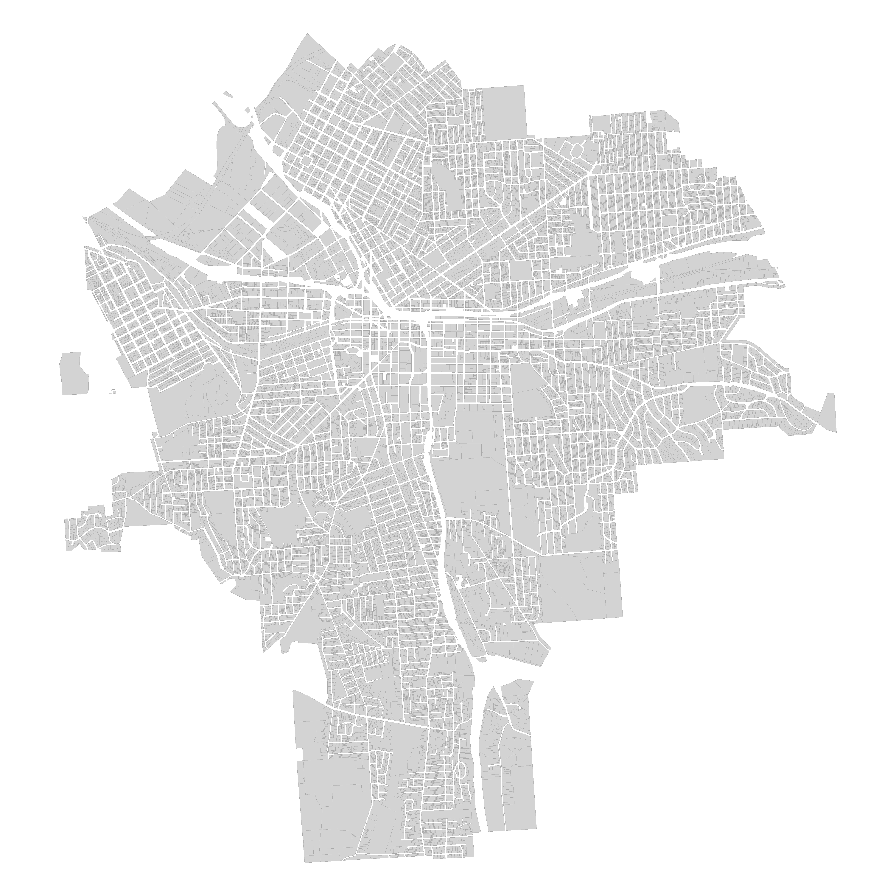
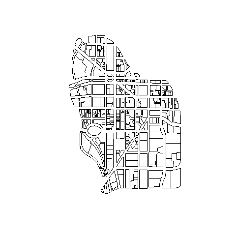

## About

This dataset represents approximately 42,000 tax parcels for the city of Syracuse, NY. Each row represents a unique parcel of land within city limits.

The dataset is available in the [DataCuse OPEN DATA PORTAL](http://data.syrgov.net/datasets/parcel-data-august-2017).

"Parcel dataset created by the Department of Neighborhood and Business Development. This dataset includes a large amount of information about each parcel (or area of land for properties) in the city."

<div class="figure" style="text-align: center">

<p class="caption">Syracuse Parcels</p>
</div>

<br>

<div class="figure" style="text-align: center">

<p class="caption">Downtown Syracuse</p>
</div>


<br><br>

## Data Dictionary

This data set contains the following variables:

VARIABLE | DESCRIPTION
-------- | ----------------------
**tax_id**  |  unique parcel ID  (numeric)  
**neighborhood**  |  city neighborhood for tax parcel (character) 
**stnum**  |  parcel address (numeric) 
**stname**  |  parcel address (character) 
**zip**  |  parcel address (numeric) 
**owner**  |  property owner (character) 
**frontfeet**  |  length of the front of the lot (numeric)    
**depth**  |  depth of the lot (numeric)
**sqft**  |  size of the parcel in square feet  (numeric)
**acres**  |  size of the parcel in acres (numeric)
**yearbuilt**  |  year of construction for the building on the parcel (numeric) 
**age**  |  age of the building (numeric)
**age_range**  |  age of the building by decade (factor)  
**land_use**  |  zoning purpose of the parcel (factor) 
**units**  |  number of units in multi-unit buildings (numeric)        
**residential**  |  is the parcel zoned for residential (T/F)  
**rental**  |  is the residential space zoned for rental (T/F) 
**vacantbuil**  |  is the building vacant (T/F)   
**assessedla**  |  assessed value of the parcel land  (numeric)
**assessedva**  |  assessed value of the parcel land plus buildings (numeric) 
**tax.exempt**  |  is the parcel tax exempt (T/F)   
**countytxbl**  |   value of parcel for tax purposes (numeric)  
**schooltxbl**  |  value of parcel for tax purposes (numeric) 
**citytaxabl**  |  value of parcel for tax purposes (numeric)   
**star**  |  does the parcel qualify for a residential tax break (T/F)      
**amtdelinqu**  |  amount of tax bill that is delinquint (numeric) 
**taxyrsdeli**  |  length of time tax bill is delinquint (numeric) 
**totint**  |  total interest owed for delinquint taxes (numeric) 
**overduewater**  |  total owed on overdue water bills (numeric) 

<br><br>

## Load Dataset

We are using a number of variables from the 2015 extract of tax parcels saved as a CSV file on GitHub for easy loading:


```r
URL <- "https://raw.githubusercontent.com/DS4PS/Data-Science-Class/master/DATA/syr_parcels.csv"
dat <- read.csv( URL, stringsAsFactors=FALSE )

head( dat ) %>% pander
```


----------------------------------------------------------------
  tax_id     neighborhood   stnum         stname           zip  
----------- -------------- ------- --------------------- -------
 1.393e+09   South Valley   2655         VALLEY DR        13215 

 1.393e+09   South Valley   2635         VALLEY DR        13120 

 1.437e+09   South Valley    203        HAYES TERR        13224 

 1.425e+09   South Valley    100    EDNA RD & CITY LINE   13120 

 1.425e+09   South Valley    104          EDNA RD         13205 

 1.425e+09   South Valley    108          EDNA RD         13205 
----------------------------------------------------------------

Table: Table continues below

 
-----------------------------------------------------------------------------
           owner             frontfeet   depth   sqft     acres    yearbuilt 
--------------------------- ----------- ------- ------- --------- -----------
 CLARMIN BUILDERS ONON COR     67.2       50     2149    0.04934      NA     

      JOHNSTON LEE R           104.8     46.5    6370    0.1462      1925    

      CHRISTO CRAIG S          82.87     168.3   12910   0.2964      1957    

     HAWKINS FARMS INC          65       160.9   10323    0.237      1958    

      PETERS LYNNETTE           65       160.9   10458   0.2401      1965    

     MITCHELL LOTAN G           65       160.9   10458   0.2401      1954    
-----------------------------------------------------------------------------

Table: Table continues below

 
-----------------------------------------------------------------------------
 age   age_range     land_use      units   residential   rental   vacantbuil 
----- ----------- --------------- ------- ------------- -------- ------------
 NA       NA        Vacant Land      0        FALSE      FALSE      FALSE    

 90      81-90     Single Family     0        TRUE       FALSE      FALSE    

 58      51-60     Single Family     0        TRUE       FALSE      FALSE    

 57      51-60     Single Family     0        TRUE       FALSE      FALSE    

 50      41-50     Single Family     0        TRUE       FALSE      FALSE    

 61      61-70     Single Family     0        TRUE       FALSE      FALSE    
-----------------------------------------------------------------------------

Table: Table continues below

 
-----------------------------------------------------------------------------
 assessedla   assessedva   tax.exempt   countytxbl   schooltxbl   citytaxabl 
------------ ------------ ------------ ------------ ------------ ------------
    475          500          TRUE         500          500          500     

   10800        69300        FALSE        69300        69300        69300    

   20200        88300        FALSE        88300        88300        88300    

   18000        70500        FALSE        70500        70500        70500    

   18000        74000        FALSE        74000        74000        74000    

   18000        95000        FALSE        95000        95000        95000    
-----------------------------------------------------------------------------

Table: Table continues below

 
--------------------------------------------------------
 star   amtdelinqu   taxyrsdeli   totint   overduewater 
------ ------------ ------------ -------- --------------
  NA        0            0          0           0       

 TRUE       0            0          0         177.8     

 TRUE       0            0          0           0       

  NA        0            0          0           0       

 TRUE       0            0          0           0       

 TRUE       0            0          0           0       
--------------------------------------------------------


<br><br>

## Parcel Shapefiles

The shapefile has been converted to a geojson format, and is available on GitHub:


```r
library( geojsonio )
library( sp )
library( rgdal )

syr <- geojson_read( "syr_parcels.geojson", method="local", what="sp" )
plot( syr,  border=NA, col="gray80" )
```

<br><br>


## Neighborhoods

<br><br>


<br><br>


## Land Use


