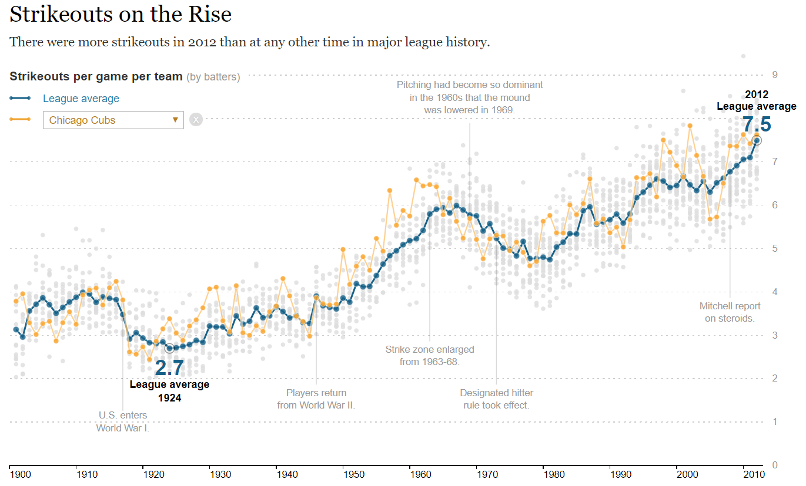

```{r setup, include=FALSE}
knitr::opts_chunk$set(echo = TRUE, message=F, warning=F)
library( dplyr )
library( pander )
library( Lahman )
data( Teams )
```


#### [DS4PS](https://ds4ps.github.io/course_website/)

<br>

*This lab introduces the R Shiny package, which allows you to create dynamic graphics that ask for input from the user and change based upon the selection.*

You can try it out using the example from the [Shiny tutorial](https://rmarkdown.rstudio.com/flexdashboard/shiny.html#loading_data).

[Shiny Example](https://cdn.rawgit.com/DS4PS/Data-Science-Class/b28db4b7/TEMPLATES/ShinyExample-01.Rmd)


<br><br>

## Replicating NYT Graphics

This lab builds on the previous lab, but you will not add the dynamic component of the graphic similar to the original [NYT version](https://archive.nytimes.com/www.nytimes.com/interactive/2013/03/29/sports/baseball/Strikeouts-Are-Still-Soaring.html?_r=0&ref=baseball). 



This lab requires the following packages:

```{r, eval=F}
install.packages( "shiny" )
install.packages( "flexdashboard" )
```

You will use the following template to complete the lab: 

[RMD Template](https://cdn.rawgit.com/DS4PS/Data-Science-Class/b28db4b7/TEMPLATES/ShinyTemplate-Lab-07.Rmd)

<br><br>


# Lab Instructions

1.	**Place your code from last week into the code chunk with the renderPlot() function:**

```{r, eval=F}
renderPlot({
  
# your code here
  
})
```

2. **Create a user-input widget on the left side bar by adding the proper values to these arguments:**

```{r, eval=F}
selectInput( inputId=,   # creates slot in input to hold values: input$your_inputId
             label=,     # title of the input widget
             choices=,   # options for the user
             selected=   # set the default option
           )
```

Note that "choices=" will determine the teams visible in the drop-down box. You will be selecting from baseball teams. Please use the variable "name" in the dataset instead of teamID since it is more use-friendly. 

You do not want to use "choices=Teams$name" for the argument because each team name is repeated multiple times. This drop-down box would then have several thousand choices.

The Cincinnati Reds and Pittsburgh Pirates have been in the dataset from the beginning, and the rest of the teams have been added along the way. This table represents the total number of seasons they have appeared:

```{r}
Teams %>%
  count( name ) %>%
  arrange( - n ) %>% 
  head( 10 ) %>%
  pander()
```

 Some of these professional baseball teams you might not recognize because they only lasted for a short time:


```{r}
Teams %>%
  count( name ) %>%
  arrange( - n ) %>% 
  tail( 10 ) %>%
  pander()
```

Note there are `r length(unique(Teams$name))` unique team names in the dataset:

```{r}
unique( Teams$name ) %>% head()
unique( Teams$name ) %>% length()
```

Find a reasonable way to select specific teams so that you are only using 10-25 team names in the drop-down menu.

3. **Similar to the NYT graphic, add the team trend line to the graphic in orange.**

Note that you would add a single team to the graphic something like this:

```{r, eval=F}
Teams$ave.so <- Teams$SO / Teams$G  # to make subsetable, add back to data frame
one.team <- filter( Teams, name == "Cincinnati Reds" )
points( x=one.team$yearID, y=one.team$ave.so, type="b", pch=19, col="darkorange4" )
```

What you need to do is replace the specific team name with the generalized input value from your selectInput() widget. 


<br><br>


# Submission Instructions

**Submit your RMD file but no HTML file.** When you include "runtime: shiny" in your header, it launches a real-time app instead of generating an HTML file.

Remember to:

* name your files according to the convention: **Lab-##-LastName.Rmd**
* show your solution, include your code.
* do not print excessive output (like a full data set).
* follow appropriate style guidelines (spaces between arguments, etc.).
