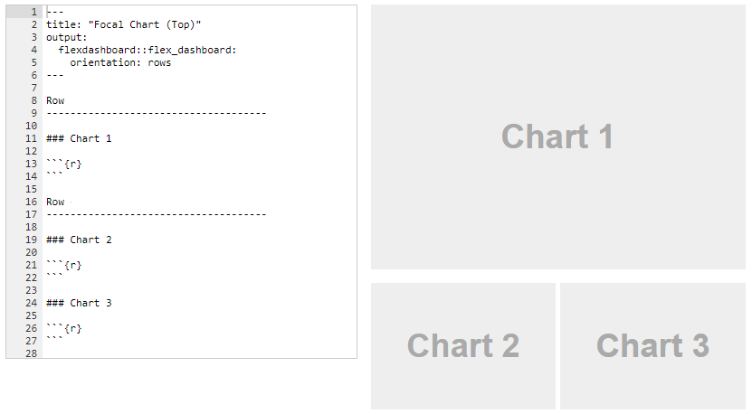
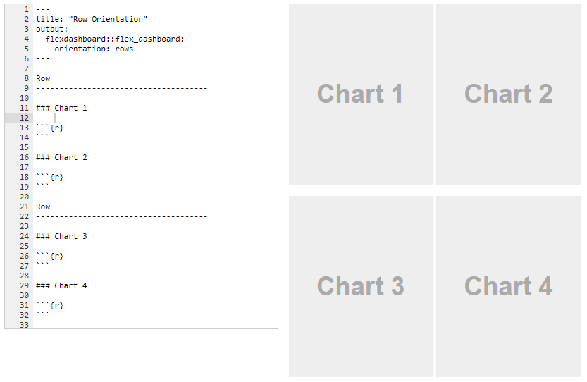

```{r setup, include=FALSE}
knitr::opts_chunk$set(echo = TRUE, message=F, warning=F)
library( dplyr )
library( pander )
library( Lahman )
library( DT )
data( Teams )
```

#### [DS4PS](https://ds4ps.github.io/course_website/)

<br>

In this lab you will practice creating a [dashboard layout](https://rmarkdown.rstudio.com/flexdashboard/layouts.html) in R. You will create a 3-window dashboard and a 4-window dashboard (examples below, though you can select different designs).

<br><br>



<br>



You will need the following packages:

```{r, eval=F}
install.packages( "flexdashboard" )  # dashboards in r
install.packages( "DT" )             # data tables
```

<br><br>

# Data

We are using the same dataset as last week. The **Teams** dataset in the Lahman package contains season statistics for each baseball team from the late 1800s onward.


```{r load_data, eval=F}
library( Lahman )
data( Teams )
```

<br>

## Data Tables

We want the user to be able to explore the data in the graphics, so we will embed a data table in the dashboard. 

Note that previously we have added a static table to our report using some functions that format the printed table, usually with the pander() function from the **pander** package: 

```{r}
# library( pander )
pander( head( Teams[c("name","yearID","SO","H","HR","G") ] ) )
```

We obviously can't print the entire 2,800+ row table. So instead, we will use the datatable() function from the **DT** package, which creates a table that can be searched, filtered, and sorted. 

```{r}
# library( DT )
datatable( Teams[c("name","yearID","SO","H","HR","G") ],
           filter='top', rownames = FALSE,
           options=list( pageLength=6, autoWidth=TRUE) )
```


<br><br>

# Graphics

You will practice creating a dashboard using graphics that report season statistics standardized by the number of games that were played. You can use these three statistics, or calculate any of your own from the Teams dataset. 


```{r, fig.width=10}
plot( Teams$yearID, Teams$SO/Teams$G, pch=19, col=gray(0.5,0.2), bty="n",
      ylab="Ave. Strikeouts Per Game (SO/G)", 
      xlab="Year (yearID)", main="AVE STRIKE OUTS PER GAME" )

plot( Teams$yearID, Teams$H/Teams$G, pch=19, col=gray(0.5,0.2), bty="n",
      ylab="Ave. Hits Per Game (H/G)", xlab="Year (yearID)", main="AVE HITS PER GAME" )

plot( Teams$yearID, Teams$HR/Teams$G, pch=19, col=gray(0.5,0.2), bty="n",
      ylab="Ave. Home Runs Per Game (HR/G)", 
      xlab="Year (yearID)", main="AVE HOME RUNS PER GAME" )
```


<br><br>


# Lab Instructions


**PART 1:** 

* Create a flexdashboard layout with **THREE** windows. 
* Add **two** graphics and **one** datatable to the dashboard.
* Save this file as **Lab-08-LastName-V1.Rmd**.

**PART 2:**

* Create a flexdashboard layout with **FOUR** windows. 
* Add **three** graphics and **one** datatable to the dashboard.
* Save this file as **Lab-08-LastName-V2.Rmd**.

**INSTRUCTIONS**

* You are free to use whatever [layout styles](https://rmarkdown.rstudio.com/flexdashboard/layouts.html) you want, including those with tabs, as long as they have the correct number of windows.
* You can use the graphics above, or calculate your own statistics from data in the Teams dataset.
* You will NOT use shiny for this lab.
* Hide your code using the code chunk "echo=F" option.
* Add year trend lines to your graphs, and whatever aesthetics you want. 
* Follow the instructions below for creating your data table.

**Data Table**

Use the datatable() function in the DT package to add the table to your dashboard. These options are fine, but you are free to customize your table using [DT options](https://rstudio.github.io/DT/) from their website.

```{r, eval=F}
datatable( Teams[c("name","yearID","SO","H","HR","G") ],
           filter='top', rownames = FALSE,
           options=list( pageLength=6, autoWidth=TRUE) )
```

Your table will look similar to the one above. HOWEVER, your data table should report the statistics that are reported on your graphs, not the raw statistics that are reported here. For example, in the lab last week we used "average strikeouts per game" (SOPG) instead of "strike outs" (SO).

You need to create a new dataframe that reports team name ("name"), year of season ("yearID"), games played ("G"), and the statistics from your graphs.

Use dplyr functions like mutate() to create your statistics and add them back to your dataset, and select() to keep only relevant variables before printing your table. 


<br><br>


# Submission Instructions

You will submit your two RMD files. No HTML files are needed.

* **Lab-08-LastName-V1.Rmd**
* **Lab-08-LastName-V2.Rmd**

Login to Canvas at <http://canvas.asu.edu> and navigate to the assignments tab in the course repository. Upload your RMD files to the appropriate lab submission link.


