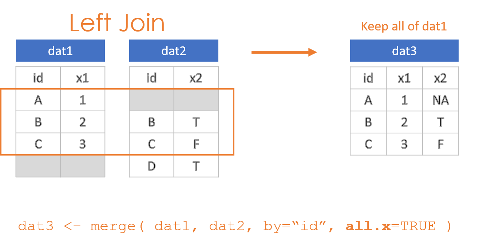
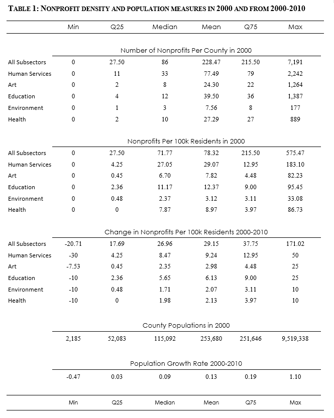

#### [DS4PS](https://ds4ps.github.io/course_website/)

<br>

This lab demonstrates the process of joining two datasets through a **merge()** function. This is one of the most common and most important processes in data science, because it allows you to combine multiple datasets to link observations that pertain to the same individuals / cases. The deepest insights often come from bringing data together in this way.

We will use the following packages for the lab:


```r
library( dplyr )
```

You can create a new RMarkdown file, or download the lab template: 

[RMD Template](https://cdn.rawgit.com/DS4PS/Data-Science-Class/c464d527/TEMPLATES/MarkdownTemplateSimple.Rmd)

<br><br>

# Overview of Joins

### Inner, Outer, Left and Right

There are two things to remember when conducting joins. The first is that when you merge two datasets it is rare for them both to contain the exact same observations. As a result, you need to make decisions about which data to keep and which data to drop post-merge. There are four options:

* Keep everything: "Outer Join"
* Keep only observations in both datasets: "Inner Join"
* Keep all observations from dat1: "Left Join"
* Keep all observations from dat2: "Right Join"

<br>


<br>

These options are specified through the *all=*, *all.x=*, and *all.y=* arguments in the **merge()** function, where the arguments all.x stands for observations in dat1, and all.y stands for observations in dat2 in this example.


<br>


<br>



<br>


The important 

### Compound IDs


Consider an example where sales representatives get a bonus if they sell over $100,000 in subscriptions each year. We have one database generated by the sales department, and another generated by HR. We want to merge them to ensure bonuses have been properly issued. The data tables are structured as follows:


--------------------
 id   year   sales  
---- ------ --------
 A    2001   54000  

 A    2002   119000 

 B    2001   141000 

 B    2002   102000 

 C    2001   66000  

 C    2002   68000  
--------------------


-------------------
 id   year   bonus 
---- ------ -------
 A    2001   FALSE 

 A    2002   TRUE  

 B    2001   TRUE  

 B    2002   TRUE  

 C    2001   FALSE 

 C    2002   FALSE 
-------------------


The RIGHT way to merge these tables is to specify the set of IDs that allow you to indentify unique observations. The employee ID is not sufficient in this case because there are separate observations for each year. As a result, 


```r
merge( dat1, dat2, by=c("id","year") )         %>% pander()
```


----------------------------
 id   year   sales    bonus 
---- ------ -------- -------
 A    2001   54000    FALSE 

 A    2002   119000   TRUE  

 B    2001   141000   TRUE  

 B    2002   102000   TRUE  

 C    2001   66000    FALSE 

 C    2002   68000    FALSE 
----------------------------


The WRONG way to merge these two datasets is to use only the employee ID. In this case, since the rows are now no longer unique, the only choice the merge() function has is to join EVERY instance on the right to each instance on the left. It has the effect of blowing up the size of the database (notice we have increased from 6 to 12 rows), as well as duplicating fields and incorrectly aligning data.

Row number 2, for example, reports that employee A received a bonus on $54,000 in sales.


```r
merge( dat1, dat2, by="id" )         %>% pander()
```


---------------------------------------
 id   year.x   sales    year.y   bonus 
---- -------- -------- -------- -------
 A     2001    54000     2001    FALSE 

 A     2001    54000     2002    TRUE  

 A     2002    119000    2001    FALSE 

 A     2002    119000    2002    TRUE  

 B     2001    141000    2001    TRUE  

 B     2001    141000    2002    TRUE  

 B     2002    102000    2001    TRUE  

 B     2002    102000    2002    TRUE  

 C     2001    66000     2001    FALSE 

 C     2001    66000     2002    FALSE 

 C     2002    68000     2001    FALSE 

 C     2002    68000     2002    FALSE 
---------------------------------------

The solution is to ensure you are using the combination of keys that ensures each observation is correctly specified. 


### Specify Merge Keys

You can check for shared variable names across two datasets by looking at the intersection of names in both:


```r
intersect( names(dat1), names(dat2) )
```

```
## [1] "id"   "year"
```

This will only work when the datasets were generated from a common system that uses standardized variable names. In other cases, variables may be spelled differently ('year' vs. 'Year') or have completely different names. 

The check at least allows you to catch instances where variable names would be repeated, and thus duplicated in the merged file. When this happens, like the 'year' variable in the example above, the merge operation will add an x and y to the variables to specify whether they originated from your first or second dataset ('year.x' and 'year.y' in the example above). 

In instances where variable names differ, you can specify the names directly using "by.x=" and "by.y=":


```r
merge( dat1, dat2, by.x="fips", by.y="FIPS" ) 
```


<br><br>

# Data

This lab uses nonprofit tax data and population data from the US Census. 

Nonprofit data was obtained through the National Center for Charitable Statistics, the 2000 and 2010 Core files: [DATA DICTIONARY](https://nccs-data.urban.org/dd2.php?close=1&form=Core+2010+PC).

Census data is from the 2000 and 2010 Dicennial Census, table SF1, population by county.


```r
url <- "https://github.com/DS4PS/Data-Science-Class/blob/master/DATA/nonprofits_2010.csv?raw=true"
np.dat.2010 <- read.csv( url, stringsAsFactors=F )
head( np.dat.2010 )
```

<div data-pagedtable="false">
  <script data-pagedtable-source type="application/json">
{"columns":[{"label":[""],"name":["_rn_"],"type":[""],"align":["left"]},{"label":["MSA_NECH"],"name":[1],"type":["int"],"align":["right"]},{"label":["EIN"],"name":[2],"type":["int"],"align":["right"]},{"label":["NAME"],"name":[3],"type":["chr"],"align":["left"]},{"label":["ADDRESS"],"name":[4],"type":["chr"],"align":["left"]},{"label":["CITY"],"name":[5],"type":["chr"],"align":["left"]},{"label":["STATE"],"name":[6],"type":["chr"],"align":["left"]},{"label":["ZIP5"],"name":[7],"type":["int"],"align":["right"]},{"label":["FIPS"],"name":[8],"type":["chr"],"align":["left"]},{"label":["NTMAJ12"],"name":[9],"type":["chr"],"align":["left"]},{"label":["NTEE1"],"name":[10],"type":["chr"],"align":["left"]},{"label":["LEVEL1"],"name":[11],"type":["chr"],"align":["left"]},{"label":["LEVEL2"],"name":[12],"type":["chr"],"align":["left"]},{"label":["LEVEL3"],"name":[13],"type":["chr"],"align":["left"]},{"label":["LEVEL4"],"name":[14],"type":["chr"],"align":["left"]},{"label":["MAJGRPB"],"name":[15],"type":["chr"],"align":["left"]},{"label":["REVENUE"],"name":[16],"type":["dbl"],"align":["right"]},{"label":["EXPENSES"],"name":[17],"type":["dbl"],"align":["right"]},{"label":["ASSETS"],"name":[18],"type":["dbl"],"align":["right"]},{"label":["RULEDATE"],"name":[19],"type":["int"],"align":["right"]},{"label":["LONGITUDE"],"name":[20],"type":["dbl"],"align":["right"]},{"label":["LATITUDE"],"name":[21],"type":["dbl"],"align":["right"]},{"label":["MSA"],"name":[22],"type":["chr"],"align":["left"]},{"label":["URBAN"],"name":[23],"type":["lgl"],"align":["right"]},{"label":["YEAR"],"name":[24],"type":["int"],"align":["right"]}],"data":[{"1":"733","2":"237293409","3":"PATTEN LUMBERMENS MUSEUM INC","4":"PO BOX 300","5":"PATTEN","6":"ME","7":"4765","8":"23019","9":"ARTS","10":"A","11":"PC","12":"O","13":"AR","14":"A","15":"A","16":"77293","17":"45051","18":"255165","19":"1974","20":"-68.60290","21":"46.06850","22":"BANGOR, ME","23":"TRUE","24":"2010","_rn_":"1"},{"1":"733","2":"651317010","3":"SAFE PLACE COMMUNITY CENTER INC","4":"PO BOX 179","5":"CHARLESTON","6":"ME","7":"4422","8":"23019","9":"HUMAN_SERVICES","10":"P","11":"PC","12":"O","13":"HS","14":"P","15":"P","16":"58468","17":"45561","18":"42325","19":"2010","20":"-69.03528","21":"45.06083","22":"BANGOR, ME","23":"TRUE","24":"2010","_rn_":"2"},{"1":"733","2":"223236711","3":"CURRAN HOMESTEAD","4":"PO BOX 107","5":"ORRINGTON","6":"ME","7":"4474","8":"23019","9":"EDUCATION","10":"A","11":"PC","12":"O","13":"ED","14":"B","15":"B","16":"53529","17":"28458","18":"178370","19":"1993","20":"-68.77880","21":"44.71510","22":"BANGOR, ME","23":"TRUE","24":"2010","_rn_":"3"},{"1":"733","2":"10320766","3":"NORTHEAST CONTACT FOR BETTER BUSINESS INC","4":"PO BOX 486","5":"BREWER","6":"ME","7":"4412","8":"23019","9":"PUBLIC_BENEFIT","10":"S","11":"PC","12":"O","13":"PB","14":"S","15":"S","16":"42049","17":"61748","18":"20981","19":"1975","20":"-68.72500","21":"44.77820","22":"BANGOR, ME","23":"TRUE","24":"2010","_rn_":"4"},{"1":"733","2":"10211484","3":"BANGOR THEOLOGICAL SEMINARY","4":"2 COLLEGE CIR","5":"BANGOR","6":"ME","7":"4401","8":"23019","9":"UNIVERSITIES","10":"B","11":"PC","12":"O","13":"ED","14":"B","15":"BH","16":"1962292","17":"2231538","18":"14823105","19":"1939","20":"-68.83110","21":"44.85210","22":"BANGOR, ME","23":"TRUE","24":"2010","_rn_":"5"},{"1":"733","2":"10498250","3":"WINGS FOR CHILDREN AND FAMILIES","4":"900 HAMMOND ST","5":"BANGOR","6":"ME","7":"4401","8":"23019","9":"HEALTH","10":"F","11":"PC","12":"O","13":"HE","14":"F","15":"F","16":"3241244","17":"2987048","18":"1118590","19":"1995","20":"-68.80740","21":"44.79777","22":"BANGOR, ME","23":"TRUE","24":"2010","_rn_":"6"}],"options":{"columns":{"min":{},"max":[10]},"rows":{"min":[10],"max":[10]},"pages":{}}}
  </script>
</div>


```r
url <- "https://github.com/DS4PS/Data-Science-Class/blob/master/DATA/nonprofits_2000.csv?raw=true"
np.dat.2000 <- read.csv( url, stringsAsFactors=F )
head( np.dat.2000 )
```

<div data-pagedtable="false">
  <script data-pagedtable-source type="application/json">
{"columns":[{"label":[""],"name":["_rn_"],"type":[""],"align":["left"]},{"label":["MSA_NECH"],"name":[1],"type":["int"],"align":["right"]},{"label":["EIN"],"name":[2],"type":["int"],"align":["right"]},{"label":["NAME"],"name":[3],"type":["chr"],"align":["left"]},{"label":["ADDRESS"],"name":[4],"type":["chr"],"align":["left"]},{"label":["CITY"],"name":[5],"type":["chr"],"align":["left"]},{"label":["STATE"],"name":[6],"type":["chr"],"align":["left"]},{"label":["ZIP5"],"name":[7],"type":["int"],"align":["right"]},{"label":["FIPS"],"name":[8],"type":["int"],"align":["right"]},{"label":["NTMAJ12"],"name":[9],"type":["chr"],"align":["left"]},{"label":["NTEE1"],"name":[10],"type":["chr"],"align":["left"]},{"label":["LEVEL1"],"name":[11],"type":["chr"],"align":["left"]},{"label":["LEVEL2"],"name":[12],"type":["chr"],"align":["left"]},{"label":["LEVEL3"],"name":[13],"type":["chr"],"align":["left"]},{"label":["LEVEL4"],"name":[14],"type":["chr"],"align":["left"]},{"label":["MAJGRPB"],"name":[15],"type":["chr"],"align":["left"]},{"label":["REVENUE"],"name":[16],"type":["dbl"],"align":["right"]},{"label":["EXPENSES"],"name":[17],"type":["dbl"],"align":["right"]},{"label":["ASSETS"],"name":[18],"type":["dbl"],"align":["right"]},{"label":["RULEDATE"],"name":[19],"type":["int"],"align":["right"]},{"label":["MSA"],"name":[20],"type":["chr"],"align":["left"]},{"label":["URBAN"],"name":[21],"type":["lgl"],"align":["right"]},{"label":["YEAR"],"name":[22],"type":["int"],"align":["right"]},{"label":["LONGITUDE"],"name":[23],"type":["lgl"],"align":["right"]},{"label":["LATITUDE"],"name":[24],"type":["lgl"],"align":["right"]}],"data":[{"1":"8872","2":"521194534","3":"PTA MARYLAND CONGRESS OF PARENT & TEACHERS INC","4":"299 FORT HOYLE RD","5":"JOPPA","6":"MD","7":"21085","8":"24025","9":"EDUCATION","10":"B","11":"PC","12":"O","13":"ED","14":"B","15":"B","16":"12330","17":"8837","18":"5583","19":"1969","20":"WASHINGTON, DC","21":"TRUE","22":"2000","23":"NA","24":"NA","_rn_":"1"},{"1":"8872","2":"521940780","3":"SUTRADHAR INSTITUTE OF DANCE AND RELATED ARTS INC","4":"5113 BANGOR DR","5":"KENSINGTON","6":"MD","7":"20895","8":"24031","9":"EDUCATION","10":"B","11":"PC","12":"O","13":"ED","14":"B","15":"B","16":"25871","17":"28742","18":"9123","19":"1996","20":"WASHINGTON, DC","21":"TRUE","22":"2000","23":"NA","24":"NA","_rn_":"2"},{"1":"8872","2":"541744871","3":"THE CHILDCARE NETWORK","4":"601 CAROLINE ST STE 305","5":"FREDERICKSBRG","6":"VA","7":"22401","8":"51630","9":"HUMAN_SERVICES","10":"P","11":"PC","12":"O","13":"HS","14":"P","15":"P","16":"332232","17":"329473","18":"45870","19":"1995","20":"WASHINGTON, DC","21":"TRUE","22":"2000","23":"NA","24":"NA","_rn_":"3"},{"1":"8872","2":"522011479","3":"HEALING DIMENSIONS FOUNDATION INC","4":"9462 GRECO GARTH","5":"COLUMBIA","6":"MD","7":"21045","8":"24027","9":"EDUCATION","10":"B","11":"PC","12":"O","13":"ED","14":"B","15":"B","16":"29350","17":"36423","18":"10703","19":"1997","20":"WASHINGTON, DC","21":"TRUE","22":"2000","23":"NA","24":"NA","_rn_":"4"},{"1":"8872","2":"521349403","3":"INTERNATIONAL CONSORTIUM ON GOVERNMENTAL FINANCIAL MANAGEMENT","4":"PO BOX 8665","5":"SILVER SPRING","6":"MD","7":"20907","8":"24031","9":"INTERNATIONAL","10":"Q","11":"PC","12":"O","13":"IN","14":"Q","15":"Q","16":"327753","17":"338796","18":"33859","19":"1984","20":"WASHINGTON, DC","21":"TRUE","22":"2000","23":"NA","24":"NA","_rn_":"5"},{"1":"8872","2":"521876176","3":"INTERNATIONAL CENTER FOR RESIDENTIAL EDUCATION INC","4":"3726 CONNECTICUT AVE NW STE 109","5":"WASHINGTON","6":"DC","7":"20008","8":"11001","9":"EDUCATION","10":"B","11":"PC","12":"O","13":"ED","14":"B","15":"B","16":"89171","17":"89152","18":"7515","19":"1994","20":"WASHINGTON, DC","21":"TRUE","22":"2000","23":"NA","24":"NA","_rn_":"6"}],"options":{"columns":{"min":{},"max":[10]},"rows":{"min":[10],"max":[10]},"pages":{}}}
  </script>
</div>


```r
url <- "https://raw.githubusercontent.com/DS4PS/Data-Science-Class/master/DATA/census_population_2000_and_2010.csv"
pop <- read.csv( url, stringsAsFactors=F, colClasses=c("character","character","numeric","numeric") )
head( pop )
```

<div data-pagedtable="false">
  <script data-pagedtable-source type="application/json">
{"columns":[{"label":[""],"name":["_rn_"],"type":[""],"align":["left"]},{"label":["fips"],"name":[1],"type":["chr"],"align":["left"]},{"label":["MSA"],"name":[2],"type":["chr"],"align":["left"]},{"label":["year"],"name":[3],"type":["dbl"],"align":["right"]},{"label":["population"],"name":[4],"type":["dbl"],"align":["right"]}],"data":[{"1":"01001","2":"MONTGOMERY, AL","3":"2000","4":"43671","_rn_":"1"},{"1":"01001","2":"MONTGOMERY, AL","3":"2010","4":"54571","_rn_":"2"},{"1":"01003","2":"MOBILE, AL","3":"2000","4":"140415","_rn_":"3"},{"1":"01003","2":"MOBILE, AL","3":"2010","4":"182265","_rn_":"4"},{"1":"01005","2":"RURAL","3":"2000","4":"29038","_rn_":"5"},{"1":"01005","2":"RURAL","3":"2010","4":"27457","_rn_":"6"}],"options":{"columns":{"min":{},"max":[10]},"rows":{"min":[10],"max":[10]},"pages":{}}}
  </script>
</div>


# Lab Instructions

In this lab you will look at nonprofit density by community. Your analysis will mirror the analysis in this table:




**PART 1:** 

1) Combine the 2000 and 2010 nonprofit data using the rbind(), or row bind, function. 


```r
np.dat <- rbind( np.dat.2000, np.dat.2010 )
```

2) Count the nonprofits in each county for each year. Use "FIPS" for the county code and "YEAR" for the tax year.

*Note, FIPS stands for "Federal Information Processing Standard", a set of codes published by the US government that provide standard unique identifier ID numbers for states, countries, Census tracts and other geographies. This allows everyone to build databases that have the same ID codes so that data can be more easily combined. It would be near impossible if each entity collecting data at a specific unit of observation like a state or county created their own ID system.*

3) Add county population to this dataset by merging the Census data with the nonprofit data.

Which join should you use? Outer, inner, left, or right? 

Note that the variables are spelled differently in your two datasets: 'FIPS' and 'YEAR' vs 'fips' and 'year'. You need to either change the spelling by renaming variables, or use the "by.x=" and "by.y=" arguments in the merge.  

4) Calculate the nonprofit density per county using the following formula:

$$Density = \frac{Number Of Nonprofits}{Population/100,000}$$

5) Report the summary statistics for the 2000 density measures. They should match these:


```r
head( npo.count.2000 ) %>% pander()
```


--------------------------------------------------------------
 FIPS    YEAR    n          MSA          population   density 
------- ------ ----- ------------------ ------------ ---------
 10001   2000   109      DOVER, DE         126697      86.03  

 10003   2000   671   PHILADELPHIA, PA     500265      134.1  

 10005   2000   140        RURAL           156638      89.38  

 1001    2000   25           NA              NA         NA    

 1003    2000   88           NA              NA         NA    

 1005    2000   12           NA              NA         NA    
--------------------------------------------------------------

```r
summary( npo.count.2000$density ) %>% pander()
```


-----------------------------------------------------------
 Min.    1st Qu.   Median   Mean    3rd Qu.   Max.    NA's 
------- --------- -------- ------- --------- ------- ------
 4.039    43.17    69.04    79.37    102.1    575.8   311  
-----------------------------------------------------------


**PART 2:** 

Calculate the population growth rates between 2000 and 2010. One easy way to do this is to arrange the 2000 and 2010 populations side-by-side as separate columns. Try splitting your dataset into two sets by years, then merge them back together by FIPS codes. 

The growth rate is calculated as:

$$Population Growth = \frac{Population_{2010} - Population_{2000}}{Population_{2000}}$$

The correct summary statistics are:


```r
head( pop.merged ) %>% pander()
```


-------------------------------------------
 fips    pop.2000   pop.2010   growth.rate 
------- ---------- ---------- -------------
 01001    43671      54571       0.2496    

 01003    140415     182265       0.298    

 01005    29038      27457      -0.05445   

 01007    20826      22915       0.1003    

 01009    51024      57322       0.1234    

 01011    11714      10914      -0.06829   
-------------------------------------------

```r
summary( pop.merged$growth.rate ) %>% pander()
```


--------------------------------------------------------------
  Min.    1st Qu.   Median     Mean    3rd Qu.   Max.    NA's 
-------- --------- --------- -------- --------- ------- ------
 -0.466   -0.0251   0.03191   0.0526   0.1023    1.104    88  
--------------------------------------------------------------


**PART 3 - OPTIONAL:**


Calculate the 2000 nonprofit density rates and the population growth rates from above using the Metropolitan Statistical Area (the MSA - the Census definition of a large city), instead of counties.

Note that nonprofits and population both need to be aggregated up to the MSA code prior to the merge. Use MSA and not MSA_NECH.

The 2000 nonprofit density by MSA is:


--------------------------------------------------
       MSA         YEAR    n      pop     density 
----------------- ------ ------ -------- ---------
   ABILENE, TX     2000   147    126555    116.2  

   ALBANY, GA      2000    87    120822    72.01  

   ALBANY, NY      2000   1138   875583     130   

 ALBUQUERQUE, NM   2000   694    712738    97.37  

 ALEXANDRIA, LA    2000    99    126337    78.36  

  ALLENTOWN, PA    2000   596    637958    93.42  
--------------------------------------------------


----------------------------------------------------
 Min.    1st Qu.   Median   Mean    3rd Qu.   Max.  
------- --------- -------- ------- --------- -------
 31.59    67.05     89.5    91.08    104.3    380.1 
----------------------------------------------------

The population growth rate by MSA is:


-----------------------------------------------------
       MSA         pop.2000   pop.2010   growth.rate 
----------------- ---------- ---------- -------------
   ABILENE, TX      126555     131506      0.03912   

   ALBANY, GA       120822     122863      0.01689   

   ALBANY, NY       875583     920935      0.0518    

 ALBUQUERQUE, NM    712738     870694      0.2216    

 ALEXANDRIA, LA     126337     131613      0.04176   

  ALLENTOWN, PA     637958     712481      0.1168    
-----------------------------------------------------


------------------------------------------------------
  Min.     1st Qu.   Median    Mean   3rd Qu.   Max.  
--------- --------- --------- ------ --------- -------
 -0.1105   0.03955   0.09626   0.12   0.1644    3.202 
------------------------------------------------------

# Submission Instructions

After you have completed your lab, knit your RMD file. Login to Canvas at <http://canvas.asu.edu> and navigate to the assignments tab in the course repository. Upload your RMD and your HTML files to the appropriate lab submission link.

Remember to:

* name your files according to the convention: **Lab-##-LastName.Rmd**
* show your solution, include your code.
* do not print excessive output (like a full data set).
* follow appropriate style guidelines (spaces between arguments, etc.).
