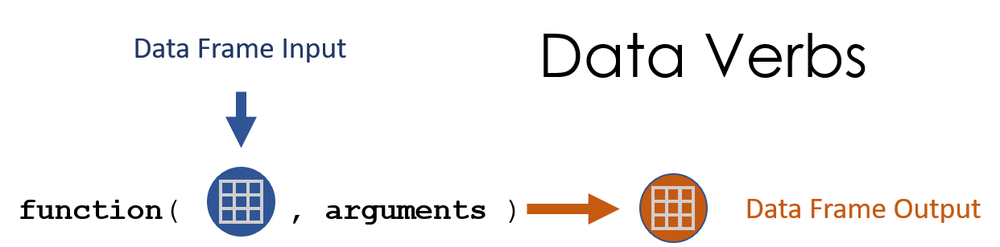

<style>
p.ex1 {
    padding-top: 10px;
}
h1, h2{
  margin-top:25px;
}
</style>


```{r setup, include=FALSE}
knitr::opts_chunk$set(echo=TRUE, message=F, warning=F)

library( pander )
library( dplyr )
```

```{r load_data, echo=F, eval=T, cache=T}
URL <- "https://raw.githubusercontent.com/DS4PS/Data-Science-Class/master/DATA/syr_parcels.csv"
dat <- read.csv( URL, stringsAsFactors=FALSE )
```

```{r, echo=F}
d <- filter( dat, 
             land_use %in% c("Vacant Land","Single Family","Commercial") &
             neighborhood %in% c("Near Westside","Westcott","University Hill","Downtown") ) 
```


## New Packages

```{r}
library( dplyr )
```

**"A Grammar of Data Manipulation"** 

The **dplyr** package makes data manipulation much easier and faster because the functions are designed to be chained so that each step builds on the last. 

The dplyr functions have a simple syntax.

The are easily combined into a "data recipe" by passing or "piping" a dataset from one function to the next.


## Key Concepts: Chaining Functions

<br><br>

```{r, echo=F, out.width='90%' }
knitr::include_graphics( "../TEXTBOOK/figures/chaining_data_verbs2.png" )
```


## Key Concepts: Data Recipe

```{r, echo=F, out.width='70%' }
knitr::include_graphics( "../TEXTBOOK/figures/data_recipe2.png" )
```


## Grammar of Data


What does "grammar" mean in the data programming context? 

Nouns (objects):

- vectors
- data frames

And verbs that act on these nouns:

- Subset
- Sort
- Transform


## dplyr Verbs

DATA VERB | ACTION  
---------|----------  
filter() | Select rows  
select() | Select columns 
arrage() | Sort the dataset by one or more columns 
mutate() | Create a new variable by transforming an existing variable or variables 


## dplyr Verbs

```{r, echo=F, out.width='40%' }
knitr::include_graphics( "../TEXTBOOK/figures/dataset_verbs.png" )
```


## dplyr Verbs

You will find these two work really well together!

DATA VERB | ACTION  
---------|----------  
group_by() | Split the dataset (implicitly) into a separate dataset for each group 
summarize() | Create summary statistics for specified variables 


## Data Verbs


```{r, fig.cap="Data verbs start with a data frame and end with a data frame.", echo=F, out.width='70%' }

```


## Example {.small}

Suppose we want to look at land use by neighborhoods:

```{r}
table( d$neighborhood, d$land_use )
```

Because the function returns a table and not a data frame we can't drill down into specific categories, or sort by specific variables.


## Example {.smaller}

But if we use the **dplyr** data verb count():

```{r, eval=F}
count( d, neighborhood, land_use ) 
```

```{r, echo=F}
count( d, neighborhood, land_use ) %>% pander()
```


## Example {.smaller}

We can now do things like filter() results:

```{r, eval=F}
count( d, neighborhood, land_use ) %>% 
  filter( land_use == "Vacant Land" )
```

```{r, echo=F}
count( d, neighborhood, land_use ) %>% 
  filter( land_use == "Vacant Land" ) %>% pander()
```


## Example {.smaller}

Or sort by specific fields in the new table:

```{r, eval=F, echo=T}
count( d, neighborhood, land_use ) %>%  
  arrange( neighborhood, - n )
```


```{r, echo=F}
count( d, neighborhood, land_use ) %>% 
  arrange( neighborhood, - n ) %>% pander()
```


## dplyr Functions

**dplyr** verbs always require a data frame as their first argument:

```{r, eval=F}
# dat is the syracuse tax dataset
count( dat, neighborhood, land_use ) 
```

```{r, fig.cap="", echo=F, out.width='80%' }

```


## dplyr Arguments

Functions in dplyr are more consistent and more intuitive than core R.

Because dplyr functions know the data frame you are working with, you don't have to preceed a variable name by *dat$* or use quote marks with the arguments. 


## dplyr Arguments

Subset by columns in dplyr:

```{r, eval=F}
select( dat, land_use, neighborhood ) 
```

VS core R:

```{r, eval=F}
dat[ , c("land_use""neighborhood") ] 
```


## dplyr Arguments

Subset by rows in dplyr:

```{r, eval=F}
filter( dat, land_use == "Commercial" ) 
```

VS core R:

```{r, eval=F}
dat[ dat$land_use == "Commercial" , ] 
```


## dplyr Arguments

Sorting data frames in dplyr:

```{r, eval=F}
arrange( dat, - amtdelinqu )  # negative sign to reverse sort order
```

VS core R:

```{r, eval=F}
dat[ order( dat$amtdelinqu, decreasing=T ) ,  ] 
```


## Data Verbs

They accept a data frame as the FIRST argument, and return a data frame.

```{r, eval=F}
count( d, neighborhood, land_use ) 
```

<br>

```{r, fig.cap="", echo=F, out.width='80%' }

```


## Data Verbs

**dplyr** data verbs always return data frames.

```{r}
class( count( d, neighborhood, land_use ) )
```

*The return object might have multiple classes, but one of them will be data.frame*


## Non-Verbs {.smaller}

```{r, echo=F}
gender <- sample( c("Male","Female"), 100, replace=TRUE )
study.group <- sample( c("Treatment","Control"), 100, replace=TRUE )
strength <- 10*(gender=="Female") + rnorm(100,30,15)
```

These functions start with a data frame (or vectors) and after some transformation they return a different data type:

```{r}
table( gender, study.group )     # returns a class() "table" 
tapply( strength, gender, mean ) # returns a class() "array"
```


## Group and Summarize

```{r, eval=F}
grouped.dat <-  group_by( dat, factor ) %>%
summarize( grouped.dat, ave.outcome=mean(outcome) )
```

The group_by() function splits the data into separate groups for each level of the factor.

When you summarize grouped data, it will return statistics for each distinct level of data.


## Group and Summarize

```{r, echo=F}
gender <- sample( c("Male","Female"), 100, replace=TRUE )
study.group <- sample( c("Treatment","Control"), 100, replace=TRUE )
strength <- 10*(gender=="Female") + rnorm(100,30,15)
dat <- data.frame( gender, study.group, strength)
```

A table will print counts of each group level.

```{r}
count( dat, gender, study.group )
```

## Group and Summarize

When you group_by() and summarize() it produces statistics for each group level.

```{r}
grouped.dat <- group_by( dat, gender, study.group )
summarize( grouped.dat, ave.strength=mean(strength) )
```


## Example 1 {.smaller}

Value of land by neighborhood:

```{r}
d %>%  # syracuse tax parcels
  mutate( value.per.acre= assessedva / acres ) %>%
  group_by( neighborhood ) %>%
  summarize( ave.val.acre=mean(value.per.acre, na.rm=T) ) %>%
  arrange( - ave.val.acre ) %>% pander()
```


## Example 2 {.smaller}

Value of land by land use:

```{r}
d %>%  # syracuse tax parcels
  mutate( value.per.acre= assessedva / acres ) %>%
  group_by( land_use ) %>%
  summarize( ave.val.acre=mean(value.per.acre, na.rm=T) ) %>%
  arrange( - ave.val.acre ) %>% pander()
```


## Example 3 {.smaller}

Value of land by neighborhood and land use:

```{r}
d %>%  # syracuse tax parcels
  mutate( value.per.acre= assessedva / acres ) %>%
  group_by( neighborhood, land_use ) %>%
  summarize( ave.val.acre=mean(value.per.acre, na.rm=T) ) %>%
  arrange( land_use, - ave.val.acre ) %>% pander()
```

