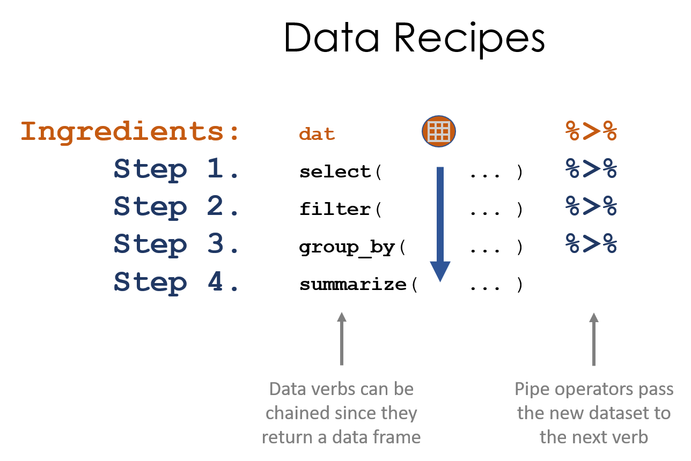

```{r setup, include=FALSE}
knitr::opts_chunk$set(echo=TRUE, message=F, warning=F)

library( pander )
```

```{r load_data, echo=F, eval=T}
URL <- "https://raw.githubusercontent.com/DS4PS/Data-Science-Class/master/DATA/syr_parcels.csv"
dat <- read.csv( URL, stringsAsFactors=FALSE )
```


## New Packages


```{r}
library( dplyr )
```

**"A Grammar of Data Manipulation"** ~ package authors

Nouns:

- vectors
- data frames

And verbs that act on these nouns:

- Subset
- Sort
- Transform a variable


## Tables

```{r, echo=F}
gender <- sample( c("Male","Female"), 100, replace=TRUE )
study.group <- sample( c("Treatment","Control"), 100, replace=TRUE )
strength <- 10*(gender=="Female") + rnorm(100,30,15)
```

Many functions in R start with a data frame (or vectors) and after some transformation they return a new data type:

```{r}
table( gender, study.group )     # returns a class() "table" 
tapply( strength, gender, mean ) # returns a class() "array"
```


## Data Verbs


```{r, fig.cap="Data verbs start with a data frame and end with a data frame.", echo=F, out.width='90%' }
knitr::include_graphics( "../TEXTBOOK/figures/data_verbs.png" )
```


## Example

```{r, echo=F}
d <- filter( dat, land_use %in% c("Vacant Land","Single Family","Commercial") )
d <- filter( d, neighborhood %in% c("Near Westside","Westcott","University Hill","Downtown") )
```


```{r}
table( d$neighborhood, d$land_use )
```

Because the function returns a table and not a data frame we can't manipulate the output to isolate just the vacant land. 

## Example

But if we use dplyr data verbs:

```{r}
count( d, neighborhood, land_use ) %>% filter( land_use == "Vacant Land" )
```


## dplyr Functions

**dplyr** verbs always return data frames (tibbles are just special data frames).

```{r}
class( count( d, neighborhood, land_use ) )
```


## Example

This is our data recipe to identify vacant land by neighborhoods:

```{r}
original.data.frame   <- d
new.data.frame        <- count( original.data.frame, neighborhood, land_use )  
filtered.data.frame   <- filter( new.data.frame, land_use == "Vacant Land" )
filtered.data.frame
```


## Example

This is the same recipe written with pipes:

```{r}
count( d, neighborhood, land_use )  %>% filter( land_use == "Vacant Land" )
```


## Example

OR:

```{r}
d %>%
  count( neighborhood, land_use )  %>%
  filter( land_use == "Vacant Land" )
```


## Data Verbs

This only works with functions that accept a data frame as the FIRST argument, and return a data frame.

```{r, eval=F}
count( d, neighborhood, land_use )  %>% filter( land_use == "Vacant Land" )
```

<br>

```{r, fig.cap="", echo=F, out.width='80%' }
knitr::include_graphics( "../TEXTBOOK/figures/data_verb_input_output.png" )
```


## Piping

```{r, fig.cap="The pipe operator passes a data frame forward through a chain of data verbs. We only reference the dataset name once, and all other times it's implicitly called through through piping.", echo=F, out.width='90%' }
knitr::include_graphics( "../TEXTBOOK/figures/chaining_data_verbs.png" )
```


## Data Recipes


```{r, fig.cap="Data recipes are written using a series of data steps. We can simplify this process using pipes", echo=F, out.width='80%' }

```


## US Baby Names

```{r}
URL <- "https://github.com/DS4PS/Data-Science-Class/blob/master/DATA/BabyNames.rds?raw=true"
names <- readRDS( gzcon( url( URL )))
names %>% head() %>% pander()
```


## Data Recipe Example

Find Top 5 Baby Boomer male names:

1. Create a subset of data for men born between 1946 and 1964. 
2. Sort by the annual count of each name in the subset. 
3. Keep only the most popular year for each name. 
4. Identify the top 10 most popular during this period. 
5. Print the results in a nice table that includes name and peak year data. 


## Data Recipe Example

Find Top 5 Baby Boomer male names:

```{r}
names %>% 
  filter( Gender =="M" & Year >= 1946 & Year <= 1964 ) %>%
  arrange( desc( Count ) ) %>%
  distinct( Name, .keep_all=T ) %>%
  top_n( 5, Count ) %>%
  select( Name, Year, Count ) %>%
  pander()
```


## dplyr Verbs

- filter()
- select()
- arrange()
- summarize()

## The group_by() Function

```{r}
d %>%  # syracuse tax parcels
  mutate( value.per.acre= assessedva / acres ) %>%
  group_by( neighborhood, land_use ) %>%
  summarize( mean(value.per.acre, na.rm=T) ) %>%
  arrange( land_use ) %>% pander()
```


