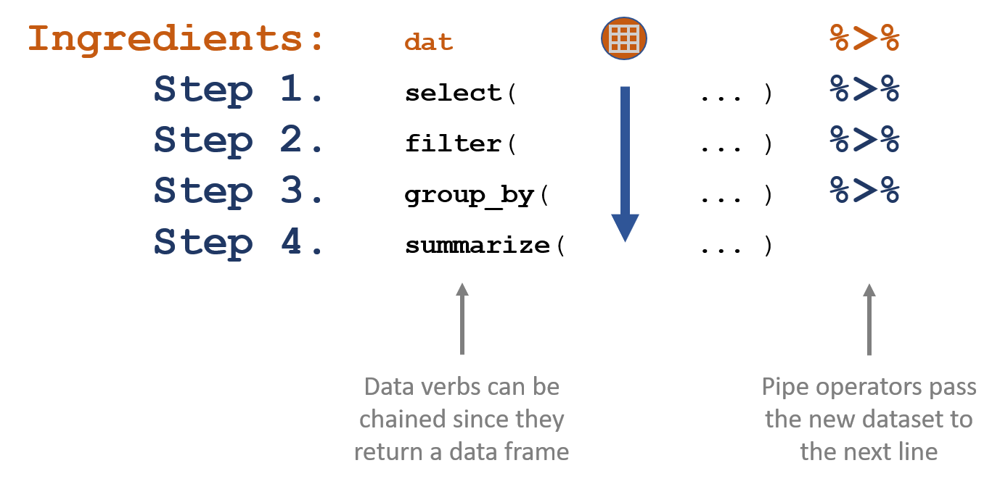
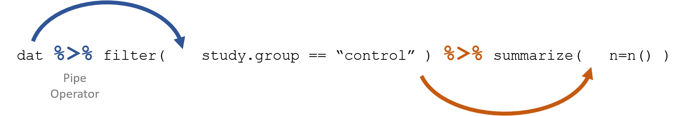

<style>
p.ex1 {
    padding-top: 10px;
}
h1, h2{
  margin-top:25px;
}
</style>


```{r setup, include=FALSE}
knitr::opts_chunk$set(echo=TRUE, message=F, warning=F)

library( pander )
library( dplyr )
```

```{r load_data, echo=F, eval=T, cache=T}
URL <- "https://raw.githubusercontent.com/DS4PS/Data-Science-Class/master/DATA/syr_parcels.csv"
dat <- read.csv( URL, stringsAsFactors=FALSE )
```

```{r, echo=F}
d <- filter( dat, 
             land_use %in% c("Vacant Land","Single Family","Commercial") &
             neighborhood %in% c("Near Westside","Westcott","University Hill","Downtown") ) 
```


## Data Recipes

```{r, echo=F, out.width='70%' }

```


## Example {.smaller}

This is our data recipe to identify vacant land by neighborhoods:

```{r, eval=F}
new.data.frame           <- count( original.data.frame, neighborhood, land_use )  
vacant.land.data.frame   <- filter( new.data.frame, land_use == "Vacant Land" )
vacant.land.data.frame
```

```{r, echo=F}
d %>% 
  count( neighborhood, land_use )  %>% 
  filter( land_use == "Vacant Land" )
```


## Example {.smaller}

This is the same recipe written with pipes:

```{r}
d %>% 
  count( neighborhood, land_use )  %>% 
  filter( land_use == "Vacant Land" )
```


## Piping {.smaller}

```{r, fig.cap="The pipe operator passes a data frame forward through a chain of data verbs. We only reference the dataset name once, and all other times it's implicitly called through through piping.", echo=F, out.width='90%' }

```


## US Baby Names {.smaller}

```{r, cache=T}
URL <- "https://github.com/DS4PS/Data-Science-Class/blob/master/DATA/BabyNames.rds?raw=true"
names <- readRDS( gzcon( url( URL )))
names %>% head() %>% pander()
```


## Data Recipe Example

Find Top 5 Male Baby Boomer Names:

1. Create a subset of data for men born between 1946 and 1964. 
2. Tally the number of times each name occurs in the dataset. 
3. Sort the list. 
4. Keep the top 5. 
 

## Data Recipe Example {.smaller}

```{r}
names %>% 
  filter( Gender =="M" & Year >= 1946 & Year <= 1964 ) %>%  # step 1
  group_by( Name ) %>% summarize( total=sum(Count) ) %>%    # step 2
  arrange( desc(total) ) %>%                                # step 3
  slice( 1:5 ) %>%                                          # step 4
  pander()
```


## Data Recipe Example 

Find Top 5 Male Baby Boomer Names for One Year:

1. Create a subset of data for men born between 1946 and 1964. 
2. Sort by the annual count of each name in the subset. 
3. Keep only the most popular year for each name. 
4. Identify the top 5 most popular during this period. 
5. Print the name and peak year data. 


## Data Recipe Example {.smaller}

```{r}
names %>% 
  filter( Gender =="M" & Year >= 1946 & Year <= 1964 ) %>%  # step 1
  arrange( desc( Count ) ) %>%                              # step 2
  distinct( Name, .keep_all=T ) %>%                         # step 3
  top_n( 5, Count ) %>%                                     # step 4
  select( Name, Year, Count ) %>%                           # step 5
  pander()
```


## Example 3

The rise and fall of Constance. 

```{r, eval=F}
library( ggvis )
names %>%
  filter( Name == "Constance" & Gender =="F" ) %>%
  select (Name, Year, Count) %>%
  ggvis( ~Year, ~Count, stroke = ~Name ) %>%
  layer_lines()
```

## Example 3

```{r, echo=F}
library( ggvis )
names %>%
  filter( Name == "Constance" & Gender =="F" ) %>%
  select (Name, Year, Count) %>%
  ggvis( ~Year, ~Count, stroke = ~Name ) %>%
  layer_lines()
```
