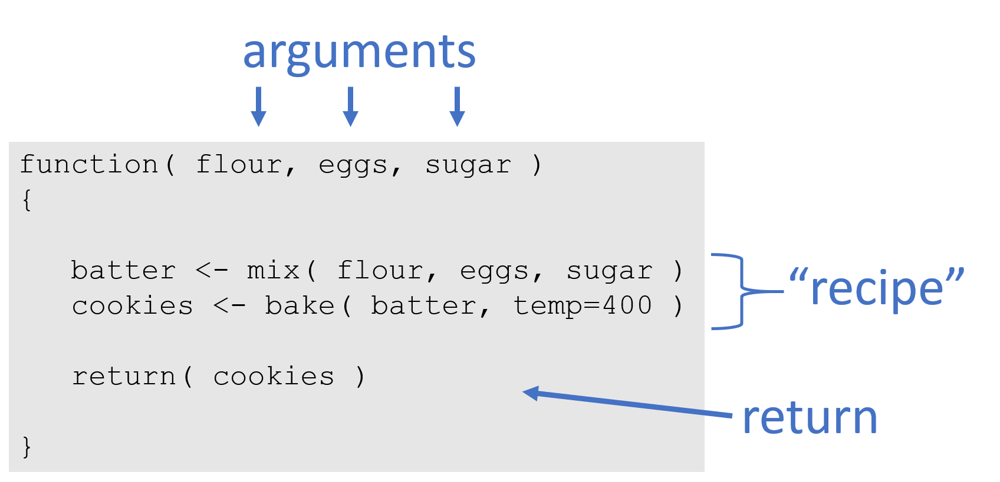

```{r setup, include=FALSE}
knitr::opts_chunk$set( echo=TRUE, message=F, warning=F )
```

## Anatomy

```{r, echo=F, fig.width=2 }

```

## Simple Function

```{r}
### A simple mortgage calculator 

   calcMortgage <- function( years, APR, principal )
   {

      months <- years * 12
      int.rate <- APR / 12
      
      # amortization formula
      monthly.payment <- ( principal * int.rate ) / 
                         (1 - (1 + int.rate)^(-months) )
      
      monthly.payment <- round( monthly.payment, 2 )
      
      return( monthly.payment )
   
   }
```


## Use

Calculate monthly payments for a:

- 30-year mortgage 
- 5% annuan interest rate 
- $100,000 loan 


```{r}
calcMortgage( years=30, APR=0.05, principal=100000  )
```

- 15-year mortgage 

```{r}
calcMortgage( years=15, APR=0.05, principal=100000  )
```

## Arguments

Note that we need to specify all argument values, or else we get an error:

```{r, eval=F}
# this will not run
calcMortgage( APR=0.05, principal=100000  )
```

*Error in calcMortgage(APR = 0.05, principal = 1e+05) :*
  *argument "years" is missing, with no default*


## Default Arguments

Sometimes we can provide pretty good guesses for default argument values. For example, we know that the most common type of loan is a 30-year fixed mortgage, and interest rates have been stable at 5% for the last year. We can include these as default values in the function:

```{r}
### A simple mortgage calculator 

   calcMortgage <- function( years=30, APR=0.05, principal )
   {

      months <- years * 12
      int.rate <- APR / 12
      
      # amortization formula
      monthly.payment <- ( principal * int.rate ) / 
                         (1 - (1 + int.rate)^(-months) )
      
      monthly.payment <- round( monthly.payment, 2 )
      
      return( monthly.payment )
   
   }
```

## Default Arguments

Now the previous code that caused an error will run fine:

```{r}
calcMortgage( APR=0.05, principal=100000  )
```

If we do not provide a loan-term, it will assume we want a 30-year mortgage. On the other hand, if we do provide an argument for the loan term, we can override the default.

```{r}
calcMortgage( years=15, APR=0.05, principal=100000  )
```

## Default Arguments

Note that we can omit years and APR, but we always need to provide the loan amount (principle), because there is no default provided. The bank is not going to guess about the loan size you want! 

When you use the R help files, it's important to pay attenion to which arguments have default values provided, and which require your input.

```{r}
args( plot.default )
```

## Default Arguments

Here is a basic scatterplot:

```{r, fig.width=5}
x <- sample( 1:100, 100 )
y <- 2*x + rnorm(100,0,10 )
plot( x, y )
```

## Default Arguments

Note that the **plot()** function provides a default for the Y argument. What type of plot is created if no Y argument is provided? 

```{r, fig.width=5}
plot( x )
```


## Assignment

When we call a function in R, the default behavior will be to print the result:

```{r}
calcMortgage( years=15, APR=0.05, principal=100000  )
```


## Assignment

```{r}
payments.15.year <- calcMortgage( years=15, APR=0.05, principal=100000  )
```

These values are then stored, and can be used later or printed by typing the object name:

```{r}
payments.15.year
```

