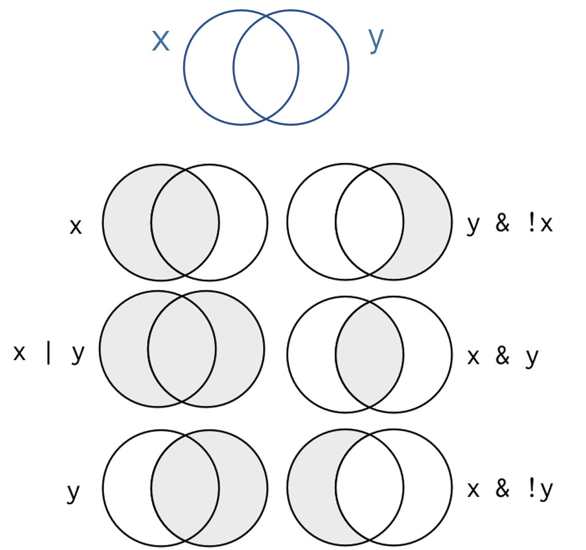

# Logical Statements


```{r, echo=F }

knitr::opts_chunk$set( echo=TRUE, message=F, warning=F, fig.width=8 )

library( dplyr )
library( Lahman )
library( pander )
```


## Key Concepts

```{r, fig.cap="Logical statements define group membership", echo=F }

```


## Operators 


Logical operators are the most basic type of data programming and the core of many types of data analysis. Most of the time we are not conducting fancy statistics, we just want to identify members of a group (print all of the females from the study), or describe things that belong to a subset of the data (compare the average price of houses with garages to houses without garages).

In order to accomplish these simple tasks we need to use logic statements. A logic statement answers the question, does an observation belong to a group.

Many times groups are simple. Show me all of the professions that make over $100k a year, for example.

Sometimes groups are complex. Identify the African American children from a specific zip code in Chicago that live in households with single mothers.

You will use nine basic logical operators:

Operator |  Description
-------- |  -----------
<        | less than
<=       | less than or equal to
 >       | greater than
>=       | greater than or equal to
==       | exactly equal to
!=	     | not equal to
x \| y	 | x OR y
x & y	   | x AND y
!        | opposite of

Logical operators create logical vectors, a vector that contains only TRUE or FALSE. The TRUE means that the observation belongs to the group, FALSE means it does not.

```{r}
x1 <- c( 7, 9, 1, 2 )

x1 > 7

x1 >= 7

x1 == 9

x1 = 9  # don't use a single equals operator!  it overwrites your variable

x1

x1 <- c(7,9,1,2)

x1 == 9 | x1 == 1


x2 <- c("male","male","female","female")

x3 <- c("treatment","control","treatment","control")

# x2 == male  # this will not work because male is not enclosed with quotes

x2 == "female"

x2 == "female" & x3 == "treatment"

```

Note that we use operators to create logical vectors where TRUE designates observation that belong to the defined group, and FALSE designates observations outside the group. We use these logical vectors in three ways:

**ONE:** We can create a selector variable that is used for subsets. When a logical vector is passed to the subset function it will keep all observations with a TRUE value, and drop observations with a FALSE value.

```{r}

x1

x1 > 5

keep.these <- x1 > 5

x1[ keep.these ]

# you can create a selector variable with one variable, and apply it to another

x2[ keep.these ]  # sex of observations where x1 > 5
```

**TWO**: Logical vectors give us an easy way to count things within defined groups. 

We can apply a **sum()** function to a logical vector, and the result will be a tally of all of the TRUE cases.


```{r}

# how many females do we have in our study?

sum( x2 == "female" )

# how many females do we have in our treatment group?

sum( x2 == "female" & x3 == "treatment" )


```

**THREE**: We use selector variables to replace observations with new values using the assignment operator. This is similar to a find and replace operation.

```{r}

x7 <- c( "mole","mouse","shrew","mouse","rat","shrew")

# the lab assistant incorrectly identified the shrews

x7

x7[ x7 == "shrew" ] <- "possum"

x7


# we don't know if linda received the treatment

x3 <- c("adam","jamal","linda","sriti")

x4 <- c( "treatment","control","treatment","control")

x4[ x3 == "linda" ] <- NA

x4

```

The **!** operator is a special case, where it is not used to define a new logical vector, but rather it swaps the values of an existing logical vector.

```{r}

x1

these <- x1 > 5

these

! these

! TRUE

! FALSE
```


## Logical Vectors

Logical vectors are collections of a set of TRUE and FALSE statements. 

Logical statements allow us to define groups based upon criteria, then decide whether observations belong to the group. A logical statement is one that contains a logical operator, and returns only TRUE, FALSE, or NA values. 

Logical vectors are important because organizing data into these sets is what drives all of the advanced data analytics (set theory is at the basis of mathematics and computer science). 

```{r, echo=F}
strength <- c(167,185,119,142)

name <- c("adam","jamal","linda","sriti")

sex <- factor( c("male","male","female","female") )

treat <- c( "treatment","control","treatment","control" )

dat <- data.frame( name, sex, treat, strength )

dat %>% pander()
```


```{r}
dat$name == "sriti"

dat$sex == "male"

dat$strength > 180
```

When defining logical vectors, you can use the abbreviated versions of T for TRUE and F for FALSE.

```{r}
z1 <- c(T,T,F,T,F,F)
z1
```


Typically logical vectors are used in combination with subset operators to identify specific groups in the data.

```{r}
# isolate data on all of the females in the dataset
dat[ dat$sex == "female" , ]
```


Note how NAs affect compound logical statements:

```{r}
TRUE & TRUE

TRUE & FALSE

TRUE & NA

FALSE & NA
```

If one condition is FALSE and the other is NA, the missing value does not matter in this case because under the & condition both must be TRUE for the observation to belong to the group we are defining with the logical statement, so it should be excluded even if we don't know the value for the second condition. For example, if we want to select all women in the treatment group, then a man is excluded from the group, even if it is unclear whether he belongs to the treatment or control condition. 

On the other hand, if one condition is TRUE, and another is NA, R does not want to throw out the data because the state of the missing value is unclear. As a result, it will preserve the observation, but it will replace all of the data with missing values.

```{r, echo=F}
dat %>% pander
```

```{r}
keep.these <- c(T,F,NA,F)
dat[ keep.these , ]
```

To remove these rows with missing values in your selector vector, replace all NAs with FALSE:

```{r}
keep.these[ is.na(keep.these) ] <- FALSE
dat[ keep.these , ]
```


## Subsets

The subset operators **[ ]** are one of the most common you will use in R.

The primary rule of subsets is to use a data operator to create a logical selector vector, and use that to generate subsets. Any observation that corresponds to TRUE will be retained, any observation that corresponds to FALSE will be dropped.

For vectors, you need to specify a single dimension. 


```{r}
these <- x1 > 140     # selector vector

these

x1[ these ]

x2[ these ]
```

For data frames, you need two dimensions (rows and columns). The two dimensions are seperated by a comma, and if you leave one blank you will not drop anything.

> dat[  row position ,  column position  ]

```{r, echo=F}
dat %>% pander
```

```{r}
these <- dat$treat == "treatment"

dat[ these , ]   # all data in the treatment group

dat[ , c("name","sex") ]  # select two columns of data

# to keep a subset as a separate dataset

dat.women <- dat[ dat$sex == "female" , ]

dat.women
  
```


Note the rules listed above about subsetting factors. After applying a subset, they will retain all of the original levels, even when they are not longer useful. You need to drop the unused levels if you would like them to be omitted from functions that use the factor levels for analysis.


```{r}

df <- data.frame( letters=LETTERS[1:5], numbers=seq(1:5) )

levels( df$letters )

sub.df <- df[ 1:3, ]

sub.df$letters

levels( sub.df$letters )

droplevels( sub.df$letters )

sub.df$letters <- droplevels( sub.df$letters )


```


