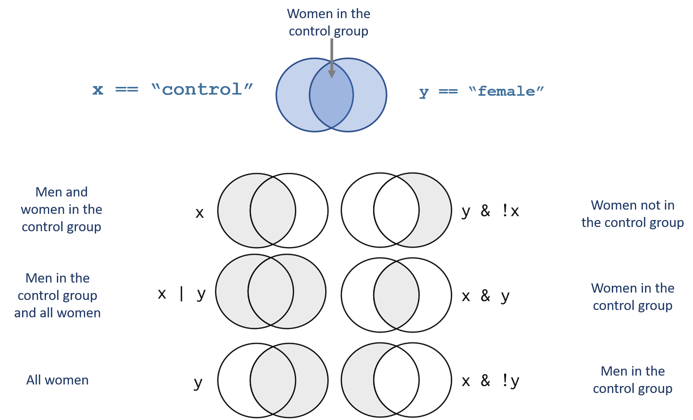

# Logical Statements


```{r, echo=F }

knitr::opts_chunk$set( echo=TRUE, message=F, warning=F, fig.width=8 )

library( dplyr )
library( Lahman )
library( pander )
```


## Key Concepts

```{r, fig.cap="Logical statements define group membership", out.width='70%', echo=F }
knitr::include_graphics( "figures/group_selection.png" )
```


Logical statements are used to translate regular language into computer code. Many of our data analysis problems start by defining our sub-groups of interest. 

> What percentage of men over 30 are bald?  

```{r, eval=F}
these <- gender == "male" & age > 30 & hair == FALSE
mean( these )
```

> Do bearded men earn more than men without beards? 

We need to make sure statements are correct. For example, the complement of "men with beards" is not men without beards, it is men without beards OR women (with or without beards). 

```{r, fig.cap="Compound statements can be tricky", out.width='60%', echo=F }
knitr::include_graphics( "figures/bearded_men.png" )
```


```{r, eval=F}
bearded.men <- gender == "male" & beard == TRUE
proper.gentlemen <- gender == "male" & beard == FALSE
mean( salary[ bearded.men ] )
mean( salary[ ! bearded.men ] )  # this is incorrect !!!
mean( salary[ proper.gentlemen ] )
```


## Operators 


Logical operators are the most basic type of data programming and the core of many types of data analysis. Most of the time we are not conducting fancy statistics, we just want to identify members of a group (print all of the females from the study), or describe things that belong to a subset of the data (compare the average price of houses with garages to houses without garages).

In order to accomplish these simple tasks we need to use logic statements. A logic statement answers the question, does an observation belong to a group.

Many times groups are simple. Show me all of the professions that make over $100k a year, for example.

Sometimes groups are complex. Identify the African American children from a specific zip code in Chicago that live in households with single mothers.

You will use nine basic logical operators:

Operator |  Description
-------- |  -----------
<        | less than
<=       | less than or equal to
 >       | greater than
>=       | greater than or equal to
==       | exactly equal to
!=	     | not equal to
x \| y	 | x OR y
x & y	   | x AND y
!        | opposite of 
[ ]       | subset

Logical operators create logical vectors, a vector that contains only TRUE or FALSE. The TRUE means that the observation belongs to the group, FALSE means it does not.

```{r}
x1 <- c( 7, 9, 1, 2 )

x1 > 7

x1 >= 7

x1 == 9 | x1 == 1

gender <- c("male","male","female","female")

gender == "female"
```

Note that the logical statement for "equals" is written with two equal signs. This is important to remember, because using a single equal sign can introduce subtle errors into your analysis. 

```{r}
x1 <- c( 7, 9, 1, 2 )

x1 == 9

x1 = 9  # don't use a single equals operator!  it overwrites your variable

x1
```

We can write compound logical statements using the AND and OR operators:

```{r}
gender <- c("male","male","female","female")

study.group <- c("treatment","control","treatment","control")

gender == "female"  &  study.group == "treatment"

gender == "female"  |  study.group == "treatment"
```


## Selector Vectors

Note that we use operators to create logical vectors where TRUE designates observation that belong to the defined group, and FALSE designates observations outside the group. The term "selector vector" is a useful way to remember this purpose. When you are doing analysis, you select specific observaions to form a group, and you can 

```{r, echo=F}
name <- c("frank","wanda","sanjay","nancy")
group <- c("treat","treat","control","control")
gender <- c("male","female","male","female")
strength <- c(27,43,19,58)
dat <- data.frame( name, gender, group, strength )
dat %>% pander
```


```{r}
these.female <- dat$gender == "female"

sum( these.female )                   # number of women in the study
mean( these.female )                  # proportion of the study that is women
dat[ these.female , ]                 # all data belonging to women
mean( dat$strength[ these.female ] )  # average outcome for women in the study
```

I will consistently name my logical vectors "these.GROUP" throughout the chapters, where GROUP represents the group label. For example, I selected women above, so the selector vector is called "these.female".  

## Usefulness of Selector Vectors

Selector vectors, i.e. logical vectors that were created by defining a group, have three main uses in our analysis. 

**ONE**: Logical vectors give us an easy way to count things within defined groups. 

We can apply a **sum()** function to a logical vector, and the result will be a tally of all of the TRUE cases. The **mean()** function will give us the proportion of the sample that belongs to our defined group.


```{r}
# how many females do we have in our study?

sum( gender == "female" )

# how many females do we have in our treatment group?

sum( gender == "female" & study.group == "treatment" )

# what proportion of our study are men? 

mean( gender == "male" )
```

**TWO:** We can create a selector variable that is used for subsets. A selector vector used in a subset operator will drop all observations that are FALSE, isolating data belonging to the group:

```{r}
these.female <- gender == "female"
name[ these.female ]
strength[ these.female ]
```

Or we can create a subset of the full dataset:

```{r, eval=F}
dat[ these.female , ]
```

```{r, echo=F}
dat[ these.female, ] %>% pander
```


**THREE**: We use selector variables to replace observations with new values using the assignment operator. This is similar to a find and replace operation.

```{r}
animals <- c( "mole", "mouse", "shrew", "mouse", "rat", "shrew" )

# the lab assistant incorrectly identified the shrews

animals

animals[ animals == "shrew" ] <- "possum"

animals
```


We don't know if linda received the treatment:

```{r, echo=F}
name <- c("adam","jamal","linda","sriti")

study.group <- c( "treatment","control","treatment","control")

data.frame( name, study.group ) %>% pander()
```

```{r}
study.group[ name == "linda" ] <- NA

study.group
```


The **!** operator is a special case, where it is not used to define a new logical vector, but rather it swaps the values of an existing logical vector.

```{r}
x1 <- c(7,9,1,2)

these <- x1 > 5

these

! these

! TRUE

! FALSE
```


## Compound Logical Statements

We can combine multiple logical statements using the AND, OR, and NOT operators ( &, |, ! ). This functionality gives us an incredible ability to specify very granular groups within our analysis. This will be important as we begin to construct analysis in a way that we search for apples to apples comparisons within our data in order to make inferences about program effectiveness. 

These statements require some precision, however. Use care when applying that AND, OR, and NOT operators as to not include unintended data in your sample. In the example above, the statement "NOT bearded men" does not mean men without beards. It means all people outside of the category of men without beards (the "complement"), which includes women with or without beards as well. 

```
! ( gender == "male" & beard == TRUE )
```
Also note that parentheses matter. Compare this statement to the statement above:

```
! gender == "male" & beard == TRUE
```
Because we excluded the parentheses this statement now defines the group "NOT men AND with beards", or bearded women. 

```{r, fig.cap="Examples of group construction with compound statements", out.width='60%', echo=F }

```


## NAs in Logical Statements

Recall that missing values are an extremely important concept in statistics. If one-third of our survey sample reports that they never smoked pot, one-third reports they have smoked pot, and one-third did not answer the question, then what do we report for the proportion of the population that has smoked pot? 

We might prefer to be cautious and count only the people that have confirmed they have smoked pot, resulting in an estimate of 33.3%. 

If we throw out the missing data, then 50% of respondents have smoked pot.

If we assume those that refuse to answer have likely smoked pot, our estimate might be 66.6% of the sample. 

These different results are a function of how we treat the missing data in our survey, so it is important that we can keep track of missing values, especially during subset operations. 


Note how NAs effect compound logical statements:

```{r}
TRUE & TRUE

TRUE & FALSE

TRUE & NA

FALSE & NA
```

To make sense of these rules consider the following: 

If one condition is already FALSE, the missing value does not matter because under the & condition BOTH must be TRUE for the observation to belong to our defined group. After we know that one of the conditions is FALSE the missing value is irrelevant. For example, if we want to select all women in the treatment group, and we have a man with an unclear treatment group status, he is still excluded from the group because he is a man. 

On the other hand, if one condition is TRUE, and another is NA, R does not want to throw out the data because the state of the missing value is unclear. As a result, it will preserve the observation, but it will replace all of the data with missing values to signal the lack of certainty associated with that observation.

```{r, echo=F}
dat %>% pander
```

```{r}
keep.these <- c(T,F,NA,F)
dat[ keep.these , ]
```

To remove these rows with missing values in your selector vector, replace all NAs with FALSE:

```{r}
keep.these[ is.na(keep.these) ] <- FALSE
dat[ keep.these , ]
```


## Subsets

The subset operators **[ ]** are one of the most common you will use in R.

The primary rule of subsets is to use a data operator to create a logical selector vector, and use that to generate subsets. Any observation that corresponds to TRUE will be retained, any observation that corresponds to FALSE will be dropped.

For vectors, you need to specify a single dimension. 


```{r, echo=F}
name <- c("frank","wanda","sanjay","nancy")
group <- c("treat","treat","control","control")
gender <- c("male","female","male","female")
strength <- c(27,43,19,58)
dat <- data.frame( name, gender, group, strength )
dat %>% pander
```

```{r}
these.treat <- dat$group == "treat"
name[ these.treat ]
strength[ these.treat ]
```


For data frames, you need two dimensions (rows and columns). The two dimensions are seperated by a comma, and if you leave one blank you will not drop anything.

> dat[  row position ,  column position  ]


```{r}
these.control <- dat$group == "control"

dat[ these.control , ]   # all data in the control group

dat[ , c("name","gender") ]  # select two columns of data

# to keep a subset as a separate dataset

dat.women <- dat[ dat$gender == "female" , ]

dat.women
  
```


Note the rules listed above about subsetting factors. After applying a subset, they will retain all of the original levels, even when they are not longer useful. You need to drop the unused levels if you would like them to be omitted from functions that use the factor levels for analysis.


```{r}

df <- data.frame( letters=LETTERS[1:5], numbers=seq(1:5) )

levels( df$letters )

sub.df <- df[ 1:3, ]

sub.df$letters

levels( sub.df$letters )

droplevels( sub.df$letters )

sub.df$letters <- droplevels( sub.df$letters )


```


