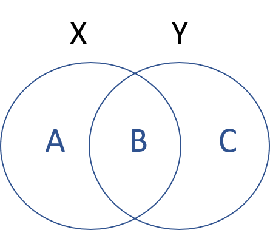

--- 
title: "Intro to Data Science for the Social Sector"
author: "Jesse Lecy"
date: "Updated `r format(Sys.time(), '%B %d, %Y')`"
site: bookdown::bookdown_site
output: bookdown::gitbook
documentclass: book
bibliography: [book.bib, packages.bib]
biblio-style: apalike
link-citations: yes
description: "This is an introductory text to data science designed for social science graduate students in public affairs, nonprofit management, and international development."
---
```{r include=FALSE, cache=FALSE}
knitr::opts_chunk$set(
  warning = FALSE,
  message = FALSE,
  comment = "#>",
  collapse = TRUE,
  cache = TRUE,
  out.width = "70%",
  fig.align = 'center',
  fig.width = 6,
  fig.asp = 0.618,  # 1 / phi
  fig.show = "hold"
)

library( dplyr )
library( pander )

options( dplyr.print_min = 6, dplyr.print_max = 6 )
```

# Welcome {-}

Welcome to the course text for Data Science for the Social Sector.

This course introduces students to the field of data science and its applications in the public sector. Modern performance management and evaluation processes require strong data literacy and the ability to combine and analyze data from a variety of sources to inform managerial processes. We offer a practical, tools-based approach that is designed to build strong foundations for people that want to work as policy analysts or data-driven managers. We will cover data programming fundamentals, visualization, text analysis, automated reporting, and dynamic reporting using dashboards. The course is analytically rigorous, but no prior programming experience is assumed.

> A data scientist is a person who should be able to leverage existing data sources, and create new ones as needed in order to extract meaningful information and actionable insights. These insights can be used to drive business decisions and changes intended to achieve business goals… ‘The Perfect Data Scientist’ is the individual who is equally strong in business, programming, statistics, and communication.

From: ["What Is Data Science, and What Does a Data Scientist Do?"](https://www.innoarchitech.com/what-is-data-science-does-data-scientist-do/)

<br>

**The Data Science Process:**


```{r include=FALSE}
# automatically create a bib database for R packages
knitr::write_bib(c(
  .packages(), 'bookdown', 'knitr', 'rmarkdown'
), 'packages.bib')
```

<!--chapter:end:index.Rmd-->

```{r include=FALSE, cache=FALSE}
knitr::opts_chunk$set(
  warning = FALSE,
  message = FALSE,
  comment = "#>",
  collapse = TRUE,
  cache = TRUE,
  out.width = "70%",
  fig.align = 'center',
  fig.width = 6,
  fig.asp = 0.618,  # 1 / phi
  fig.show = "hold"
)

library( dplyr )
library( pander )

options( dplyr.print_min = 6, dplyr.print_max = 6 )
```
# (PART) PART I: DATA PROGRAMMING {-}


# Introduction to R

This lecture introduces you to basic operations when you first start using R such as navigation, the object-oriented framework, loading a package, and creating some data vectors.

## Navigation

You need to know a few operations to help you maneuver the R work environment, such as listing objects (datasets and functions) that are active, changing your working directory, listing available files, and finding help.

### Setting Your Working Directory

When you are ready to load data, R needs to know where to look for your files. You can check what is avaiable in the current directory (i.e. folder) by asking to list all of the current files using **dir()**.


```{r, eval=F}
dir()
```

If the file that you need is located in a different folder, you can change directories easily in R Studio by Session -> Set working director -> Choose directory (or Ctrl + Shift + H).

If you are writing a script, you want to keep track of this step so that it can be reproduced. Use the function **get.wd()** to check your current working directory, and **set.wd()** to change. You need to specify your path as an argument to this function, such as.


```{r, eval=F}
setwd( "C:/user/projects/financial model" )
```


NOTE! R uses unix style notation with forward slashes, so if you copy and paste from Windows it will look like this, with back slashes:

```{r, eval=F}
setwd( "C:\user\projects\financial model" )
```

You will need to change them around for it to work.

It is best to save all of your steps in your scripts so that the analysis can be reproduced by yourself or others. In some cases you are doing exploratory or summary work, and you may want to find a file a quickly. You can use the **file.choose()** function to open a GUI to select your file directly. This function is used as an argument inside of a load data function.

```{r, eval=F}
my.dat <- read.csv( file.choose() )
```


## Commenting Code

Most computer languages have a special character that is used to "comment out" lines so that it is not run by the program. It is used for two important purposes. First, we can add text to document our functions and it will not interfere with the program. And two, we can use it to run a program while ignoring some of the code, often for debugging purposes.

The **#** hash tag is used for comments in R.

```{r}

##==============================================
##
##  Here is some documentation for this script
##
##==============================================

x <- 1:10

sum( x )

# y <- 1:25     # not run

# sum( y )      # not run

```


## Help

You will use the help functions frequently to figure out what arguments and values are needed for specific functions. Because R is very customizable, you will find that many functions have several or dozens of arguments, and it is difficult to remember the correct syntax and values. But don't worry, to look them up all you need is the function name and a call for help:


> help( dotchart )  # opens an external helpfile


If you just need to remind yourself which arguments are defined in a function, you can use the *args()* command:

```{r}
args( dotchart )
```

If you can't recall a function name, you can list all of the functions from a specific package as follows:

> help( package="stats" )   # lists all functions in stats package


## Install Programs (packages)

When you open R by default it will launch a core set of programs, called "packages" in R speak, that are use for most data operations. To see which packages are currently active use the **search()** function.

```{r}
search()
```

These programs manage the basic data operations, run the core graphics engine, and give you basic statistical methods.

The real magic for R comes from the over 7,000 contributed packages available on the CRAN: https://cran.r-project.org/web/views/

A package consists of custom functions and datasets that are generated by users. They are *packaged* together so that they can be shared with others. A package also includes documentation that describes each function, defines all of the arguments, and documents any datasets that are included.

If you know a package name, it is easy to install. In R Studio you can select Tools -> Install Packages and a list of available packages will be generated. But it is easier to use the **install.packages()** command. We will use the Lahman Package in this course, so let's install that now.

**Description** _This package provides the tables from Sean Lahman's
Baseball Database as a set of R data.frames. It uses the data
on pitching, hitting and fielding performance and other tables
from 1871 through 2013, as recorded in the 2014 version of the
database._

See the documentation here: https://cran.r-project.org/web/packages/Lahman/Lahman.pdf


```{r, eval=F}

install.packages( "Lahman" )

```

You will be asked to select a "mirror". In R speak this just means the server from which you will download the package (choose anything nearby). R is a community of developers and universities that create code and maintain the infrastructure. A couple of dozen universities around the world host servers that contain copies of the R packages so that they can be easily accessed everywhere.

If the package is successfully installed you will get a message similar to this:

> package 'Lahman' successfully unpacked and MD5 sums checked

Once a new program is installed you can now open ("load" in R speak) the package using the **library()** command:

```{r, eval=F}
library( "Lahman" )
```

If you now type **search()** you can see that Lahman has been added to the list of active programs. We can now access all of the functions and data that are available in the Lahman package.


## Accessing Built-In Datasets in R

One nice feature of R is that is comes with a bunch of built-in datasets that have been contributed by users are are loaded automatically. You can see the list of available datasets by typing:

```{r, eval=F}
data()

```

This will list all of the default datasets in core R packages. If you want to see all of the datasets available in installed packages as well use:

```{r, eval=F}
data( package = .packages(all.available = TRUE) )
```

### Basic Data Operations

Let's ignore the underlying data structure right now and look at some ways that we might interact with data.

We will use the **USArrests** dataset available in the core files.

To access the data we need to load it into working memory. Anything that is active in R will be listed in the environment, which you can check using the **ls()** command. We will load the dataset using the **data()** command.

```{r, eacho=F}
remove( list=ls() )
```


```{r}

ls() # nothing currently available

data( "USArrests" )

ls() # data is now avaible for use


```

Now that we have loaded a dataset, we can start to access the variables and analyze relationships. Let's get to know our dataset.

```{r}

names( USArrests )  # what variables are in the dataset?

nrow( USArrests )   # how many observations are there?

dim( USArrests )    # a quick way to see rows and columns - the dimensions of the dataset

row.names( head( USArrests ) )   # what are the obsevations (rows) in our data

summary( USArrests )   # summary statistics of variables

```

We can see that the dataset consists of four variables: Murder, Assault, UrbanPop, and Rape. We also see that our unit of analysis is the state. But where does the data come from, and how are these variables measured?

To see the documentation for a specific dataset you will need to use the **help()** function:

```{r, eval=F}
help( "USArrests" )
```

We get valuable information about the source and metrics:

**Description** *This data set contains statistics, in arrests per 100,000 residents for assault, murder, and rape in each of the 50 US states in 1973. Also given is the percent of the population living in urban areas.*

**Format** *A data frame with 50 observations on 4 variables.*

* **Murder**:	numeric	Murder arrests (per 100,000) 
* **Assault**:	numeric	Assault arrests (per 100,000)
* **UrbanPop**:	numeric	Percent urban population
* **Rape**:	numeric	Rape arrests (per 100,000)
 
 
To access a specific variable inside of a dataset, you will use the *$* operator between the dataset name and the variable name:

```{r}

summary( USArrests$Murder )
summary( USArrests$Assault )

# Is there a relationship between urban density and crime?

plot( USArrests$UrbanPop, USArrests$Murder )
abline( lm( USArrests$Murder ~ USArrests$UrbanPop ), col="red" )

```


### Using the Lahman Data

Let's take a look at some of the data available in the Lahman package.

```{r, eval=F}

data( package = "Lahman" ) # All datasets in package ‘Lahman’:

```

TABLE NAME        |   DEFITION
------------------|---------------------
AllstarFull   |   AllstarFull table
Appearances   |   Appearances table
AwardsManagers   |   AwardsManagers table
AwardsPlayers   |   AwardsPlayers table
AwardsShareManagers   |   AwardsShareManagers table
AwardsSharePlayers   |   AwardsSharePlayers table
Batting   |   Batting table
BattingPost   |   BattingPost table
CollegePlaying   |   CollegePlaying table
Fielding   |   Fielding table
FieldingOF   |   FieldingOF table
FieldingPost   |   FieldingPost data
HallOfFame    |   Hall of Fame Voting Data
LahmanData   |   Lahman Datasets
Managers   |    Managers table
ManagersHalf   |   ManagersHalf table
Master   |   Master table
Pitching   |   Pitching table
PitchingPost   |   PitchingPost table
Salaries   |   Salaries table
Schools   |   Schools table
SeriesPost   |   SeriesPost table
Teams    |   Teams table
TeamsFranchises   |   TeamFranchises table
TeamsHalf    |    TeamsHalf table
battingLabels   |   Variable Labels
fieldingLabels   |    Variable Labels
pitchingLabels   |   Variable Labels  


We see that we have lots of datasets to choose from here. I will use the Master dataset, which is a list of all of the Major League Baseball players over the past century, and their personal information. 

```{r, eval=F}

library( Lahman )    # loads Lahman package
data( Master )
head( Master ) 

```


Here are some common functions for exploring datasets:

```{r, eval=F}
names( Master )      # variable names
nrow( Master )       # 18,354 players included
summary( Master )    # descriptive statistics of variables
```


We can use **help(Master)** to get information about the dataset, including a data dictionary.

```{r, eval=F}

help( Master )

```


**MASTER TABLE**

-------------------

**Description**

Master table - Player names, DOB, and biographical info. This file is to be used to get details about players listed in the Batting, Pitching, and other files where players are identified only by playerID.

**Usage**

data(Master)

**Format**

A data frame with 19105 observations on the following 26 variables.

* **playerID**: A unique code asssigned to each player. The playerID links the data in this file with records on players in the other files. 
* **birthYear**: Year player was born 
* **birthMonth**: Month player was born 
* **birthDay**: Day player was born 
* **birthCountry**: Country where player was born 
* **birthState**: State where player was born 
* **birthCity**: City where player was born 
* **deathYear**: Year player died 
* **deathMonth**: Month player died 
* **deathDay**: Day player died 
* **deathCountry**: Country where player died 
* **deathState**: State where player died 
* **deathCity**: City where player died 
* **nameFirst**: Player's first name 
* **nameLast**: Player's last name 
* **nameGiven**: Player's given name (typically first and middle) 
* **weight**: Player's weight in pounds 
* **height**: Player's height in inches 
* **bats**: a factor: Player's batting hand (left (L), right (R), or both (B)) 
* **throws**: a factor: Player's throwing hand (left(L) or right(R)) 
* **debut**: Date that player made first major league appearance 
* **finalGame**: Date that player made first major league appearance (blank if still active) 
* **retroID**: ID used by retrosheet, http://www.retrosheet.org/ 
* **bbrefID**: ID used by Baseball Reference website, http://www.baseball-reference.com/ 
* **birthDate**: Player's birthdate, in as.Date format 
* **deathDate**: Player's deathdate, in as.Date format 
 
**Details**

debut, finalGame were converted from character strings with as.Date.

**Source**

Lahman, S. (2016) Lahman's Baseball Database, 1871-2015, 2015 version, http://www.seanlahman.com/baseball-archive/statistics/


### Example Analysis

Perhaps I am curious about some of the data. I see that we have information on the birth month of professional baseball players. If you have read Malcolm Gladwell's book *Outliers* you know there is an interesting cumulative advantage phenomenon that can occur with atheletes as they are young. If you are born near the end of the cutoff, you are on average six months older than other players in your league, and therefore slightly larger physically and more coordinated on average. Six months does not sound like much, but the slight size and coordination advantage means more playing time, which also improves skill. Over time, this small difference accumulates so that those lucky enough to be born near the cutoff become the best players.

Gladwell looked at studies of hockey. Do we see this in baseball?


```{r, warning=FALSE, eval=F}

table( Master$birthMonth )

tab <- prop.table( table( Master$birthMonth ) )

names(tab) <- c("Jan","Feb","Mar","Apr","May","Jun","Jul","Aug","Sep","Oct","Nov","Dec")

dotchart( tab, pch=19, xlab = "Percent of Players", ylab = "Birth Month" ) 

```


<!--chapter:end:CH-01-introduction-to-r.Rmd-->

```{r include=FALSE, cache=FALSE}
knitr::opts_chunk$set(
  warning = FALSE,
  message = FALSE,
  comment = "#>",
  collapse = TRUE,
  cache = TRUE,
  out.width = "70%",
  fig.align = 'center',
  fig.width = 6,
  fig.asp = 0.618,  # 1 / phi
  fig.show = "hold"
)

library( dplyr )
library( pander )

options( dplyr.print_min = 6, dplyr.print_max = 6 )
```
# Functions


```{r, echo=F }

knitr::opts_chunk$set( echo = TRUE, message=F, warning=F, fig.width=8 )

```


## Key Concepts


```{r, fig.cap="Components of a Function", echo=F }
knitr::include_graphics( "figures/function.png" )
```

After reading this chapter, the following vocabulary should be clear:

* script
* function
* argument
* return value
* assignment

## Computer Programs as Recipes

Computer programs are powerful because they allow us to codify recipes for complex tasks, save them, share them, and build upon them. 

In the simplest form, a computer program is like a recipe. It is a set of steps completed in order with the goal of 

<!--chapter:end:CH-02-functions.Rmd-->

```{r include=FALSE, cache=FALSE}
knitr::opts_chunk$set(
  warning = FALSE,
  message = FALSE,
  comment = "#>",
  collapse = TRUE,
  cache = TRUE,
  out.width = "70%",
  fig.align = 'center',
  fig.width = 6,
  fig.asp = 0.618,  # 1 / phi
  fig.show = "hold"
)

library( dplyr )
library( pander )

options( dplyr.print_min = 6, dplyr.print_max = 6 )
```
# Data Structures


```{r, echo=F }

knitr::opts_chunk$set( echo = TRUE, message=F, warning=F, fig.width=8 )

library( dplyr )
library( Lahman )
```


## Key Concepts

```{r, fig.cap="Components of a Vector", echo=F }
knitr::include_graphics( "figures/vectors.png" )
```

```{r, fig.cap="Basic data types in R", echo=F }
knitr::include_graphics( "figures/data_types.png" )
```


## Vectors

Vectors are the building blocks of data programming in R, so they are extremely important concepts. 

Very loosely speaking a vector is a set of numbers, words, or other values:

* [ 1, 2, 3]
* [ apple, orange, pear ]
* [ TRUE, FALSE, FALSE ]

In social sciences, a vector usually represents a variable in a dataset.

There are four primary vector types ("classes") in R: 


Class      | Description
---------- | -----------
numeric    | Typical variable of only numbers
character  | A vector of letters or words, always enclosed with quotes
factor     | Categories which represent groups, like treatment and control
logical    | A vector of TRUE and FALSE to designate which observations fit a criteria

Each vector or dataset has a "class" that tells R the data type.

These different vectors can be combined into three different types of datasets (data frames, matrices, and lists), which will be discussed below.

```{r}

x1 <- c(167,185,119,142)

x2 <- c("adam","jamal","linda","sriti")

x3 <- factor( c("male","male","female","female") )

x4 <- c( "treatment","control","treatment","control" )

x5 <- x4 == "treatment"

dat <- data.frame( name=x2, sex=x3, treat=x4, is.treat=x5, strength=x1 )

```

```{r, echo=F}
dat <- data.frame( name=x2, sex=x3, treat=x4, is.treat=x5, strength=x1, stringsAsFactors=F )
dat %>% pander
```

R keeps track of the data type of each object, which can be ascertained using the **class()** function.

```{r, eval=F}
class( x )
```

```{r, echo=F}
lapply( dat, class )
```


```{r}
class( dat )
```


## Common Vectors Functions

You will spend a lot of time creating data vectors, transforming variables, generating subsets, cleaning data, and adding new observations. These are all accomplished through **functions()** that act on vectors.

We often need to know how many elements belong to a vector, which we find with the **length()** function.

```{r}
x1

length( x1 )

```


## The Combine Function

We often need to combine several elements into a single vector, or combine two vectors to form one. This is done using the **c()** function.

```{r}

c(1,2,3)        # create a numeric vector

c("a","b","c")  # create a character vector

```


Combining two vectors:

```{r}

x <- 1:5

y <- 10:15

z <- c(x,y)

z
```

Combining two vectors of different data types:


```{r}
x <- c(1,2,3)

y <- c("a","b","c")

z <- c(x,y)

z
```


## Casting

You can easily move from one data type to another by **casting** a specific type as another type:

```{r}

x <- 1:5

x

as.character(x)

y <- c(TRUE, FALSE, TRUE, TRUE, FALSE)

y

as.numeric( y )

as.character( y )

```

But in some cases it might not make sense to cast one variable type as another.

```{r}

z <- c("a", "b", "c")

z

as.numeric( z )

```


Casting will often be induced automatically when you try to combine different types of data. For example, when you add a character element to a numeric vector, the whole vector will be cast as a character vector. 

```{r}

x1 <- 1:5
x1

x1 <- c( x1, "a" ) # a vector can only have one data type

x1 # all numbers silently recast as characters

```


If you consider the example above, when a numeric and character vector are combined all elements are re-cast as strings because numbers can be represented as characters but not vice-versa. R tries to select a reasonable default type, but sometimes casting will create some strange and unexpected behaviors. Consider some of these examples. What do you think each will produce? 

```{r}

x1 <- c(1,2,3)                    # numeric
x2 <- c("a","b","c")              # character
x3 <- c(TRUE,FALSE,TRUE)          # logical
x4 <- factor( c("a","b","c") )    # factor

case1 <- c( x1, x3 )

case2 <- c( x2, x3 )

case3 <- c( x1, x4 )

case4 <- c( x2, x4 )

```

The answers to *case1* and *case2* are somewhat intuitive. 

```{r}
case1  # combine a numeric and logical vector

case2  # combine a character and logical vector
```

Recall that TRUE and FALSE are often represented as 1 and 0 in datasets, so they can be recast as numeric elements. The numbers 2 and 3 have no meaning in a logical vector, so we can't cast a numeric vector as a logical vector.


*case3* and *case4* are a little more nuanced. See the section on factors below to make sense of them.

```{r}
case3  # combine a numeric and factor vector

case4  # combine a character and factor vector
```


TIP: When you read data in from outside sources, the input functions often will cast character or numeric vectors as factors if they contain a low number of elements. See the section on factors below for special instructions on moving from factors to numeric vectors.


## Numeric Vectors

There are some specific things to note about each vector type.

Math operators will only work on numeric vectors.

```{r}

summary( x1 )

```

Note that if we try to run this mathematicl function we get an error:

```{r, eval=F}

sum( x2 ) # Error in sum(x2) : invalid 'type' (character) of argument

```

Many functions in R are sensitive to the data type of vectors. Mathematical functions, for example, do not make sense when applied to text (character vectors). In many cases R will give an error. In some cases R will silently re-cast the variable, then perform the operation. Be watchful for when silent re-casting occurs because it might have unwanted side effects, such as deleting data or re-coding group levels in the wrong way. 


### Integers Are Simple Numeric Vectors

The integer vector is a special type of numeric vector. It is used to save memory since integers require less space than numbers that contain decimals points (you need to allocate space for the numbers to the left and the numbers to the right of the decimal). Google "computer memory allocation" if you are interested in the specifics. 

If you are doing advanced programming you will be more sensitive to memory allocation and the speed of your code, but in the intro class we will not differentiate between the two types of number vectors. In *most* cases they result in the same results, unless you are doing advanced numerical analysis where rounding errors matter.


```{r}

n <- 1:5

n

class( n )

n[ 2 ] <- 2.01

n  # all elements converted to decimals

class( n )

```


## Character Vectors

The most important rule to remember with this data type: when creating character vectors, all text must be enclosed by quotation marks.

This one works:

```{r}

c( "a", "b", "c" )   # this works

```

This one will not:

```{r, eval=F}
c( a, b, c )  
# Error: object 'a' not found
```

When you type characters surrounded by quotes then R knows you are creating new text ("strings" in programming speak). When you type characters that are not surrounded by quotes, R thinks that you are looking for an object in the environment, like the variables we have already created. It gets confused when it doesn't find the object that you typed.

In generate, you will use quotes when you are creating character vectors, and for arguments in functions. You do not use quotes when you are referencing an active object.

```{r}


plot( 1:4, col="blue", pch=19, cex=4 )   # text used for color argument, use quotes

# what if we want colors that represent groups in our data

group <- factor( c("treatment","control","treatment","control") )

plot( 1:4, col=group, pch=19, cex=4 )       # object used for color argument, no quotes

```

Recall that x3 is the sex of study participants, so the different colors represent the different genders in the study.


## Logical Vectors

Logical vectors are collections of a set of TRUE and FALSE statements. 

Logical statements allow us to define groups based upon criteria, then decide whether observations belong to the group. See the section on **operators** below for a complete list of logical statements.

Logical vectors are important because organizing data into these sets is what drives all of the advanced data analytics (set theory is at the basis of mathematics and computer science). 


```{r}
dat

dat$name == "sriti"

dat$sex == "male"

dat$strength > 180

```

Typically logical vectors are used in combination with subset operators to identify specific groups in the data.

```{r}
dat

# isolate data on all of the females in the dataset

dat[ dat$sex == "female" , ]

```

When defining logical vectors, you can use the abbreviated versions of T for TRUE and F for FALSE.

```{r}

z1 <- c(T,T,F,T,F,F)

z1

```

Note how NAs affect complex logical statements:

```{r}

TRUE & TRUE

TRUE & FALSE

TRUE & NA

FALSE & NA

```

If one condition is TRUE, and another is NA, R does not want to throw out the data because the state of the missing value is unclear. As a result, it will preserve the observation, but it will replace all of the data with missing values:

```{r}

dat

keep.these <- c(T,F,NA,F)

dat[ keep.these , ]

```

To remove these rows, replace all NAs in your selector vector with FALSE:

```{r}
keep.these[ is.na(keep.these) ] <- FALSE

dat[ keep.these , ]
```


## Factors

When there are categorical variables within our data, or groups, then we use a special vector to keep track of these groups. We could just use numbers (1=female, 0=male) or characters ("male","female"), but factors are useful for two reasons.

First, it saves memory. Text is very "expensive" in terms of memory allocation and processing speed, so using simpler data structure makes R faster. 

Second, when a variable is set as a factor, R recognizes that it represents a group and it can deploy object-oriented functionality. When you use a factor in analysis, R knows that you want to split the analysis up by groups.

```{r}

height <- c( 70, 68, 62, 64, 72, 69, 58, 63  )

strength <- c(167,185,119,142,175,204,124,117)

sex <- factor( c("male","male","female","female","male","male","female","female" ) )

plot( height, strength )   # simple scatter plot

plot( sex, strength )      # box and whisker plot       

```

Factors are more memory efficient than character vectors because they store the underlying data as a numeric vector instead of a categorical (text) vector. Each group in the data is assigned a number, and when printing items the program only has to remember which group corresponds to which number:

```{r}
sex

as.numeric( sex )

#  male = 2
#  female = 1
```

If you print a factor, the computer just replaces each category designation with its name (2 would be replaced with "male" in this example). These replacements can be done in real time without clogging the memory of your computer as they don't need to be saved.

In some instances a categorical variable might be represented by numbers. For example, grades 9-12 for high school kids. The **very important** rule to remember with factors is you can't move directly from the factor to numeric using the **as.numeric()** casting function. This will give you the underlying data structure, but will not give you the category names. To get these, you need the **as.character** casting function.

```{r}

grades <- sample( x=9:12, size=10, replace=T )

grades

grades <- as.factor( grades )

grades

as.numeric( grades )

as.character( grades )

# to get back to the original numeric vector

as.numeric( as.character( grades ))


```

Note that when subsetting a factor, it will retain all of the original levels, even when they are not in use. 

In this example, there are 37 teams in the Lahman dataset (some of them defunct) and 16 teams in the National League in 2002. But after applying the year and league subsets you will still have 37 levels.

```{r}

# there are only 16 teams in the NL in 2002

sals.2002 <- Salaries [Salaries$yearID=="2002", ]
nl.sals <- sals.2002 [ sals.2002$lgID == "NL",]
levels( nl.sals$teamID )

```


After applying a subset, in order to remove the unused factor levels you need to apply either droplevels(), or else recast your factor as a new factor.

For example:

```{r}

sals.2002 <- Salaries [Salaries$yearID=="2002", ]

nl.sals <- sals.2002 [ sals.2002$lgID == "NL",]
levels( nl.sals$teamID )

# fix in one of two equivalent ways:
#
# nl.sals$teamID <- droplevels( nl.sals$teamID )
# nl.sals$teamID <- factor( nl.sals$teamID )

levels( nl.sals$teamID )
nl.sals$teamID <- droplevels( nl.sals$teamID )
levels( nl.sals$teamID )


```


TIP: When reading data from Excel spreadsheets (usually saved in the comma separated value or CSV format), remember to include the following argument to prevent the creation of factors, which can produce some annoying behaviors.

```{r, eval=F}

dat <- read.csv( "filename.csv", stringsAsFactors=F )
```


## Generating Vectors

You will often need to generate vectors for data transformations or simulations. Here are the most common functions that will be helpful.

```{r}

# repeat a number, or series of numbers

rep( x=9, times=5 )

rep( x=c(5,7), times=5 )

rep( x=c(5,7), each=5 )

rep( x=c("treatment","control"), each=5 )  # also works to create categories


# create a sequence of numbers

seq( from=1, to=15, by=1 )

seq( from=1, to=15, by=3 )

1:15   # shorthand if by=1


# create a random sample

hat <- c("a","b","c","b","f")

sample( x=hat, size=3, replace=FALSE )
sample( x=hat, size=3, replace=FALSE )
sample( x=hat, size=3, replace=FALSE )

# for multiple samples use replacement

sample( x=hat, size=10, replace=TRUE )


# create data that follows a normal curve

iq <- rnorm( n=1000, mean=100, sd=15 )

hist( iq, col="gray" )


```


# Operators 


Logical operators are the most basic type of data programming and the core of many types of data analysis. Most of the time we are not conducting fancy statistics, we just want to identify members of a group (print all of the females from the study), or describe things that belong to a subset of the data (compare the average price of houses with garages to houses without garages).

In order to accomplish these simple tasks we need to use logic statements. A logic statement answers the question, does an observation belong to a group.

Many times groups are simple. Show me all of the professions that make over $100k a year, for example.

Sometimes groups are complex. Identify the African American children from a specific zip code in Chicago that live in households with single mothers.

You will use nine basic logical operators:

Operator |  Description
-------- |  -----------
<        | less than
<=       | less than or equal to
 >       | greater than
>=       | greater than or equal to
==       | exactly equal to
!=	     | not equal to
x \| y	 | x OR y
x & y	   | x AND y
!        | opposite of

Logical operators create logical vectors, a vector that contains only TRUE or FALSE. The TRUE means that the observation belongs to the group, FALSE means it does not.

```{r}


x1 <- c(7,9,1,2)

x2 <- c("male","male","female","female")

x3 <- c("treatment","control","treatment","control")

x1 > 7

x1 >= 7

x1 == 9

x1 = 9  # don't use a single equals operator!  it overwrites your variable

x1

x1 <- c(7,9,1,2)

x1 == 9 | x1 == 1

# x2 == male  # this will not work because male is not enclosed with quotes

x2 == "female"

x2 == "female" & x3 == "treatment"

```

Note that we use operators to create logical vectors where TRUE designates observation that belong to the defined group, and FALSE designates observations outside the group. We use these logical vectors in three ways:

(1) We can create a selector variable that is used for subsets. When a logical vector is passed to the subset function it will keep all observations with a TRUE value, and drop observations with a FALSE value.

```{r}

x1

x1 > 5

keep.these <- x1 > 5

x1[ keep.these ]

# you can create a selector variable with one variable, and apply it to another

x2[ keep.these ]  # sex of observations where x1 > 5
```

(2) Logical vectors give us an easy way to count things within defined groups. 

We can apply a **sum()** function to a logical vector, and the result will be a tally of all of the TRUE cases.


```{r}

# how many females do we have in our study?

sum( x2 == "female" )

# how many females do we have in our treatment group?

sum( x2 == "female" & x3 == "treatment" )


```

(3) We use selector variables to replace observations with new values using the assignment operator. This is similar to a find and replace operation.

```{r}

x7 <- c( "mole","mouse","shrew","mouse","rat","shrew")

# the lab assistant incorrectly identified the shrews

x7

x7[ x7 == "shrew" ] <- "possum"

x7


# we don't know if linda received the treatment

x3 <- c("adam","jamal","linda","sriti")

x4 <- c( "treatment","control","treatment","control")

x4[ x3 == "linda" ] <- NA

x4

```

The **!** operator is a special case, where it is not used to define a new logical vector, but rather it swaps the values of an existing logical vector.

```{r}

x1

these <- x1 > 5

these

! these

! TRUE

! FALSE
```


## Datasets

When we combine multiple vectors together, we now have a dataset. There are three main types that we will use in this class.

Class        | Description
------------ | -----------
data frame   | A typical data set comprised of several variables
matrix       | A data set comprised of only numbers, used for matrix math
list         | The grab bag of data structures - several vectors held together


### Data Frames

The most familiar spreadsheet-type data structure is called a data frame in R. It consists of rows, which represent observations, and columns, which represent variables.

```{r}

data( USArrests )

dim( USArrests )   # number of rows by number of columns

names( USArrests )   # variable names or column names

row.names( USArrests )

head( USArrests )  # print first six rows of the data

```

### Matrices

A matrix is also a rectangular data object that consists of collections of vectors, but it is special in the sense that it only has numeric vectors and no variable names.

```{r}

mat <- matrix( 1:20, nrow=5 )

mat

names( mat )

dim( mat )

as.data.frame( mat )  # creates variable names

```

These are used almost exclusively for matrix algebra operations, which are fundamental to mathematical statistics. We will not use matrices in this course.

### Lists

The list is the most flexible data structure. It is created by sticking a bunch of unrelated vectors or datasets together. For example, when you run a regression you generate a bunch of interesting information. This information is saved as a list.

```{r}

x <- 1:100
y <- 2*x + rnorm( 100, 0, 10)

m.01 <- lm( y ~ x )

names( m.01 )

m.01$coefficients

m.01$residuals

m.01$call

```

These output are all related to the model we have run, so they are kept organized by the list so they can be used for various further steps like comparing models or checking for model fit. 

A data frame is a bit more rigid that a list in that you cannot combine elements that do not have the same dimsions.

```{r}

# new.dataframe <- data.frame( m.01$coefficients, m.01$residuals, m.01$call )
#
# these will fail because the vectors have different lengths 

```


## Subsets

The subset operators **[ ]** are one of the most common you will use in R.

The primary rule of subsets is to use a data operator to create a logical selector vector, and use that to generate subsets. Any observation that corresponds to TRUE will be retained, any observation that corresponds to FALSE will be dropped.

For vectors, you need to specify a single dimension. 


```{r}

x1 <- c(167,185,119,142)

x2 <- c("adam","jamal","linda","sriti")

x3 <- factor( c("male","male","female","female") )

x4 <- c( "treatment","control","treatment","control" )

dat <- data.frame( name=x2, sex=x3, treat=x4, strength=x1 )


these <- x1 > 140     # selector vector

these

x1[ these ]

x2[ these ]


```


For data frames, you need two dimensions (rows and columns). The two dimensions are seperated by a comma, and if you leave one blank you will not drop anything.


```{r}

# dat[  row position ,  column position  ]

dat 

these <- dat$treat == "treatment"

dat[ these , ]   # all data in the treatment group

dat[ , c("name","sex") ]  # select two columns of data

# to keep a subset as a separate dataset

dat.women <- dat[ dat$sex == "female" , ]

dat.women
  
```


Note the rules listed above about subsetting factors. After applying a subset, they will retain all of the original levels, even when they are not longer useful. You need to drop the unused levels if you would like them to be omitted from functions that use the factor levels for analysis.


```{r}

df <- data.frame( letters=LETTERS[1:5], numbers=seq(1:5) )

levels( df$letters )

sub.df <- df[ 1:3, ]

sub.df$letters

levels( sub.df$letters )

droplevels( sub.df$letters )

sub.df$letters <- droplevels( sub.df$letters )


```


## Variable Transformations

When we create a new variable from existing variables, it is called a 'transformation'. This is very common in data science. Crime is measures by the number of assults *per 100,000 people*, for example (crime / pop). A batting average is the number of hits divided by the number of at bats. 

In R, mathematical operations are *vectorized*, which means that operations are performed on the entire vector all at once. This makes transformations fast and easy.


```{r}

x <- 1:10

x + 5

x * 5

```

R uses a convention called "recycling", which means that it will re-use elements of a vector if necessary. In the example below the x vector has 10 elements, but the y vector only has 5 elements. When we run out of y, we just start over from the beginning. This is powerful in some instances, but can be dangerous in others if you don't realize that that it is happening.


```{r}

x <- 1:10

y <- 1:5

x + y

x * y

# the colors are recycled

plot( 1:5, 1:5, col=c("red","blue"), pch=19, cex=3 )


```

Here is an example of recycling gone wrong:

```{r}

x1 <- c(167,185,119,142)

x2 <- c("adam","jamal","linda","sriti")

x3 <- c("male","male","female","female")

x4 <- c( "treatment","contro","treatment","control" )

dat <- data.frame( name=x2, sex=x3, treat=x4, strength=x1 )


# create a subset of data of all female study participants

dat$sex == "female"

these <- dat$sex == "female"

dat[ these, ]  # correct subset


# same thing, but i mess is up - the female element is recycled in the overwrite

dat$sex = "female"    # whoops just over-wrote my data! should be double equal

these <- dat$sex == "female" 

dat[ these , ]

```


## Missing Values: NA's

Missing values are coded differently in each data analysis program. SPSS uses a period, for example. In R, missing values are coded as "NA".

The important thing to note is that R wants to make sure you know there are missing values if you are conducting analysis. As a result, it will give you the answer of "NA" when you try to do math with a vector that includes a missing value. You have to ask it explicitly to ignore the missing value.

```{r}
x5 <- c( 1, 2, 3, 4 )

x5

sum( x5 )

mean( x5 )

x5 <- c( 1, 2, NA, 4 )

x5

# should missing values be treated as zeros or dropped? 

sum( x5 )

mean( x5 )

sum( x5, na.rm=T )   # na.rm=T argument drops missing values

mean( x5, na.rm=T )  # na.rm=T argument drops missing values
```

You cannot use the *==* operator to identify missing values in a dataset. There is a special **is.na()** function to locate all of the missing values in a vector.

```{r}

x5

x5 == NA    # this does not do what you want

is.na( x5 )    # much better

! is.na( x5 )  # if you want to create a selector vector to drop missing values 

x5[ ! is.na(x5) ]

x5[ is.na(x5) ] <- 0  # replace missing values with zero

```


## The 'attach' Function 

**Never Use This!**


This is a convenient function for making variable names easily accessible, but it is problematic because of:

scope

conflicting variable names

```{r}

x <- 1:5
y <- 6:10

dat <- data.frame(x,y)

rm(x)
rm(y)


# I want to transform x in my dataset

attach( dat )

2*x

x <- 2*x

detach( dat )

x

dat  # whoops! I didn't save my work in the dataset

```


You will see the **attach()** function used on occassion, and it is tempting because you can write the variable names directly. But in general, try to avoid the **attach()** function and don't form bad habits by using it now because when your scripts become more complicated then can cause problmes.


<!--chapter:end:CH-03-data-structures.Rmd-->

```{r include=FALSE, cache=FALSE}
knitr::opts_chunk$set(
  warning = FALSE,
  message = FALSE,
  comment = "#>",
  collapse = TRUE,
  cache = TRUE,
  out.width = "70%",
  fig.align = 'center',
  fig.width = 6,
  fig.asp = 0.618,  # 1 / phi
  fig.show = "hold"
)

library( dplyr )
library( pander )

options( dplyr.print_min = 6, dplyr.print_max = 6 )
```
# Merging Data

```{r, echo=F }

knitr::opts_chunk$set( echo = TRUE, message=F, warning=F, fig.width=8 )

```

## Packages Used in This Chapter

```{r}
library( pander )
library( dplyr )
library( maps )
```


## Relational Databases

Modern databases are huge - think about the amount of information stored at Amazon in the history of each transation, the database where Google logs every single search from every person around the world, or Twitter's database of all of the tweets (millions each day).

When databases become large, flat spreadsheet style formats are not useful because they create a lot of redundant information, are large to store, and are not efficient to search. Large datasets are instead stored in relational databases - sets of tables that contain unique IDs that allow them to be joined when necessary.

For example, consider a simple customer database. We don't want to store customer info with our transactions because we would be repeating their name and street address every time they make a new purchase. As a result, we store customer information and transaction information separately.


```{r, echo=FALSE}

customer.info <- data.frame(
                    CUSTOMER.ID=c("178","934","269"),
                    FIRST.NAME=c("Alvaro","Janette","Latisha"),
                    LAST.NAME=c("Jaurez","Johnson","Shane"),
                    ADDRESS=c("123 Park Ave","456 Candy Ln","1600 Penn Ave"),
                    ZIP.CODE=c("57701","57701","20500"))

purchases <- data.frame(
                    CUSTOMER.ID=c("178","178","269","269","934"),
                    PRODUCT=c("video","shovel","book","purse","mirror"),
                    PRICE=c(5.38,12.00,3.99,8.00,7.64) )

```

**Customer Database**

```{r, echo=F}
customer.info %>% pander
```

**Transactions Database**

```{r, echo=F}
purchases  %>% pander   
```


If we want to make the information actionable then we need to combine these datasets. For example, perhaps we want to know the average purchase amount from an individual in the 57701 zip code. We cannot answer that question with either dataset since the zip code is in one dataset, and the price is in another. We need to merge the data.


```{r}

merge( customer.info, purchases )   

full.dat <- merge( customer.info, purchases ) 

full.dat$PRICE[ full.dat$ZIP.CODE == "57701" ]

mean( full.dat$PRICE[ full.dat$ZIP.CODE == "57701" ] )

```


In reality, each purchase would have a purchase ID that is linked to shipping addresses, customer complaints, seller ratings, etc. Each seller would have their own data table with info. Each purchase would be tied to a payment type, which has its own data table. The system gets quite complex, which is why it is important to pay attention to the details of putting the data back together again.


We will cover a few details of data merges that will help you avoid common and very subtle mistakes that can lead to incorrect inferences.


## Set Theory

In order to merge data **correctly** you need to understand some very basic principles of set theory. 


### Set Theory Functions

Let's assume we have two sets: set1=*[A,B]*, set2=*[B,C]*. Each element in this set represents a group of observations that occurs in the dataset. So B represents people that occur in both datasets, A represents people that occur only in the first dataset, and C represents people that only occur in the second dataset.

We can then describe membership through three operations:

Operation      | Description
-------------- | -----------
union          | The universe of all elements across all both sets: [A,B,C]
intersection   | The elements shared by both sets: [B]
difference     | The elements in my first set, not in my second [A] or [C]

Let's see how this might work in practice with an example of members of a study:

```{r}

name <- c("frank","wanda","sanjay","nancy")
group <- c("treat","treat","control","control")
gender <- c("male","female","male","female")

data.frame( name, group, gender ) %>% pander

```

For this example let's define set 1 as the treatment group, and set 2 as all women in the study. Note that set membership is always defined as binary (you are in the set or out), but it can include multiple criteria (the set of animals can contains cats, dogs, and mice). 

```{r}

treated <- name[ group == "treat" ]

treated 

females <- name[ gender == "female" ]

females 

```


Now we can specify group belonging using some convenient set theory functions: **union()**, **setdiff()**, and **intersect()**.


```{r}


union( treated, females )

intersect( treated, females )

setdiff( treated, females )

setdiff( females, treated )


```


It is very important to note that **union()** and **intersect()** are symmetric functions, meaning *intersect(x,y)* will give you the same result as *intersect(y,x)*. The **setdiff()** function is not symmetric, however.


### Set Theory Using Logical Operators

Typically you will define your groups using logical operators, which perform the exact same funciton as set theory functions but are a little more expressive and flexible. 

Let's use the same example above where x="treatment" and y="female", then consider these cases:


Who belongs in each group? 

```{r}

#   x

name[ group == "treat" ]

#   x & y

name[ group == "treat" & gender == "female" ]

#   x & ! y

name[ group == "treat" & gender != "female" ]

#  x | y

name[ group == "treat" | gender == "female" ]


```


Who belongs in these groups? 

* !x & !y 
* x & ! ( x & y ) 
* ( x | y ) & ! ( x & y ) 


## Merging Data


**The Merge Function**

The merge function joins two datasets. The function requires two datasets as the arguments, and they need to share a unique ID variable. Recall the example from above:

```{r}

merge( customer.info, purchases )

```

The important thing to keep in mind is that the default merge operation uses the **intersection** of the two datasets. It will drop all elements that don't occur in both datasets. We may want to fine-tune this as to not lose valuable data and potentially bias our analysis. As an example, no illegal immigrants will have social security numbers, so if you are merging using the SSN, you will drop this group from the data, which could impact your results.



With a little help from the set theory examples above, we can think about which portions of the data we wish to drop and which portions we wish to keep.

Argument       | Usage
-------------- | -----------
all=F          | DEFAULT - new dataset contains intersection of X and Y (B only)
all=T          | New dataset contains union of X and Y (A, B & C)
all.x=T        | New dataset contains A and B, not C
all.y=T        | New dataset contains B and C, not A

Here is some demonstrations with examples adapted from the R help file.

```{r, echo=FALSE}
## use character columns of names to get sensible sort order

authors <- data.frame(
    surname = I(c("Tukey", "Tierney", "Ripley", "McNeil","Shakespeare")),
    nationality = c("US", "US", "UK", "Australia","England"),
    deceased = c("yes", rep("no", 3),"yes"))

books <- data.frame(
                     name = I(c("Tukey", "Venables",
                         "Ripley", "Ripley", "McNeil", "R Core Team")),
                     title = c("Exploratory Data Analysis",
                         "Modern Applied Statistics",
                         "Spatial Statistics", "Stochastic Simulation",
                         "Interactive Data Analysis",
                         "An Introduction to R") )

```


```{r}

authors   

books    


# adding books to the author bios dataset  ( set B only )

merge(authors, books, by.x = "surname", by.y = "name")    


# adding author bios to the books dataset  ( set B only )

merge(books, authors, by.x = "name", by.y = "surname")    


# keep books without author bios, lose authors without books  ( sets A and B )

merge( books, authors, by.x = "name", by.y = "surname", all.x=T )     


# keep authors without book listed, lose books without author bios   ( sets B and C )

merge( books, authors, by.x = "name", by.y = "surname", all.y=T )    


# dont' throw out any data   ( sets A and B and C )

merge( books, authors, by.x = "name", by.y = "surname", all=T )   
```

Also note that the order of your datasets in the argument list will impact the inclusion or exclusion of elements.

merge( x, y, all=F )  EQUALS  merge( y, x, all=F )

merge( x, y, all.x=T )  DOES NOT EQUAL  merge( y, x, all.x=T )


### The by.x and by.y Arguments

When you use the default **merge()** function without specifying the variables to merge upon, the function will check for common variable names across the two datasets. If there are multiple, it will join the shared variables to create a new unique key. This might be problematic if that was not the intent.

Take the example of combining fielding and salary data in the Lahman package. If we are not explicit about the merge variable, we may get odd results. Note that they two datasets share four ID variables.

```{r, ech=F }

library( Lahman )
data( Fielding )
data( Salaries )

```


```{r}


intersect( names(Fielding), names(Salaries) )

# merge id

int <- intersect( names(Fielding), names(Salaries) )

paste( int[1],int[2],int[3],int[4], sep="." )

```


To avoid problems, be explicit using the *by.x* and *by.x* arguments to control which variable is used for the merge.

```{r}

head( merge( Salaries, Fielding ) )

head( merge( Salaries, Fielding, by.x="playerID", by.y="playerID" ) )
      

```


## Non-Unique Observations in ID Variables

In some rare instances, you will need to merge to datasets that have non-singular elements in the unique key ID variables, meaning each observation / individual appears more than one time in the data. Note that in this case, for each occurance of an observation / individual in your X dataset, you will merge once with each occurance of the same observation / individual in the Y dataset. The result will be a multiplicative expansion of the size of your dataset.

For example, if John appears on four separate rows of X, and three seperate rows of Y, the new dataset will contain 12 rows of John (4 x 3 = 12).

dataset X contains four separate instances of an individual [ X1, X2, X3, X4 ]

dataset Y contains three separate instances of an individual [ Y1, Y2, Y3 ]

After the merge we have one row for each pair:

X1-Y1  
X1-Y2  
X1-Y3  
X2-Y1  
X2-Y2  
X2-Y3  
X3-Y1  
X3-Y2  
X3-Y3  
X4-Y1  
X4-Y2  
X4-Y3  


For example, perhaps a sales company has a database that keeps track of biographical data, and sales performance. Perhaps we want to see if there is peak age for sales performance. We need to merge these datasets.

```{r}

bio <- data.frame( name=c("John","John","John"),
                   year=c(2000,2001,2002),
                   age=c(43,44,45) )

performance <- data.frame( name=c("John","John","John"),
                           year=c(2000,2001,2002),
                           sales=c("15k","20k","17k") )

# correct merge

merge( bio, performance, by.x=c("name","year"), by.y=c("name","year") ) 


# incorrect merge

merge( bio, performance, by.x=c("name"), by.y=c("name") )  
 
```


**It is good practice to check the size (number of rows) of your dataset before and after a merge. If it has expanded, chances are you either used the wrong unique IDs, or your dataset contains duplicates.**

### Example of Incorrect Merge

Here is a tangible example using the Lahman baseball dataset. Perhaps we want to examine the relationship between fielding position and salary. The *Fielding* dataset contains fielding position information, and the *Salaries* dataset contains salary information. We can merge these two datasets using the *playerID* field.

If we are not thoughtful about this, however, we will end up causing problems. Let's look at an example using Kirby Pucket.

```{r}

kirby.fielding <- Fielding[ Fielding$playerID == "puckeki01" , ]

head( kirby.fielding )

nrow( kirby.fielding )

kirby.salary <- Salaries[ Salaries$playerID == "puckeki01" , ]

head( kirby.salary )

nrow( kirby.salary )

kirby.field.salary <- merge( kirby.fielding, kirby.salary, by.x="playerID", by.y="playerID" )

head( select( kirby.field.salary, yearID.x, yearID.y,	POS,	G,	GS,	salary ) )

nrow( kirby.field.salary )

21*13

```

What we have done here is taken each year of fielding data, and matched it to **every** year of salary data. We can see that we have 21 fielding observations and 13 years of salary data, so our resulting dataset is `r 21*13` observation pairs. 

This merge also makes it difficult to answer the question of the relationship between fielding position and salary if players change positions over time. 

The correct merge in this case would be a merge on a playerID-yearID pair. We can create a unique key by combining playerID and yearID using **paste()**:

```{r}

head( paste( kirby.fielding$playerID, kirby.fielding$yearID, sep=".") )

```

But there is a simple solution as the merge function also allows for multiple variables to be used for a **merge()** command.


```{r}

kirby.field.salary <- merge( kirby.fielding, kirby.salary, 
                            by.x=c("playerID","yearID"), 
                            by.y=c("playerID","yearID")   )

nrow( kirby.field.salary )

```


## The %in% function

Since we are talking about intersections and matches, I want to briefly introduce the **%in%** function. It is a combination of the two.

The **intersect()** function returns a list of unique matches between two vectors.

```{r}
data(Salaries)
data(Fielding)
intersect( names(Salaries), names(Fielding) )
```

The **match()** function returns the position of matched elements.

```{r}
x <- c("A","B","C","B")

y <- c("B","D","A","F")

match( x, y )
```

The **%in%** function returns a logical vector, where TRUE signifies that the element in *y* also occurs in *x*. In other words, does a specific element in *y* belong to the intersection of *x*,*y*.

This is very useful for creating subsets of data that belong to both sets.

```{r}
x <- c("A","B","C")

y <- c("B","D","A","B","F","B")

y %in% x # does each element of y occur anywhere in x?

y[ y %in% x] # keep only data that occurs in both

```


## The Match Function

Often times we do not need to merge data, we may just need sort data in one dataset so that it matches the order of another dataset. This is accomplished using the **match()** function.

Note that we can rearrange the order of a dataset by referencing the desired position.

```{r}

x <- c("Second","Third","First")

x

x[ c(3,1,2) ]
```


The **match()** function returns the *positions* of matches of its *first* vector to the *second* vector listed in the arguments. Or in other words, the *order* that vector 2 would need to follow to match vector 1. 

```{r}

x <- c("A","B","C")

y <- c("B","D","A")

cbind( x, y )

match( x, y )

match( y, x) # not a symmetric operation!

# In the y vector:
#
#  [3]=A
#  [1]=B
# [NA]=D (no match)

order.y <- match( x, y )

y[ order.y ]


```

We can see that **match()** returns the correct order to put *y* in so that it matches the order of *x*. In the re-ordered vector, the first element is the original third element *A*, the second element is the original first element *B*, and there is no third element because *D* did not match anything in *x*.

Note the order of arguments in the function:

> match(   data I want to match to   ,   data I need to re-order   )

We can use this position information to re-order *y* as follows:


```{r}

x <- sample( LETTERS[1:15], size=10 )

y <- sample( LETTERS[1:15], size=10 )

cbind( x, y )

order.y <- match( x, y )

y.new <- y[ order.y ]

cbind( x, y.new )


# Note the result if you confuse the order or arguments

order.y <- match( y, x )

y.new <- y[ order.y ]

cbind( x, y.new )


```

This comes in handy when we are matching information between two tables. For example, in GIS the map regions follow a specific order but your data does not. Create a color scheme for levels of your data, and then re-order the colors so they match the correct region on the map. In this example, we will look at unemployment levels by county.


```{r}

library( maps )
data( county.fips )
data( unemp )

map( database="county" )

# assign a color to each level of unemployment, red = high, gray = medium, blue = low

color.function <- colorRampPalette( c("steelblue", "gray70", "firebrick") )


color.vector <- cut( rank(unemp$unemp), breaks=7, labels=color.function( 7 ) )

color.vector <- as.character( color.vector )

head( color.vector )

# doesn't look quite right

map( database="county", col=color.vector, fill=T, lty=0 )


# what went wrong here? 

# our unemployment data (and thus the color vector) follows a different order

cbind( map.id=county.fips$fips, data.id=unemp$fips, color.vector )[ 2500:2510 , ]

# place the color vector in the correct order

this.order <- match( county.fips$fips, unemp$fips )

color.vec.ordered <- color.vector[ this.order ]

# colors now match their correct counties

map( database="county", col=color.vec.ordered, fill=T, lty=0 )
title( main="Unemployment Levels by County in 2009")

```


Note that elements can be recycled from your *y* vector:

```{r}

x <- c("A","B","C","B")

y <- c("B","D","A","F")

cbind( x, y )

match( x, y )

order.y <- match( x, y )

y.new <- y[ order.y ]

cbind( x, y.new )

```


<!--chapter:end:CH-04-merging-data.Rmd-->

```{r include=FALSE, cache=FALSE}
knitr::opts_chunk$set(
  warning = FALSE,
  message = FALSE,
  comment = "#>",
  collapse = TRUE,
  cache = TRUE,
  out.width = "70%",
  fig.align = 'center',
  fig.width = 6,
  fig.asp = 0.618,  # 1 / phi
  fig.show = "hold"
)

library( dplyr )
library( pander )

options( dplyr.print_min = 6, dplyr.print_max = 6 )
```
# Analysis with Groups in R


```{r setup, include=FALSE}

knitr::opts_chunk$set(echo = TRUE, warning=F, message=F, fig.width=8)

```


### Packages Used in this Chapter

```{r}

library( pander )
library( dplyr )
library( tidyr )
library( reshape2 )
library( scales )
library( ggplot2 )
library( Lahman )

```


```{r, echo=F}

race <- factor( sample( c("black","black","white","white","white","asian"), size=1000, replace=T ) )
blood.type <- factor( sample( c("A","B"), 1000, replace=T ) )
gender <- factor( sample( c("male","male","female","female","female"), size=1000, replace=T ) )
age <- round( 30 - abs(rnorm(1000,0,5)) + 2*abs(rnorm(1000,0,10)), 0 )
study.group <- factor( rep(c("treatment","control"), each=500 ) )

speed <- 100 + 150*as.numeric(study.group=="treatment") - 
               100*as.numeric(gender=="male") +
               15*age - 0.02*(age^2.5) + rnorm(1000,0,50)

speed[ speed < 10 ] <- 10

d <- data.frame( id=1:1000, race, blood.type, gender, age, study.group, speed=round(speed,2) )
d$gender <- factor( gender, levels=c("male","female"))

# head( d ) %>% pander

```


### Hypothetical Experimental Data

We will demonstrate some functions using this hypothetical dataset:

```{r}
head( d ) %>% pander
```


## Group Structure

The two most important skills as you first learn a data programming language are:

1. Translating English phrases into computer code using logical statements  
2. Organizing your data into groups  

This lecture focuses on efficienty splitting your data into groups, and then analyzing your data by group.


### What Are Groups?

A group represents a set of elements with identical characteristics - mice all belong to one group and elephants belong to another. Easy enough, right?

In data analysis, it is a little more complicated because a group is defined by a set of features. Each group still represents a set of elements with identical characteristics, but when we have multiple features there is a unique group for each combination of features. 

The simple way to think about this is that the cross-tab of features generates a grid (table), and each cell represents a unique group:

```{r, eval=F, echo=F}

nf <- layout( matrix( rep( 1:16 ), nrow=4 ) )
layout.show( nf )

```


```{r, fig.width=3, fig.height=3, echo=F}

# expand.grid( race=c("orange","blue","green"),
#              gender=c("male","female"),
#              study_group=c("treatment","control") ) %>% table()


# gg <- expand.grid( race=c("white","black","asian"),
#              gender=c("male","female"),
#              study_group=c("treatment","control") )
# 
# lb <- apply( gg[ , names(gg) ] , 1 , paste , collapse = "\n" )
# 
# layout( matrix( rep( 1:12 ), nrow=4 ) )
# par( mar=c(0,0,0,0) )
# for( i in 1:length(lb) )
# {
#   
#   plot( x=c(0,1), y=c(0,1), type="n", xlab="", ylab="", axes=F )
#   text( x=0.5, y=0.5, lb[i] )
#   box()
#   
# }


gg <- expand.grid( # race=c("white","black","asian"),
             gender=c("Male","Female"),
             study_group=c("Treatment","Control") )

lb <- apply( gg[ , names(gg) ] , 1 , paste , collapse = "\n" )

layout( matrix( rep( 1:4 ), nrow=2 ) )
par( mar=c(0,0,0,0) )
for( i in 1:length(lb) )
{
  
  plot( x=c(0,1), y=c(0,1), type="n", xlab="", ylab="", axes=F )
  text( x=0.5, y=0.5, lb[i], cex=2 )
  box()
  
}

dat <- d

```

We might be interested in simple groups (treatment cases versus control cases), or complex groups (does the treatment effect women and men differently?). 

In previous lectures you have learned to identify a group with a logical statement, and analyze that group discretely.

```{r}

mean( speed[ study.group == "treatment" & gender=="female" ] )


```


In this lecture you will learn to define a group structure, then analyze all of your data using that structure. 

```{r, eval=F}

tapply( speed, INDEX = list( study.group, gender ), FUN = mean )

```

```{r, echo=F}

tapply( speed, INDEX = list( study.group, gender ), FUN = mean ) %>% pander

```


### Main Take-Away

R has been designed to do efficient data analysis by defining a group structure, then quickly applying a function to all unique members. 


The base R packages do this with a set of functions in the **apply()** family. The **tapply()** function allows you to specify an outcome to analyze and a group, then ask for results from a function. 

```{r, eval=F}

tapply( X=speed, INDEX=list( study.group, gender ), FUN=mean ) 

```

```{r, echo=F}

tapply( X=speed, INDEX=list( study.group, gender ), FUN=mean ) %>% pander


```


The **dplyr** package makes this process easier using some simple verbs and the "pipe" operator.

```{r, eval=F}

dat  %>%  group_by( study.group, gender )  %>%  summarize( ave.speed = mean(speed) )

```

```{r, echo=F}

dat %>% 
  group_by( study.group, gender ) %>%
  summarize( ave.speed=mean(speed) ) %>%
  pander

```


### Example

Let's think about a study looking at reading speed. The treatment is a workshop that teaches some speed-reading techniques. In this study we have data on:

* gender (male,female)
* race (black,white,asian)
* blood.type (A,B)
* age (from 18 to 93)

```{r, echo=F}
# head( d ) %>% pander
```


Examining descriptive statistics we can see that reading speed varies by gender and the treatment group, but not by race or blood type:

```{r, echo=F}

par( mfrow=c(2,2) )
plot( gender, speed, frame.plot=F, outline=F, main="Gender" )
plot( race, speed, frame.plot=F, outline=F, main="Race" )
plot( blood.type, speed, frame.plot=F, outline=F, main="Blood Type" )
plot( study.group, speed, frame.plot=F, outline=F, main="Study Group" )

```

The question is, how many unique groups can we create with these four factors? 

Each individual factor contains a small number of levels (only 2 or 3 in this case), which makes the group structure look deceptively simple at first glance. When we start to examine combinations of factors we see that group structure can get complicated pretty quickly.

If we look at gender alone, we have two levels: male and female. So we have two groups. If we look at our study groups alone we have two groups: treatment and control.

If we look at gender and the study groups together, we now have a 2 x 2 grid, or four unique groups. 

If the race factor has three levels, how many unique groups will we have considering the study design, gender, and race together?  

```{r, echo=F}


p <- ggplot( d, aes(x="", y=speed) ) + geom_violin( fill="steelblue") + theme_minimal()
p + facet_grid( race ~ study.group + gender) + # theme( strip.background = element_blank() ) + 
    labs( x="" ) # + ggtitle( "Speed by Group" )

```

We can calculate the size of the grid by multiplying number of levels for each factor. We see here we have 12 unique groups:

```{r}

nlevels( gender ) * nlevels( study.group ) * nlevels( race )

```

If we add blood type, a factor with two levels (A and B), we now have 24 unique groups:

```{r}

p + facet_grid( race + study.group ~ gender + blood.type) 

```


What about age? It is a continuous variable, so it's a little more tricky.

We can certainly analyze the relationship between age and speed using correlation tools. 

```{r}
plot( age, speed, bty="n", main="Age" )
```

But we can also incorporate this independent variable into a group structure. We can treat each distinct age as a separate group. The ages in this study range from 18 to 93, so we have 65 distinct ages represented. 

```{r}

plot( factor(age), speed, las=2, frame.plot=F, outline=F, main="Age", xaxt="n"  )

```

If we think about the overall group structure, then, we have unique groups defined by gender, race, blood type, and study design, and another 65 age groups. So in total we now have 24 x 65 = 1,560 groups! That is getting complicated.

This group design is problematic for two reasons. From a pragmatic standpoint, we can't report results from 1,500 groups in a table. From a more substantive perspective, we although we have 1,500 distinct cells in our grid, many may not include observations that represent the unique combination of all factors. So this group design is not very practical.

A similar problem arises if our data includes time. If our data includes the time of events recorded by hours, days of the week, months, and years, we can have generate complicated group structures if we try to analyze every unique combination.

We can simplify our analysis by thinking about age ranges instead of ages, or in other words by binning our continuous data. If we split it into five-year ranges, for example, we have gone from 65 distinct ages to 12 distinct age groups. 


```{r}

age.group <- cut( age, 
                  breaks=seq(from=20,to=80,by=5),
                  labels=paste( seq(from=20,to=75,by=5), "to", seq(from=25,to=80,by=5) ) )

group.structure <- formula( speed ~ age.group )

boxplot( group.structure, las=2, frame.plot=F, outline=F, main="Age Group"  )


```


We have now simplified our analysis from 1,560 to 288 possible groups. Combinations of groups will also be easier:


```{r}

group.structure <- formula( speed ~ gender * age.group )

boxplot( group.structure, 
         las=2, frame.plot=F, outline=F, main="Age Group by Gender",
         col=c("firebrick","steelblue"), xaxt="n" )

```


## Analysis by Group

Let's demonstrate some analysis of groups using the Lahman package and some **dplyr** verbs. Let's do some analysis of player salaries (*Salaries* dataset), and start with a simple group structure - teams in the National League and time. 

1. Which team has the highest average player salary?
2. Which team has the most players paid over $5 million a season? 
3. Which team has raised it's pay the most over the past decade? 

Let's start by thinking about group structure. We have teams, and we have seasons. Teams is stored as a factor, and seasons as a numeric value, so we can consider group for each by counting levels and unique values:

```{r}
nlevels( Salaries$teamID )
length( unique( Salaries$yearID ) )
```
So we can potentially calculate 32 x 46 = 1,472 average player salaries. 

### Highest Ave Player Salary

For our first question, we will select only teams from the National League. Let's use the most recent year of data to calculate average pay.

```{r}

Salaries %>% filter( lgID == "NL", yearID == 2016 ) %>% 
             group_by( teamID) %>% 
             summarize( Ave_Salary = mean(salary) )

```

Since the salaries are large, they are a little hard to read. Let's clean up the table a bit.

```{r}


Salaries  %>% 
             filter( lgID == "NL", yearID == 2016 ) %>% 
             group_by( teamID ) %>% 
             summarize( Ave_Salary=dollar( mean(salary,na.rm=T) ) ) %>%
             arrange( desc(Ave_Salary) ) %>%
             pander()

```


### Most Players Paid Over $5 Million

This question requires you to utilize a logical statement in order to translate from the question to code. We need to inspect each salary, determine whether it is over the $5m threshold, then count all of the cases. The operation will look something like this:

```{r}
sum( Salaries$salary > 5000000 )
```

It gets a little trickier when we want to do the operation simultaneously across groups. Our team group structure is already defined, so let's define our logical vector and count cases that match:

```{r}

dat.NL <- filter( Salaries, yearID == 2010 & lgID == "NL" ) %>% droplevels()

gt.5m <- dat.NL$salary > 5000000

table( dat.NL$teamID, gt.5m )

```

This solution works, but the table provides too much information. We can use dply to simplify and format the table nicely for our report:

```{r}

Salaries %>% 
   filter( yearID == 2010 & lgID == "NL" ) %>%
   group_by( teamID ) %>% 
   summarise( gt_five_million = sum( salary > 5000000 ) ) %>% 
   arrange( desc(gt_five_million) ) %>%
   pander

```

### Fielding Positions

Which fielding position is the highest paid?

```{r}

merge( Salaries, Fielding ) %>%
  filter( yearID == 2016 ) %>%
  group_by( POS ) %>%
  summarize( Mean_Salary = dollar( mean(salary) ) ) %>%
  pander


```

### Country of Birth

Which country has produced the highest paid baseball players? 

```{r}

merge( Salaries, Master ) %>%
  filter( yearID == 2016 ) %>%
  group_by( birthCountry ) %>%
  summarize( Mean_Salary = dollar( mean(salary) ) ) %>% 
  pander

```


### Pay Raises

To examine pay raises, we will now use more than one year of data. Since the question asks about pay raises over the past decade, we will filter the last ten years of data.

And how since we are looking at patterns over teams and over time, we need to define a group structure with two variables:

```{r}

Salaries %>% filter( yearID > 2006 & lgID == "NL" ) %>% 
             group_by( teamID, yearID ) %>% 
             summarize( mean= dollar(mean(salary)) ) %>%
             head( 20 ) %>% pander

```
This might seem like an odd format. We might expect something that looks more like our grid structure:

```{r}

dat.NL <- filter( Salaries, yearID > 2010 & lgID == "NL" ) %>% droplevels()

tapply( dat.NL$salary, INDEX=list(dat.NL$teamID, dat.NL$yearID), FUN=mean, na.rm=T ) %>% pander

```


Later on we will look at the benefits of "tidy data", but the basic idea is that you can "facet" your analysis easily when your groups are represented as factors instead of arranged as a table. For example, here is a time series graph that is faceted by teams:


```{r}

Salaries %>% filter( yearID > 2000 & lgID == "AL" ) %>% 
             group_by( teamID, yearID ) %>% 
             summarize( Mean_Player_Salary=mean(salary) ) -> t1

qplot( data=t1, x=yearID, y=Mean_Player_Salary, geom=c("point", "smooth")  ) + facet_wrap( ~ teamID, ncol=5 )

```

Now you can quickly see that Detroit is the team that has raised salaries most aggressively.


If we need to, we can easily convert a tidy dataset into something that looks like a table using the **spread()** function:

```{r}

Salaries %>% filter( yearID > 2006 & lgID == "NL" ) %>% 
             group_by( teamID, yearID ) %>% 
             summarize( mean = dollar(mean(salary)) ) %>%
             spread( key=yearID, value=mean, sep="_" ) %>% 
             select( 1:6 ) %>% na.omit() %>%
             pander


Salaries %>% filter( yearID > 2006 & lgID == "NL" ) %>% 
             group_by( teamID, yearID ) %>% 
             summarize( mean = dollar(mean(salary)) ) %>%
             spread( key=teamID, value=mean, sep="_" ) %>% 
             select( 1:6 ) %>% 
             pander

```


<!--chapter:end:CH-05-group-structure.Rmd-->

