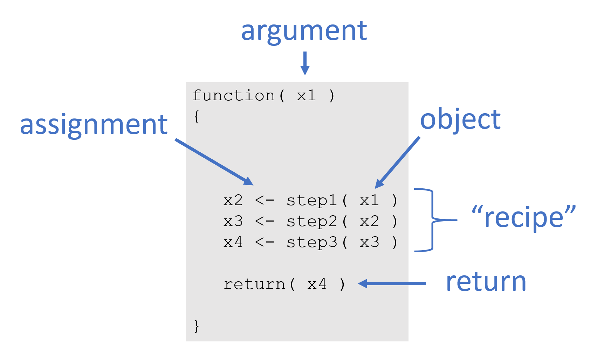
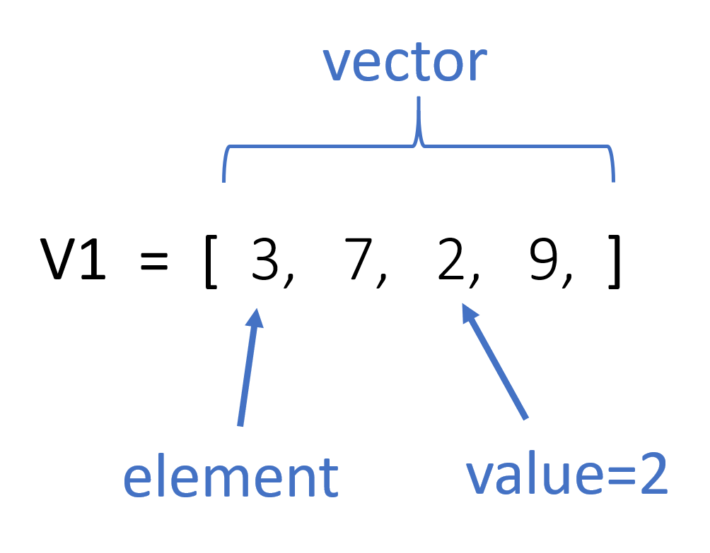
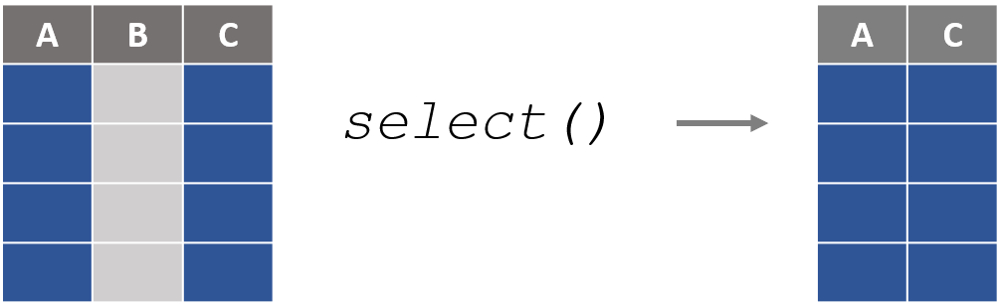
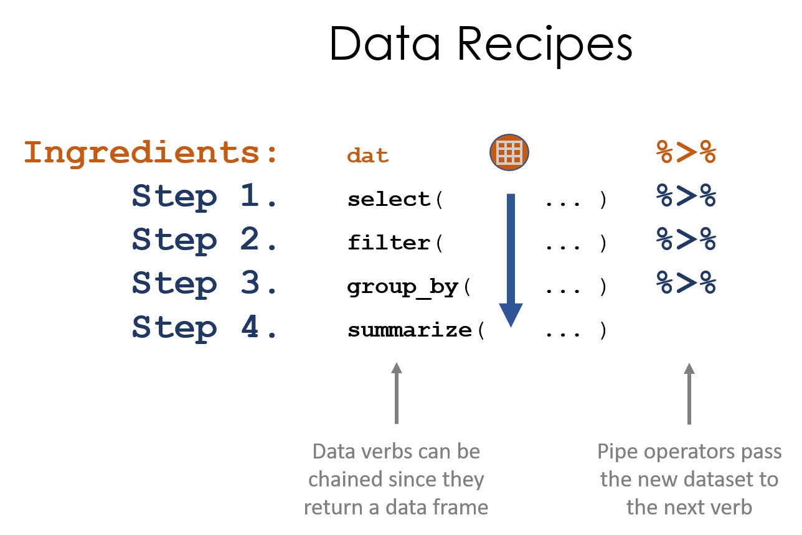
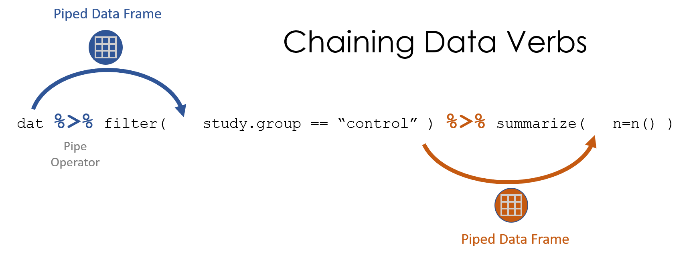
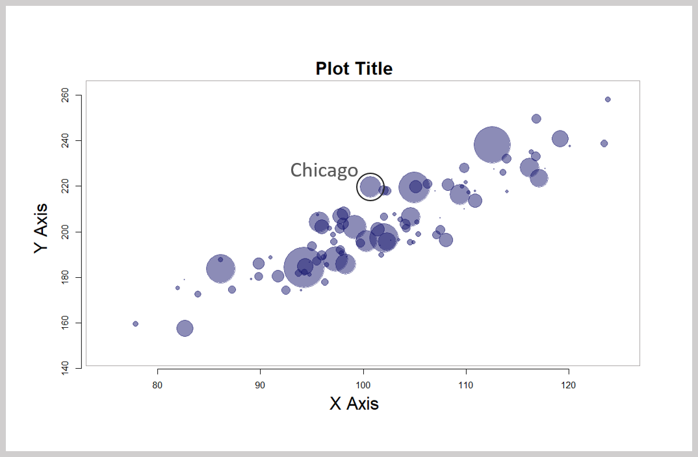
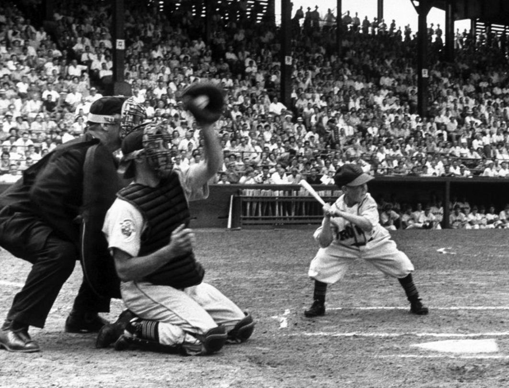

--- 
title: "Intro to Data Science for the Social Sector"
date: "Updated `r format(Sys.time(), '%B %d, %Y')`"
site: bookdown::bookdown_site
output: bookdown::gitbook
documentclass: book
bibliography: [book.bib, packages.bib]
biblio-style: apalike
link-citations: yes
description: "This is an introductory text to data science designed for social science graduate students in public affairs, nonprofit management, and international development."
---
```{r include=FALSE, cache=FALSE}
knitr::opts_chunk$set(
  warning = FALSE,
  message = FALSE,
  comment = "###",
  collapse = TRUE,
  cache = TRUE,
  out.width = "90%",
  fig.align = 'center',
  fig.width = 8,
  fig.asp = 0.618,  # 1 / phi
  fig.show = "hold"
)

library( dplyr )
library( pander )
library( stargazer )

options( dplyr.print_min = 6, dplyr.print_max = 6 )
```

# Welcome {-}

Welcome to the course text for Data Science for the Social Sector.

This course introduces students to the field of data science and its applications in the public sector. Modern performance management and evaluation processes require strong data literacy and the ability to combine and analyze data from a variety of sources to inform managerial processes. We offer a practical, tools-based approach that is designed to build strong foundations for people that want to work as policy analysts or data-driven managers. We will cover data programming fundamentals, visualization, text analysis, automated reporting, and dynamic reporting using dashboards. The course is analytically rigorous, but no prior programming experience is assumed.

<br>

**The Data Science Process (Wickham & Grolemund, 2016):**


<br>

> *A data scientist is a person who should be able to leverage existing data sources, and create new ones as needed in order to extract meaningful information and actionable insights. These insights can be used to drive business decisions and changes intended to achieve business goals… ‘The Perfect Data Scientist’ is the individual who is equally strong in business, programming, statistics, and communication.*


From: ["What Is Data Science, and What Does a Data Scientist Do?"](https://www.innoarchitech.com/what-is-data-science-does-data-scientist-do/)

<br>


```{r include=FALSE}
# automatically create a bib database for R packages
knitr::write_bib(c(
  .packages(), 'bookdown', 'knitr', 'rmarkdown'
), 'packages.bib')
```

<!--chapter:end:index.Rmd-->

```{r include=FALSE, cache=FALSE}
knitr::opts_chunk$set(
  warning = FALSE,
  message = FALSE,
  comment = "###",
  collapse = TRUE,
  cache = TRUE,
  out.width = "90%",
  fig.align = 'center',
  fig.width = 8,
  fig.asp = 0.618,  # 1 / phi
  fig.show = "hold"
)

library( dplyr )
library( pander )
library( stargazer )

options( dplyr.print_min = 6, dplyr.print_max = 6 )
```
# (PART) PART I: FOUNDATIONS {-}


# Introduction to R

This lecture introduces you to basic operations when you first start using R such as navigation, the object-oriented framework, loading a package, and creating some data vectors.

## Navigation

You need to know a few operations to help you maneuver the R work environment, such as listing objects (datasets and functions) that are active, changing your working directory, listing available files, and finding help.

### Setting Your Working Directory

When you are ready to load data, R needs to know where to look for your files. You can check what is avaiable in the current directory (i.e. folder) by asking to list all of the current files using **dir()**.


```{r, eval=F}
dir()
```

If the file that you need is located in a different folder, you can change directories easily in R Studio by Session -> Set working director -> Choose directory (or Ctrl + Shift + H).

If you are writing a script, you want to keep track of this step so that it can be reproduced. Use the function **get.wd()** to check your current working directory, and **set.wd()** to change. You need to specify your path as an argument to this function, such as.


```{r, eval=F}
setwd( "C:/user/projects/financial model" )
```


NOTE! R uses unix style notation with forward slashes, so if you copy and paste from Windows it will look like this, with back slashes:

```{r, eval=F}
setwd( "C:\user\projects\financial model" )
```

You will need to change them around for it to work.

It is best to save all of your steps in your scripts so that the analysis can be reproduced by yourself or others. In some cases you are doing exploratory or summary work, and you may want to find a file a quickly. You can use the **file.choose()** function to open a GUI to select your file directly. This function is used as an argument inside of a load data function.

```{r, eval=F}
my.dat <- read.csv( file.choose() )
```


## Commenting Code

Most computer languages have a special character that is used to "comment out" lines so that it is not run by the program. It is used for two important purposes. First, we can add text to document our functions and it will not interfere with the program. And two, we can use it to run a program while ignoring some of the code, often for debugging purposes.

The **#** hash tag is used for comments in R.

```{r}

##==============================================
##
##  Here is some documentation for this script
##
##==============================================

x <- 1:10

sum( x )

# y <- 1:25     # not run

# sum( y )      # not run

```


## Help

You will use the help functions frequently to figure out what arguments and values are needed for specific functions. Because R is very customizable, you will find that many functions have several or dozens of arguments, and it is difficult to remember the correct syntax and values. But don't worry, to look them up all you need is the function name and a call for help:


> help( dotchart )  # opens an external helpfile


If you just need to remind yourself which arguments are defined in a function, you can use the *args()* command:

```{r}
args( dotchart )
```

If you can't recall a function name, you can list all of the functions from a specific package as follows:

> help( package="stats" )   # lists all functions in stats package


## Install Programs (packages)

When you open R by default it will launch a core set of programs, called "packages" in R speak, that are use for most data operations. To see which packages are currently active use the **search()** function.

```{r}
search()
```

These programs manage the basic data operations, run the core graphics engine, and give you basic statistical methods.

The real magic for R comes from the over 7,000 contributed packages available on the CRAN: https://cran.r-project.org/web/views/

A package consists of custom functions and datasets that are generated by users. They are *packaged* together so that they can be shared with others. A package also includes documentation that describes each function, defines all of the arguments, and documents any datasets that are included.

If you know a package name, it is easy to install. In R Studio you can select Tools -> Install Packages and a list of available packages will be generated. But it is easier to use the **install.packages()** command. We will use the Lahman Package in this course, so let's install that now.

**Description** _This package provides the tables from Sean Lahman's
Baseball Database as a set of R data.frames. It uses the data
on pitching, hitting and fielding performance and other tables
from 1871 through 2013, as recorded in the 2014 version of the
database._

See the documentation here: https://cran.r-project.org/web/packages/Lahman/Lahman.pdf


```{r, eval=F}

install.packages( "Lahman" )

```

You will be asked to select a "mirror". In R speak this just means the server from which you will download the package (choose anything nearby). R is a community of developers and universities that create code and maintain the infrastructure. A couple of dozen universities around the world host servers that contain copies of the R packages so that they can be easily accessed everywhere.

If the package is successfully installed you will get a message similar to this:

> package 'Lahman' successfully unpacked and MD5 sums checked

Once a new program is installed you can now open ("load" in R speak) the package using the **library()** command:

```{r, eval=F}
library( "Lahman" )
```

If you now type **search()** you can see that Lahman has been added to the list of active programs. We can now access all of the functions and data that are available in the Lahman package.


## Accessing Built-In Datasets in R

One nice feature of R is that is comes with a bunch of built-in datasets that have been contributed by users are are loaded automatically. You can see the list of available datasets by typing:

```{r, eval=F}
data()

```

This will list all of the default datasets in core R packages. If you want to see all of the datasets available in installed packages as well use:

```{r, eval=F}
data( package = .packages(all.available = TRUE) )
```

### Basic Data Operations

Let's ignore the underlying data structure right now and look at some ways that we might interact with data.

We will use the **USArrests** dataset available in the core files.

To access the data we need to load it into working memory. Anything that is active in R will be listed in the environment, which you can check using the **ls()** command. We will load the dataset using the **data()** command.

```{r, eacho=F}
remove( list=ls() )
```


```{r}

ls() # nothing currently available

data( "USArrests" )

ls() # data is now avaible for use


```

Now that we have loaded a dataset, we can start to access the variables and analyze relationships. Let's get to know our dataset.

```{r}

names( USArrests )  # what variables are in the dataset?

nrow( USArrests )   # how many observations are there?

dim( USArrests )    # a quick way to see rows and columns - the dimensions of the dataset

row.names( head( USArrests ) )   # what are the obsevations (rows) in our data

summary( USArrests )   # summary statistics of variables

```

We can see that the dataset consists of four variables: Murder, Assault, UrbanPop, and Rape. We also see that our unit of analysis is the state. But where does the data come from, and how are these variables measured?

To see the documentation for a specific dataset you will need to use the **help()** function:

```{r, eval=F}
help( "USArrests" )
```

We get valuable information about the source and metrics:

**Description** *This data set contains statistics, in arrests per 100,000 residents for assault, murder, and rape in each of the 50 US states in 1973. Also given is the percent of the population living in urban areas.*

**Format** *A data frame with 50 observations on 4 variables.*

* **Murder**:	numeric	Murder arrests (per 100,000) 
* **Assault**:	numeric	Assault arrests (per 100,000)
* **UrbanPop**:	numeric	Percent urban population
* **Rape**:	numeric	Rape arrests (per 100,000)
 
 
To access a specific variable inside of a dataset, you will use the *$* operator between the dataset name and the variable name:

```{r}

summary( USArrests$Murder )
summary( USArrests$Assault )

# Is there a relationship between urban density and crime?

plot( USArrests$UrbanPop, USArrests$Murder, 
      frame.plot=F, pch=19, col="gray" )
abline( lm( USArrests$Murder ~ USArrests$UrbanPop ), col="red" )

```


### Using the Lahman Data

Let's take a look at some of the data available in the Lahman package.

```{r, eval=F}

data( package = "Lahman" ) # All datasets in package "Lahman":

```

TABLE NAME        |   DEFITION
------------------|---------------------
AllstarFull   |   AllstarFull table
Appearances   |   Appearances table
AwardsManagers   |   AwardsManagers table
AwardsPlayers   |   AwardsPlayers table
AwardsShareManagers   |   AwardsShareManagers table
AwardsSharePlayers   |   AwardsSharePlayers table
Batting   |   Batting table
BattingPost   |   BattingPost table
CollegePlaying   |   CollegePlaying table
Fielding   |   Fielding table
FieldingOF   |   FieldingOF table
FieldingPost   |   FieldingPost data
HallOfFame    |   Hall of Fame Voting Data
LahmanData   |   Lahman Datasets
Managers   |    Managers table
ManagersHalf   |   ManagersHalf table
Master   |   Master table
Pitching   |   Pitching table
PitchingPost   |   PitchingPost table
Salaries   |   Salaries table
Schools   |   Schools table
SeriesPost   |   SeriesPost table
Teams    |   Teams table
TeamsFranchises   |   TeamFranchises table
TeamsHalf    |    TeamsHalf table
battingLabels   |   Variable Labels
fieldingLabels   |    Variable Labels
pitchingLabels   |   Variable Labels  


We see that we have lots of datasets to choose from here. I will use the Master dataset, which is a list of all of the Major League Baseball players over the past century, and their personal information. 

```{r, eval=F}
library( Lahman )    # loads Lahman package
data( Master )
head( Master ) 
```


Here are some common functions for exploring datasets:

```{r, eval=F}
names( Master )      # variable names
nrow( Master )       # 18,354 players included
summary( Master )    # descriptive statistics of variables
```


We can use **help(Master)** to get information about the dataset, including a data dictionary.

```{r, eval=F}
help( Master )
```


**MASTER TABLE**

-------------------

**Description**

Master table - Player names, DOB, and biographical info. This file is to be used to get details about players listed in the Batting, Pitching, and other files where players are identified only by playerID.

**Usage**

data(Master)

**Format**

A data frame with 19105 observations on the following 26 variables.

* **playerID**: A unique code asssigned to each player. The playerID links the data in this file with records on players in the other files. 
* **birthYear**: Year player was born 
* **birthMonth**: Month player was born 
* **birthDay**: Day player was born 
* **birthCountry**: Country where player was born 
* **birthState**: State where player was born 
* **birthCity**: City where player was born 
* **deathYear**: Year player died 
* **deathMonth**: Month player died 
* **deathDay**: Day player died 
* **deathCountry**: Country where player died 
* **deathState**: State where player died 
* **deathCity**: City where player died 
* **nameFirst**: Player's first name 
* **nameLast**: Player's last name 
* **nameGiven**: Player's given name (typically first and middle) 
* **weight**: Player's weight in pounds 
* **height**: Player's height in inches 
* **bats**: a factor: Player's batting hand (left (L), right (R), or both (B)) 
* **throws**: a factor: Player's throwing hand (left(L) or right(R)) 
* **debut**: Date that player made first major league appearance 
* **finalGame**: Date that player made first major league appearance (blank if still active) 
* **retroID**: ID used by retrosheet, http://www.retrosheet.org/ 
* **bbrefID**: ID used by Baseball Reference website, http://www.baseball-reference.com/ 
* **birthDate**: Player's birthdate, in as.Date format 
* **deathDate**: Player's deathdate, in as.Date format 
 
**Details**

debut, finalGame were converted from character strings with as.Date.

**Source**

Lahman, S. (2016) Lahman's Baseball Database, 1871-2015, 2015 version, http://www.seanlahman.com/baseball-archive/statistics/


```{r, echo=F, eval=F}

### Example Analysis

Perhaps I am curious about some of the data. I see that we have information on the birth month of professional baseball players. If you have read Malcolm Gladwell's book *Outliers* you know there is an interesting cumulative advantage phenomenon that can occur with atheletes as they are young. If you are born near the end of the cutoff, you are on average six months older than other players in your league, and therefore slightly larger physically and more coordinated on average. Six months does not sound like much, but the slight size and coordination advantage means more playing time, which also improves skill. Over time, this small difference accumulates so that those lucky enough to be born near the cutoff become the best players.

Gladwell looked at studies of hockey. Do we see this in baseball?
library( Lahman )
data( Master )
prop.table( table( Master$birthMonth ) )  %>% pander()
```


```{r, warning=FALSE, eval=F}
tab <- prop.table( table( Master$birthMonth ) )
names(tab) <- c("Jan","Feb","Mar","Apr","May","Jun","Jul","Aug","Sep","Oct","Nov","Dec")
dotchart( tab, pch=19, 
          xlab = "Proportion of MLB Players", 
          ylab = "Birth Month" ) 
```


<!--chapter:end:CH-01-introduction-to-r.Rmd-->

```{r include=FALSE, cache=FALSE}
knitr::opts_chunk$set(
  warning = FALSE,
  message = FALSE,
  comment = "###",
  collapse = TRUE,
  cache = TRUE,
  out.width = "90%",
  fig.align = 'center',
  fig.width = 8,
  fig.asp = 0.618,  # 1 / phi
  fig.show = "hold"
)

library( dplyr )
library( pander )
library( stargazer )

options( dplyr.print_min = 6, dplyr.print_max = 6 )
```
# Functions


```{r, echo=F }

knitr::opts_chunk$set( echo = TRUE, message=F, warning=F, fig.width=8 )

```


## Key Concepts

```{r, fig.cap="Anatomy of a function", echo=F }

```

```{r, fig.cap="Assignment of output values", echo=F }
knitr::include_graphics( "figures/assignment.png" )
```

After reading this chapter you should be able to define the following:

* function
* argument
* object
* assignment


## Computer Programs as Recipes

Computer programs are powerful because they allow us to codify recipes for complex tasks, save them, share them, and build upon them. 

In the simplest form, a computer program is like a recipe. We have inputs, steps, and outputs.

Ingredients: 

* 1/3 cup butter   
* 1/2 cup sugar   
* 1/4 cup brown sugar   
* 2 teaspoons vanilla extract  
* 1 large egg  
* 2 cups all-purpose flour  
* 1/2 teaspoon baking soda  
* 1/2 teaspoon kosher salt  
* 1 cup chocolate chips  
 
Instructions: 

1. Preheat the oven to 375 degrees F. 
2. In a large bowl, mix butter with the sugars until well-combined. 
3. Stir in vanilla and egg until incorporated. 
4. Addflour, baking soda, and salt.  
5. Stir in chocolate chips. 
6. Bake for 10 minutes. 


In R, the recipe would look something like this:

```
function( butter=0.33, sugar=0.5, eggs=1, flour=2, temp=375 )
{
   dry.goods <- combine( flour, sugar )
   batter <- mix( dry.goods, butter, eggs )
   cookies <- bake( batter, temp, time=10 )
   return( cookies )
}
```

Note that this function to make cookies relies on other functions for each step, combine(), mix(), and bake(). Each of these functions would have to be defined as well, or more likely someone else in the open source community has already written a package called "baking" that contains simple functions for cooking so that you can use them for more complicated recipes. 

You will find that R allows you to conduct powerful analysis primarily because you can build on top of and extend a lot of existing functionality. 


## Example Function

As you get started in R you will be working with existing functions, not writing your own. It is, however, constructive to see how one is created. This example demonstrates the use of a mortgage calculator that will take a loan size, term, and interest rate and return a monthly payment. 

```{r}
   calcMortgage <- function( principal, years, APR )
   {

      months <- years * 12
      int.rate <- APR / 12
      
      # amortization formula
      monthly.payment <- ( principal * int.rate ) / 
                         (1 - (1 + int.rate)^(-months) )
      
      monthly.payment <- round( monthly.payment, 2 )
      
      return( monthly.payment )
   
   }
```


Let's then see what the payments will be for a:

- $100,000 loan 
- 30-year mortgage 
- 5% annual interest rate 

```{r}
calcMortgage( principal=100000, years=30, APR=0.05  )
```


## Default Argument Values

Note that the loan function needs all three of the input values in order to calculate the loan size. If we were to omit one required value, we would get an error. 

```{r, eval=F}
calcMortgage( principal=100000  )
# Error in calcMortgage(APR = 0.05, principal = 1e+05):  
#  argument "years" is missing, with no default 
```


When creating functions, we might have a good idea of typical use cases. If true, we can try to guess at reasonable user parameters. For example, perhaps we are working at a bank where most of the customers take out 30-year mortgages, and interest rates have been stable at 5 percent. We can set these as default values when we create the function. 

```{r}
   calcMortgage <- function( principal, years=30, APR=0.05 )
   ...
```

```{r, echo=F}
   calcMortgage <- function( principal, years=30, APR=0.05 )
   {

      months <- years * 12
      int.rate <- APR / 12
      
      # amortization formula
      monthly.payment <- ( principal * int.rate ) / 
                         (1 - (1 + int.rate)^(-months) )
      
      monthly.payment <- round( monthly.payment, 2 )
      
      return( monthly.payment )
   
   }
```

We can now run the function while omitting arguments, as long as they have defaults assigned.

```{r, eval=T}
calcMortgage( principal=100000  )
```


## Assignment

When we call a function in R, the default behavior of the function is typically to print the results on the screen:

```{r}
calcMortgage( principal=100000  )
```

If we are creating a script, however, we often need to save the function outputs at each step. We can do this by assigning output to a new variable.

```{r}
payments.15.year <- calcMortgage( years=15, principal=100000  )
payments.30.year <- calcMortgage( years=30, principal=100000  )
```

These values are then stored, and can be used later or printed by typing the object name:

```{r}
payments.15.year
payments.30.year
```

Note that variable names can include periods or underscores. They can also include numbers, but they cannot start with a number. Like everything in R, they will be case sensitive. 


<!--chapter:end:CH-02-functions.Rmd-->

```{r include=FALSE, cache=FALSE}
knitr::opts_chunk$set(
  warning = FALSE,
  message = FALSE,
  comment = "###",
  collapse = TRUE,
  cache = TRUE,
  out.width = "90%",
  fig.align = 'center',
  fig.width = 8,
  fig.asp = 0.618,  # 1 / phi
  fig.show = "hold"
)

library( dplyr )
library( pander )
library( stargazer )

options( dplyr.print_min = 6, dplyr.print_max = 6 )
```
# VECTORS {-}

Vectors are the building blocks of data programming in R, so they are extremely important concepts. 

This section will cover basic principles of working with vectors in the R language, including the different types of vectors (data types or classes), and common functions used on vectors. 

<br><br>

```{r, fig.cap="Components of a Vector", echo=F, out.width='40%' }

```


# Data Types 


```{r, echo=F }

knitr::opts_chunk$set( echo = TRUE, message=F, warning=F, fig.width=8 )

library( dplyr )
library( Lahman )
```


## Key Concepts

```{r, fig.cap="Components of a Vector", echo=F, out.width='60%' }

```

```{r, fig.cap="Basic data types in R", echo=F }
knitr::include_graphics( "figures/data_types.png" )
```


## Vectors


Generally speaking a vector is a set of numbers, words, or other values stored sequentially:

* [ 1, 2, 3]
* [ apple, orange, pear ]
* [ TRUE, FALSE, FALSE ]

In social sciences, a vector usually represents a variable in a dataset, often as a column in a spreadsheet. 

There are four primary vector types ("classes") in R: 


Class      | Description
---------- | -----------
numeric    | Typical variable of only numbers
character  | A vector of letters or words, always enclosed with quotes
factor     | Categories which represent groups, like treatment and control
logical    | A vector of TRUE and FALSE to designate which observations fit a criteria

Each vector or dataset has a "class" that tells R the data type.

These different vectors can be combined into three different types of datasets (data frames, matrices, and lists), which will be discussed below.

```{r}

x1 <- c(167,185,119,142)

x2 <- c("adam","jamal","linda","sriti")

x3 <- factor( c("male","male","female","female") )

x4 <- c( "treatment","control","treatment","control" )

x5 <- x4 == "treatment"

dat <- data.frame( name=x2, sex=x3, treat=x4, is.treat=x5, strength=x1 )

```

```{r, echo=F}
dat <- data.frame( name=x2, sex=x3, treat=x4, is.treat=x5, strength=x1, stringsAsFactors=F )
dat %>% pander
```

R keeps track of the data type of each object, which can be ascertained using the **class()** function.

```{r, eval=F}
class( x )
```

```{r, echo=F}
lapply( dat, class )
```


```{r}
class( dat )
```


## Common Vectors Functions

You will spend a lot of time creating data vectors, transforming variables, generating subsets, cleaning data, and adding new observations. These are all accomplished through **functions()** that act on vectors.

We often need to know how many elements belong to a vector, which we find with the **length()** function.

```{r}
x1

length( x1 )

```


## The Combine Function

We often need to combine several elements into a single vector, or combine two vectors to form one. This is done using the **c()** function.

```{r}

c(1,2,3)        # create a numeric vector

c("a","b","c")  # create a character vector

```


Combining two vectors:

```{r}

x <- 1:5

y <- 10:15

z <- c(x,y)

z
```

Combining two vectors of different data types:


```{r}
x <- c(1,2,3)

y <- c("a","b","c")

z <- c(x,y)

z
```


## Casting

You can easily move from one data type to another by **casting** a specific type as another type:

```{r}

x <- 1:5

x

as.character(x)

y <- c(TRUE, FALSE, TRUE, TRUE, FALSE)

y

as.numeric( y )

as.character( y )

```

But in some cases it might not make sense to cast one variable type as another.

```{r}

z <- c("a", "b", "c")

z

as.numeric( z )

```


Casting will often be induced automatically when you try to combine different types of data. For example, when you add a character element to a numeric vector, the whole vector will be cast as a character vector. 

```{r}

x1 <- 1:5
x1

x1 <- c( x1, "a" ) # a vector can only have one data type

x1 # all numbers silently recast as characters

```


If you consider the example above, when a numeric and character vector are combined all elements are re-cast as strings because numbers can be represented as characters but not vice-versa. R tries to select a reasonable default type, but sometimes casting will create some strange and unexpected behaviors. Consider some of these examples. What do you think each will produce? 

```{r}

x1 <- c(1,2,3)                    # numeric
x2 <- c("a","b","c")              # character
x3 <- c(TRUE,FALSE,TRUE)          # logical
x4 <- factor( c("a","b","c") )    # factor

case1 <- c( x1, x3 )

case2 <- c( x2, x3 )

case3 <- c( x1, x4 )

case4 <- c( x2, x4 )

```

The answers to *case1* and *case2* are somewhat intuitive. 

```{r}
case1  # combine a numeric and logical vector

case2  # combine a character and logical vector
```

Recall that TRUE and FALSE are often represented as 1 and 0 in datasets, so they can be recast as numeric elements. The numbers 2 and 3 have no meaning in a logical vector, so we can't cast a numeric vector as a logical vector.


*case3* and *case4* are a little more nuanced. See the section on factors below to make sense of them.

```{r}
case3  # combine a numeric and factor vector

case4  # combine a character and factor vector
```


TIP: When you read data in from outside sources, the input functions often will cast character or numeric vectors as factors if they contain a low number of elements. See the section on factors below for special instructions on moving from factors to numeric vectors.


## Numeric Vectors

There are some specific things to note about each vector type.

Math operators will only work on numeric vectors.

```{r}

summary( x1 )

```

Note that if we try to run this mathematical function we get an error:

```{r, eval=F}

sum( x2 ) # Error in sum(x2) : invalid 'type' (character) of argument

```

Many functions in R are sensitive to the data type of vectors. Mathematical functions, for example, do not make sense when applied to text (character vectors). In many cases R will give an error. In some cases R will silently re-cast the variable, then perform the operation. Be watchful for when silent re-casting occurs because it might have unwanted side effects, such as deleting data or re-coding group levels in the wrong way. 


### Integers Are Simple Numeric Vectors

The integer vector is a special type of numeric vector. It is used to save memory since integers require less space than numbers that contain decimals points (you need to allocate space for the numbers to the left and the numbers to the right of the decimal). Google "computer memory allocation" if you are interested in the specifics. 

If you are doing advanced programming you will be more sensitive to memory allocation and the speed of your code, but in the intro class we will not differentiate between the two types of number vectors. In *most* cases they result in the same results, unless you are doing advanced numerical analysis where rounding errors matter.


```{r}

n <- 1:5

n

class( n )

n[ 2 ] <- 2.01

n  # all elements converted to decimals

class( n )

```


## Character Vectors

The most important rule to remember with this data type: when creating character vectors, all text must be enclosed by quotation marks.

This one works:

```{r}

c( "a", "b", "c" )   # this works

```

This one will not:

```{r, eval=F}
c( a, b, c )  
# Error: object 'a' not found
```

When you type characters surrounded by quotes then R knows you are creating new text ("strings" in programming speak). When you type characters that are not surrounded by quotes, R thinks that you are looking for an object in the environment, like the variables we have already created. It gets confused when it doesn't find the object that you typed.

In generate, you will use quotes when you are creating character vectors, and for arguments in functions. You do not use quotes when you are referencing an active object. An active object is typically a dataset or vector that you have imported or created. You can print a list of all active objects with the `ls()` function.

### Quotes in Arguments

When you first start using R it can be confusing about when quotes are needed around arguments. Take the following example of the color argument (`col=`) in the `plot()` function.

```{r, eval=F}
strength <- c(167,185,119,142)
name <- c("adam","jamal","linda","sriti")
group <- factor( c( "treatment","control","treatment","control" ) )

plot( strength, col="blue", ... )

plot( strength, col=group,  ... )
```


```{r, fig.width=3.5,fig.height=3.5, fig.show='hold', echo=F }

strength <- c(167,185,119,142)
name <- c("adam","jamal","linda","sriti")
group <- factor( c( "treatment","control","treatment","control" ) )

par( mar=c(0,0,3,0) )
plot( strength, col="blue",       
      pch=19, cex=3, axes=F, type="h", lwd=2,
      main='col = "blue"', ylab="strength", ylim=c(100,200)  )   
text( 1:4, strength, name, col="blue", pos=3, offset=1 )

plot( strength, col=group,      
      pch=19, cex=3, axes=F, type="h", lwd=2,
      main='col = group', ylab="strength", ylim=c(100,200) )       
text( 1:4, strength, name, col=c("red","black"), pos=3, offset=1 )
```

In the first example we are using a text string as an argument to specify a color (`col="blue"`), so it must be enclosed by quotes because it is text.

In the second example R selects the color based upon group membership specified by the factor called 'group' (treatment or control). Since the argument is now referencing an object (`col=group`), we do not use quotes.

The exception here is when your argument requires a number. Numbers are not passed with quotes, or they would be cast as text.  


## Factors

When there are categorical variables within our data, or groups, then we use a special vector to keep track of these groups. We could just use numbers (1=female, 0=male) or characters ("male","female"), but factors are useful for two reasons.

First, it saves memory. Text is very "expensive" in terms of memory allocation and processing speed, so using simpler data structure makes R faster. 

Second, when a variable is set as a factor, R recognizes that it represents a group and it can deploy object-oriented functionality. When you use a factor in analysis, R knows that you want to split the analysis up by groups.

```{r}
height <- c( 70, 68, 62, 64, 72, 69, 58, 63  )

strength <- c(167,185,119,142,175,204,124,117)

sex <- factor( c("male","male","female","female","male","male","female","female" ) )

plot( height, strength )   # simple scatter plot

plot( sex, strength )      # box and whisker plot       
```

Factors are more memory efficient than character vectors because they store the underlying data as a numeric vector instead of a categorical (text) vector. Each group in the data is assigned a number, and when printing items the program only has to remember which group corresponds to which number:

```{r}
sex

as.numeric( sex )

#  male = 2
#  female = 1
```

If you print a factor, the computer just replaces each category designation with its name (2 would be replaced with "male" in this example). These replacements can be done in real time without clogging the memory of your computer as they don't need to be saved.

In some instances a categorical variable might be represented by numbers. For example, grades 9-12 for high school kids. The **very important** rule to remember with factors is you can't move directly from the factor to numeric using the **as.numeric()** casting function. This will give you the underlying data structure, but will not give you the category names. To get these, you need the **as.character** casting function.

```{r}

grades <- sample( x=9:12, size=10, replace=T )

grades

grades <- as.factor( grades )

grades

as.numeric( grades )

as.character( grades )

# to get back to the original numeric vector

as.numeric( as.character( grades ))


```

Note that when sub-setting a factor, it will retain all of the original levels, even when they are not in use. 

In this example, there are 37 teams in the Lahman dataset (some of them defunct) and 16 teams in the National League in 2002. But after applying the year and league subsets you will still have 37 levels.

```{r}

# there are only 16 teams in the NL in 2002

sals.2002 <- Salaries [Salaries$yearID=="2002", ]
nl.sals <- sals.2002 [ sals.2002$lgID == "NL",]
levels( nl.sals$teamID )

```


After applying a subset, in order to remove the unused factor levels you need to apply either droplevels(), or else recast your factor as a new factor.

For example:

```{r}

sals.2002 <- Salaries [Salaries$yearID=="2002", ]

nl.sals <- sals.2002 [ sals.2002$lgID == "NL",]
levels( nl.sals$teamID )

# fix in one of two equivalent ways:
#
# nl.sals$teamID <- droplevels( nl.sals$teamID )
# nl.sals$teamID <- factor( nl.sals$teamID )

levels( nl.sals$teamID )
nl.sals$teamID <- droplevels( nl.sals$teamID )
levels( nl.sals$teamID )


```


TIP: When reading data from Excel spreadsheets (usually saved in the comma separated value or CSV format), remember to include the following argument to prevent the creation of factors, which can produce some annoying behaviors.

```{r, eval=F}

dat <- read.csv( "filename.csv", stringsAsFactors=F )
```


## Logical Vectors

Logical vectors are collections of a set of TRUE and FALSE statements. 

Logical statements allow us to define groups based upon criteria, then decide whether observations belong to the group. A logical statement is one that contains a logical operator, and returns only TRUE, FALSE, or NA values. 

Logical vectors are important because organizing data into these sets is what drives all of the advanced data analytics (set theory is at the basis of mathematics and computer science). 

```{r, echo=F}
strength <- c(167,185,119,142)

name <- c("adam","jamal","linda","sriti")

sex <- factor( c("male","male","female","female") )

treat <- c( "treatment","control","treatment","control" )

dat <- data.frame( name, sex, treat, strength )

dat %>% pander()
```


```{r}
dat$name == "sriti"

dat$sex == "male"

dat$strength > 180
```

When defining logical vectors, you can use the abbreviated versions of T for TRUE and F for FALSE.

```{r}
z1 <- c(T,T,F,T,F,F)
z1
```


Typically logical vectors are used in combination with subset operators to identify specific groups in the data.

```{r}
# isolate data on all of the females in the dataset
dat[ dat$sex == "female" , ]
```

See the next chapter for more details on subsets.


## Generating Vectors

You will often need to generate vectors for data transformations or simulations. Here are the most common functions that will be helpful.

```{r}

# repeat a number, or series of numbers

rep( x=9, times=5 )

rep( x=c(5,7), times=5 )

rep( x=c(5,7), each=5 )

rep( x=c("treatment","control"), each=5 )  # also works to create categories


# create a sequence of numbers

seq( from=1, to=15, by=1 )

seq( from=1, to=15, by=3 )

1:15   # shorthand if by=1


# create a random sample

hat <- c("a","b","c","b","f")

sample( x=hat, size=3, replace=FALSE )
sample( x=hat, size=3, replace=FALSE )
sample( x=hat, size=3, replace=FALSE )

# for multiple samples use replacement

sample( x=hat, size=10, replace=TRUE )


# create data that follows a normal curve

iq <- rnorm( n=1000, mean=100, sd=15 )

hist( iq, col="gray" )


```


## Variable Transformations

When we create a new variable from existing variables, it is called a 'transformation'. This is very common in data science. Crime is measures by the number of assaults *per 100,000 people*, for example (crime / pop). A batting average is the number of hits divided by the number of at bats. 

In R, mathematical operations are *vectorized*, which means that operations are performed on the entire vector all at once. This makes transformations fast and easy.


```{r}

x <- 1:10

x + 5

x * 5

```

R uses a convention called "recycling", which means that it will re-use elements of a vector if necessary. In the example below the x vector has 10 elements, but the y vector only has 5 elements. When we run out of y, we just start over from the beginning. This is powerful in some instances, but can be dangerous in others if you don't realize that that it is happening.


```{r}

x <- 1:10

y <- 1:5

x + y

x * y

# the colors are recycled

plot( 1:5, 1:5, col=c("red","blue"), pch=19, cex=3 )


```

Here is an example of recycling gone wrong:

```{r}

x1 <- c(167,185,119,142)

x2 <- c("adam","jamal","linda","sriti")

x3 <- c("male","male","female","female")

x4 <- c( "treatment","contro","treatment","control" )

dat <- data.frame( name=x2, sex=x3, treat=x4, strength=x1 )


# create a subset of data of all female study participants

dat$sex == "female"

these <- dat$sex == "female"

dat[ these, ]  # correct subset


# same thing, but i mess is up - the female element is recycled in the overwrite

dat$sex = "female"    # whoops just over-wrote my data! should be double equal

these <- dat$sex == "female" 

dat[ these , ]

```


## Missing Values: NA's

Missing values are coded differently in each data analysis program. SPSS uses a period, for example. In R, missing values are coded as "NA".

The important thing to note is that R wants to make sure you know there are missing values if you are conducting analysis. As a result, it will give you the answer of "NA" when you try to do math with a vector that includes a missing value. You have to ask it explicitly to ignore the missing value.

```{r}
x5 <- c( 1, 2, 3, 4 )

x5

sum( x5 )

mean( x5 )

x5 <- c( 1, 2, NA, 4 )

x5

# should missing values be treated as zeros or dropped? 

sum( x5 )

mean( x5 )

sum( x5, na.rm=T )   # na.rm=T argument drops missing values

mean( x5, na.rm=T )  # na.rm=T argument drops missing values
```

You cannot use the *==* operator to identify missing values in a dataset. There is a special **is.na()** function to locate all of the missing values in a vector.

```{r}

x5

x5 == NA    # this does not do what you want

is.na( x5 )    # much better

! is.na( x5 )  # if you want to create a selector vector to drop missing values 

x5[ ! is.na(x5) ]

x5[ is.na(x5) ] <- 0  # replace missing values with zero

```


## Datasets


```{r, echo=F, eval=F }

knitr::opts_chunk$set( echo = TRUE, message=F, warning=F, fig.width=8 )

library( dplyr )
library( Lahman )
```


When multiple vectors represent data from a single sample, they are typically combined into a dataset. There are three main types of datasets that we will use in this class.

Class        | Description
------------ | -----------
data frame   | A typical data set comprised of several variables
matrix       | A data set comprised of only numbers, used for matrix math
list         | The grab bag of data structures - several vectors held together


### Data Frames

The most familiar spreadsheet-type data structure is called a data frame in R. It consists of rows, which represent observations, and columns, which represent variables.

```{r}

data( USArrests )

dim( USArrests )   # number of rows by number of columns

names( USArrests )   # variable names or column names

row.names( USArrests )

head( USArrests )  # print first six rows of the data

```

### Matrices

A matrix is also a rectangular data object that consists of collections of vectors, but it is special in the sense that it only has numeric vectors and no variable names.

```{r}

mat <- matrix( 1:20, nrow=5 )

mat

names( mat )

dim( mat )

as.data.frame( mat )  # creates variable names

```

These are used almost exclusively for matrix algebra operations, which are fundamental to mathematical statistics. We will not use matrices in this course.

### Lists

The list is the most flexible data structure. It is created by sticking a bunch of unrelated vectors or datasets together. For example, when you run a regression you generate a bunch of interesting information. This information is saved as a list.

```{r}

x <- 1:100
y <- 2*x + rnorm( 100, 0, 10)

m.01 <- lm( y ~ x )

names( m.01 )

m.01$coefficients

m.01$residuals

m.01$call

```

These output are all related to the model we have run, so they are kept organized by the list so they can be used for various further steps like comparing models or checking for model fit. 

A data frame is a bit more rigid that a list in that you cannot combine elements that do not have the same dimensions.

```{r}

# new.dataframe <- data.frame( m.01$coefficients, m.01$residuals, m.01$call )
#
# these will fail because the vectors have different lengths 

```


<!--chapter:end:CH-03-data-structures.Rmd-->

```{r include=FALSE, cache=FALSE}
knitr::opts_chunk$set(
  warning = FALSE,
  message = FALSE,
  comment = "###",
  collapse = TRUE,
  cache = TRUE,
  out.width = "90%",
  fig.align = 'center',
  fig.width = 8,
  fig.asp = 0.618,  # 1 / phi
  fig.show = "hold"
)

library( dplyr )
library( pander )
library( stargazer )

options( dplyr.print_min = 6, dplyr.print_max = 6 )
```
# Logical Statements


```{r, echo=F }

knitr::opts_chunk$set( echo=TRUE, message=F, warning=F, fig.width=8 )

library( dplyr )
library( Lahman )
library( pander )
```


<style>
th {
    text-align: left;
}
td {
    text-align: left;
}
</style>


## Key Concepts

```{r, fig.cap="Logical statements define group membership", out.width='70%', echo=F }
knitr::include_graphics( "figures/group_selection.png" )
```


Logical statements are used to translate regular language into computer code. Many of our data analysis problems start by defining our sub-groups of interest. 

> What percentage of men over 30 are bald?  

```{r, eval=F}
these <- gender == "male" & age > 30 & hair == FALSE
mean( these )
```

> Do bearded men earn more than men without beards? 

We need to make sure statements are correct. For example, the complement of "men with beards" is not men without beards, it is men without beards OR women (with or without beards). 

```{r, fig.cap="Compound statements can be tricky", out.width='60%', echo=F }
knitr::include_graphics( "figures/bearded_men.png" )
```


```{r, eval=F}
bearded.men <- gender == "male" & beard == TRUE
proper.gentlemen <- gender == "male" & beard == FALSE
mean( salary[ bearded.men ] )
mean( salary[ ! bearded.men ] )  # this is incorrect !!!
mean( salary[ proper.gentlemen ] )
```


## Operators 


Logical operators are the most basic type of data programming and the core of many types of data analysis. Most of the time we are not conducting fancy statistics, we just want to identify members of a group (print all of the females from the study), or describe things that belong to a subset of the data (compare the average price of houses with garages to houses without garages).

In order to accomplish these simple tasks we need to use logic statements. A logic statement answers the question, does an observation belong to a group.

Many times groups are simple. Show me all of the professions that make over $100k a year, for example.

Sometimes groups are complex. Identify the African American children from a specific zip code in Chicago that live in households with single mothers.

You will use nine basic logical operators:

Operator |  Description
-------- |  -----------
**<**        | less than
**<=**     | less than or equal to
**>**       | greater than
**>=**      | greater than or equal to
**==**      | exactly equal to
**!=**	     | not equal to
**x \| y**	 | x OR y
**x & y**	   | x AND y
**!**       | opposite of 
**[ ]**       | subset

Logical operators create logical vectors, a vector that contains only TRUE or FALSE. The TRUE means that the observation belongs to the group, FALSE means it does not.

```{r}
x1 <- c( 7, 9, 1, 2 )

x1 > 7

x1 >= 7

x1 == 9 | x1 == 1

gender <- c("male","male","female","female")

gender == "female"
```

Note that the logical statement for "equals" is written with two equal signs. This is important to remember, because using a single equal sign can introduce subtle errors into your analysis. 

```{r}
x1 <- c( 7, 9, 1, 2 )

x1 == 9

x1 = 9  # don't use a single equals operator!  it overwrites your variable

x1
```

We can write compound logical statements using the AND and OR operators:

```{r}
gender <- c("male","male","female","female")

study.group <- c("treatment","control","treatment","control")

gender == "female"  &  study.group == "treatment"

gender == "female"  |  study.group == "treatment"
```


## Selector Vectors

Note that we use operators to create logical vectors where TRUE designates observation that belong to the defined group, and FALSE designates observations outside the group. 

The term "selector vector" is a useful way to remember this purpose. After you have defined a group by composing a logical statement, then the vector can be used to count group members and take subsets of other variables to calculate group statistics. 

```{r, echo=F}
name <- c("frank","wanda","sanjay","nancy")
group <- c("treat","treat","control","control")
gender <- c("male","female","male","female")
strength <- c(27,43,19,58)
dat <- data.frame( name, gender, group, strength )
dat %>% pander
```


```{r}
these.female <- dat$gender == "female"

sum( these.female )                   # number of women in the study
mean( these.female )                  # proportion of the study that is women
dat[ these.female , ]                 # all data belonging to women
mean( dat$strength[ these.female ] )  # average outcome for women in the study
```

I will consistently name my logical vectors "these.GROUP" throughout the chapters, where GROUP represents the group label. For example, I selected women above, so the selector vector is called "these.female".  

## Usefulness of Selector Vectors

Selector vectors, i.e. logical vectors that were created by defining a group, have three main uses in our analysis. 

**ONE**: Logical vectors give us an easy way to count things within defined groups. 

We can apply a **sum()** function to a logical vector, and the result will be a tally of all of the TRUE cases. The **mean()** function will give us the proportion of the sample that belongs to our defined group.


```{r}
# how many females do we have in our study?

sum( gender == "female" )

# how many females do we have in our treatment group?

sum( gender == "female" & study.group == "treatment" )

# what proportion of our study are men? 

mean( gender == "male" )
```

**TWO:** We can create a selector variable that is used for subsets. A selector vector used in a subset operator will drop all observations that are FALSE, isolating data belonging to the group:

```{r}
these.female <- gender == "female"
name[ these.female ]
strength[ these.female ]
```

Or we can create a subset of the full dataset:

```{r, eval=F}
dat[ these.female , ]
```

```{r, echo=F}
dat[ these.female, ] %>% pander
```


**THREE**: We use selector variables to replace observations with new values using the assignment operator. This is similar to a find and replace operation.

```{r}
animals <- c( "mole", "mouse", "shrew", "mouse", "rat", "shrew" )

# the lab assistant incorrectly identified the shrews

animals

animals[ animals == "shrew" ] <- "possum"

animals
```


We don't know if linda received the treatment:

```{r, echo=F}
name <- c("adam","jamal","linda","sriti")

study.group <- c( "treatment","control","treatment","control")

data.frame( name, study.group ) %>% pander()
```

```{r}
study.group[ name == "linda" ] <- NA

study.group
```


The **!** operator is a special case, where it is not used to define a new logical vector, but rather it swaps the values of an existing logical vector.

```{r}
x1 <- c(7,9,1,2)

these <- x1 > 5

these

! these

! TRUE

! FALSE
```


## Compound Logical Statements

We can combine multiple logical statements using the AND, OR, and NOT operators ( &, |, ! ). This functionality gives us an incredible ability to specify very granular groups within our analysis. This will be important as we begin to construct analysis in a way that we search for apples to apples comparisons within our data in order to make inferences about program effectiveness. 

These statements require some precision, however. Use care when applying that AND, OR, and NOT operators as to not include unintended data in your sample. In the example above, the statement "NOT bearded men" does not mean men without beards. It means all people outside of the category of men without beards (the "complement"), which includes women with or without beards as well. 

```
! ( gender == "male" & beard == TRUE )
```
Also note that parentheses matter. Compare this statement to the statement above:

```
! gender == "male" & beard == TRUE
```
Because we excluded the parentheses this statement now defines the group "NOT men AND with beards", or bearded women. 

```{r, fig.cap="Examples of group construction with compound statements", out.width='90%', echo=F }
knitr::include_graphics( "figures/compound_logical_statements.png" )
```


## NAs in Logical Statements

Recall that missing values are an extremely important concept in statistics. If one-third of our survey sample reports that they never smoked pot, one-third reports they have smoked pot, and one-third did not answer the question, then what do we report for the proportion of the population that has smoked pot? 

We might prefer to be cautious and count only the people that have confirmed they have smoked pot, resulting in an estimate of 33.3%. 

If we throw out the missing data, then 50% of respondents have smoked pot.

If we assume those that refuse to answer have likely smoked pot, our estimate might be 66.6% of the sample. 

These different results are a function of how we treat the missing data in our survey, so it is important that we can keep track of missing values, especially during subset operations. 


Note how NAs effect compound logical statements:

```{r}
TRUE & TRUE

TRUE & FALSE

TRUE & NA

FALSE & NA
```

To make sense of these rules consider the following: 

If one condition is already FALSE, the missing value does not matter because under the & condition BOTH must be TRUE for the observation to belong to our defined group. After we know that one of the conditions is FALSE the missing value is irrelevant. For example, if we want to select all women in the treatment group, and we have a man with an unclear treatment group status, he is still excluded from the group because he is a man. 

On the other hand, if one condition is TRUE, and another is NA, R does not want to throw out the data because the state of the missing value is unclear. As a result, it will preserve the observation, but it will replace all of the data with missing values to signal the lack of certainty associated with that observation.

```{r, echo=F}
dat %>% pander
```

```{r}
keep.these <- c(T,F,NA,F)
dat[ keep.these , ]
```

To remove these rows with missing values in your selector vector, replace all NAs with FALSE:

```{r}
keep.these[ is.na(keep.these) ] <- FALSE
dat[ keep.these , ]
```


## Subsets

The subset operators **[ ]** are one of the most common you will use in R.

The primary rule of subsets is to use a data operator to create a logical selector vector, and use that to generate subsets. Any observation that corresponds to TRUE will be retained, any observation that corresponds to FALSE will be dropped.

For vectors, you need to specify a single dimension. 


```{r, echo=F}
name <- c("frank","wanda","sanjay","nancy")
group <- c("treat","treat","control","control")
gender <- c("male","female","male","female")
strength <- c(27,43,19,58)
dat <- data.frame( name, gender, group, strength )
dat %>% pander
```

```{r}
these.treat <- dat$group == "treat"
name[ these.treat ]
strength[ these.treat ]
```


For data frames, you need two dimensions (rows and columns). The two dimensions are seperated by a comma, and if you leave one blank you will not drop anything.

> dat[  row position ,  column position  ]


```{r}
these.control <- dat$group == "control"

dat[ these.control , ]   # all data in the control group

dat[ , c("name","gender") ]  # select two columns of data

# to keep a subset as a separate dataset

dat.women <- dat[ dat$gender == "female" , ]

dat.women
  
```


Note the rules listed above about subsetting factors. After applying a subset, they will retain all of the original levels, even when they are not longer useful. You need to drop the unused levels if you would like them to be omitted from functions that use the factor levels for analysis.


```{r}

df <- data.frame( letters=LETTERS[1:5], numbers=seq(1:5) )

levels( df$letters )

sub.df <- df[ 1:3, ]

sub.df$letters

levels( sub.df$letters )

droplevels( sub.df$letters )

sub.df$letters <- droplevels( sub.df$letters )


```


<!--chapter:end:CH-04-business-logic.Rmd-->

```{r include=FALSE, cache=FALSE}
knitr::opts_chunk$set(
  warning = FALSE,
  message = FALSE,
  comment = "###",
  collapse = TRUE,
  cache = TRUE,
  out.width = "90%",
  fig.align = 'center',
  fig.width = 8,
  fig.asp = 0.618,  # 1 / phi
  fig.show = "hold"
)

library( dplyr )
library( pander )
library( stargazer )

options( dplyr.print_min = 6, dplyr.print_max = 6 )
```
# DATA VERBS {-}


In this section we are moving from a focus on vector operations to a focus on dataset operations. 

Some of the most popular packages for building and manipulating datasets come from what is affectionately referred to as the "tidyverse", a set of packages developed by Hadley Wickam and the R Studio team. They are designed to make basic dataset operations more intuitive and robust. 

These packages were created with a common framework for data design called "tidy data". When datasets are built as or wrangled into the tidy format they are much easier to analyze, and they will play nicely with a large set of packages the follow the same philosophy of data design. 

The core R packages contain all of the functions necessary to wrangle datasets, but they are sometimes counter-intuitive or clumbsy in the sense that they might start with a data frame and return a table or a list, making them hard to use in data recipes. All of the "data verbs" that we will cover in this section start with a data frame and return a data frame, making them easier to use as data steps within a larger project.

We will begin with some extremely useful verbs contained within the `dplyr` package. 

```{r, fig.cap="A data verb requires a dataset as input, and returns a transformed dataset.", echo=F, out.width='60%' }
knitr::include_graphics( "figures/data_verbs.png" )
```


# The **dplyr** Package

```{r, echo=F }

knitr::opts_chunk$set( echo = TRUE, message=F, warning=F, fig.width=8 )

```

<style>
th {
    text-align: left;
}
td {
    text-align: left;
}
</style>


## Packages Used in This Chapter

```{r}
library( dplyr )
library( pander )
```


## Key Concepts

```{r, fig.cap="Data verbs are functions that require a dataframe as the primary argument, perform some transformation on the data, then return a new dataframe.", echo=F, out.width='60%' }
knitr::include_graphics( "figures/dataset_verbs.png" )
```


For a nice overview of all of the dataset verbs in `dplyr` check out [The `dplyr` Cheatsheet](https://ugoproto.github.io/ugo_r_doc/dplyr.pdf).


## The **dplyr** Package

This chapter will demonstrate a few basic dataset functions contained within the **dplyr** package. There are a few things to note as you get started:

* `dplyr` functions are all data verbs that accept a dataset as the argument, transform the data, and return a new dataset. 
* The first argument is always the dataset name, and variables (columns) can be referenced directly by name without quotation marks. 
* `dplyr` functions will return data as a "tibble" (*tbl_df* class), which is a regular data frame wrapped in a nice print method that includes metadata in the printout. 

For example, here is the regular data frame preview: 

```{r, echo=F}
head( PlantGrowth, 10 )
```

The tibble will print the first few rows and columns of a dataset, and includes dataset dimensions and vector classes:

```{r, echo=F}
tbl_df( PlantGrowth )
```

We will cover the following **_dplyr_** functions in this section of the textbook:

DATA VERB | ACTION  
---------|----------  
filter() | Select rows  
select() | Select columns 
arrage() | Sort the dataset by one or more columns 
mutate() | Create a new variable by transforming an existing variable or variables 
summarize() | Create summary statistics for specified variables 
group_by() | Split the dataset (implicitly) into a separate dataset for each group 


## Use **filter()** to Subset Rows

```{r, fig.cap="", echo=F, out.width='60%' }
knitr::include_graphics( "figures/filter.png" )
```

In the last chapter we learned how to use operators to translate from plain English questions to data queries. 

As an example, a city manager might want to know the average amount owed on a delinquent property tax. 

```{r, echo=F}
library( scales )
amount.owed <- dollar( c(0,5549,0,1709,0,634,0,0,0,9353,0,1366,0,0,0) )
tax.id <- 1:15
data.frame( tax.id, amount.owed ) %>% head(10) %>% pander()
amount.owed <- c(0,5549,0,1709,0,634,0,0,0,9353,0,1366,0,0,0) 
taxdat <- data.frame( tax.id, amount.owed )
```


We could write the query as follows:

1. Define the group. 
2. Select the data that belongs to the group. 
3. Analyze the group subset. 


```{r}
these.late <- taxdat$amount.owed > 0                 # 1. Define group
overdue.amounts <- taxdat$amount.owed[ these.late ]  # 2. Select data
overdue.amounts
mean( overdue.amounts )                              # 3. Analyze data
```

The **filter()** function in the  **_dplyr_** package is a slightly more elegant verb for selecting the group and subsetting the data by rows.

> filter(  dataset name ,  logical expression  )


```{r}
filter( taxdat, amount.owed > 0 )
```

Note that we do not need to reference the dat$ references inside **dplyr** functions. 


## **select()** Columns

```{r, fig.cap="", echo=F, out.width='60%' }

```

In the core R operators, we select colums from a dataset using the subset function:

```{r, eval=T, echo=F}
USArrests %>% head() %>% pander()
```

```{r, eval=F}
USArrests[ , c("Murder","Assault") ]
```

```{r, echo=F}
head( USArrests[ , c("Murder","Assault") ] ) %>% pander()
```

The **_select()_** function converts this oeration into a data verb: 

```{r, eval=F}
select( USArrests, Murder, Assault )
```

```{r, echo=F}
select( USArrests, Murder, Assault ) %>% head() %>% pander()
```

The **_select()_** function adds a lot of additional arguments that make it easy to quickly identify and keep only the necessary variables. We can demonstrate a few using the built-in *iris* dataset  in R.

```{r, echo=F}
head( iris ) %>% pander()
```

Exclude a column with the negative sign:

```{r, eval=F}
select( iris, -Species ) 
```

```{r, echo=F}
select( iris, -Species ) %>% head() %>% pander()
```

Select by variable names:

```{r, eval=F}
select( iris, ends_with( "Length" ) ) 
```

```{r, echo=F}
select( iris, ends_with( "Length" ) ) %>% head() %>% pander()
```

```{r, eval=F}
select( iris, starts_with( "Petal" ) ) 
```

```{r, echo=F}
select( iris, starts_with( "Petal" ) ) %>% head() %>% pander()
```

```{r, eval=F}
select( iris, matches("pal") ) 
```

```{r, echo=F}
select( iris, matches("pal") ) %>% head() %>% pander()
```


Or we can select by a range of variables by placing a colon between the first and last:

```{r, eval=F}
select( iris, Sepal.Length:Petal.Width ) 
```

```{r, echo=F}
select( iris, Petal.Length:Species ) %>% head() %>% pander()
```


## **arrange()** Sorts Data


```{r, fig.cap="", echo=F, out.width='60%' }
knitr::include_graphics( "figures/arrange.png" )
```


The **_arrange()_** function sorts a dataset by one or more columns. By default, it sorts from smallest to largest.

```{r, eval=F}
arrange( PlantGrowth, weight ) 
```

```{r, echo=F}
PlantGrowth %>%
  arrange( weight ) %>%
  slice( 1:5 ) %>%
  pander()
```

If we prefer the dataset be sorted from largest to smallest, we can applyr the descending function **desc()** to the sort variable.

```{r, eval=F}
arrange( PlantGrowth, desc(weight) ) 
```

```{r, echo=F}
PlantGrowth %>%
  arrange( desc(weight) ) %>%
  slice( 1:5 ) %>%
  pander()
```

Or alternatively we can use the shortcut syntax of adding a negative sign in front of the variable:

```{r, eval=F}
arrange( PlantGrowth, -weight ) 
```


We can also sort by multiple columns at once:

```{r, eval=F}
arrange( PlantGrowth, group, weight ) 
```


```{r, echo=F}
PlantGrowth %>%
  group_by( group ) %>%
  top_n( 5, weight ) %>%
  arrange( group, weight ) %>% 
  select( group, weight ) %>%
  head( 10 ) %>%
  pander()
```

NOTE, the equivalent core R functions would use **subset[]** and **order()** functions together. You might see examples on Stack Overflow written like this:

```{r, eval=F}
PlantGrowth[ order(PlantGrowth$weight, decreasing=TRUE) , ]
```

```{r, echo=F}
PlantGrowth[ order(PlantGrowth$weight, decreasing=TRUE) , ] %>% head() %>% pander()
```

As you can see, the `dplyr` versions are typically more intuitive and concise!


## Variable Transforms with **mutate()**

One of the most common operations in data analysis is to create a new variable from one or more existing variables, a "variable transformation". Some examples include:

```{r, eval=F}
x_squared <-  x * x

celsius <-  ( fereinheit - 32 ) * ( 5/9 )

body.mass.index <-  kg / meters^2

per.capita.income <-  income / population
```

The **_mutate()_** function creates a new transformed variable from the forumala you specify and adds it to the original dataset.

As an example, perhaps we have data on the number of nonprofits located in each US city. If we look at the raw count of nonprofits, it makes it look as though the large cities have the most vibrant nonprofit sectors:


```{r, echo=F}
dat.npos <- 
structure(list(city = c("ROSEBURG", "BIRMINGHAM", "BISMARCK", 
"BLOOMINGTON", "BLOOMINGTON", "BOISE", "CHICAGO", "BOSTON", "ALBANY", 
"HARLINGEN", "BRYAN", "BUFFALO", "BURLINGTON", "CANTON", "CASPER", 
"CEDAR RAPIDS", "CHAMPAIGN", "CHARLESTON", "CHARLESTON", "CHARLOTTE", 
"CHARLOTTESVLE", "CHATTANOOGA", "CHEYENNE", "ALBANY", "CHICAGO", 
"CHICAGO", "CHICO", "CINCINNATI", "CLARKSVILLE", "CLEVELAND", 
"COLORADO SPGS", "COLUMBIA", "COLUMBIA", "COLUMBUS", "COLUMBUS", 
"CRP CHRISTI", "CUMBERLAND", "FRISCO", "DALLAS", "DANVILLE", 
"DAVENPORT", "ALBUQUERQUE", "DAYTON", "DAYTONA BEACH", "DECATUR", 
"DECATUR", "DENVER", "DES MOINES", "NOVI", "DETROIT", "DOTHAN", 
"DOVER", "ALEXANDRIA", "DUBUQUE", "DULUTH", "EAU CLAIRE", "EL PASO", 
"ELKHART", "ELMIRA", "ENID", "ERIE", "ALLENTOWN", "EUGENE", "EVANSVILLE", 
"FARGO", "FAYETTEVILLE", "FAYETTEVILLE", "FLAGSTAFF", "FLORENCE", 
"FLORENCE", "FORT COLLINS", "FORT MYERS", "STUART", "FORT SMITH", 
"FT WALTON BCH", "FORT WAYNE", "ALTOONA", "FRESNO", "GADSDEN", 
"GAINESVILLE", "GLENS FALLS", "GOLDSBORO", "GRAND FORKS", "GRAND JCT", 
"GRAND RAPIDS", "GREAT FALLS", "GREEN BAY", "GREENSBORO", "GREENVILLE", 
"GREENVILLE", "AMARILLO", "HARRISBURG", "CANTON", "HARTFORD", 
"HATTIESBURG", "HICKORY", "HONOLULU", "HOUMA", "SUGAR LAND", 
"HOUSTON", "HUNTINGTON", "HUNTSVILLE", "INDIANAPOLIS", "IOWA CITY", 
"JACKSON", "JACKSON", "JACKSON", "JACKSONVILLE", "JACKSONVILLE", 
"JAMESTOWN", "JANESVILLE", "JOHNSON CITY", "JOHNSTOWN", "JONESBORO", 
"JOPLIN", "KALAMAZOO", "KANSAS CITY", "ANCHORAGE", "TEMPLE", 
"KNOXVILLE", "KOKOMO", "LA CROSSE", "LAFAYETTE", "LAFAYETTE", 
"LAKE CHARLES", "LAKELAND", "ABILENE", "LANCASTER", "LANSING", 
"LAREDO", "LAS CRUCES", "LAS VEGAS", "LAWRENCE", "LAWTON", "LEWISTON", 
"LEXINGTON", "LIMA", "LINCOLN", "LITTLE ROCK", "LONGVIEW", "LOS ANGELES", 
"LOS ANGELES", "ANNISTON", "LOUISVILLE", "APPLETON", "LUBBOCK", 
"LYNCHBURG", "MACON", "MADISON", "ASHEVILLE", "MANSFIELD", "MCALLEN", 
"MEDFORD", "MELBOURNE", "MEMPHIS", "MERCED", "FT LAUDERDALE", 
"ATHENS", "MILWAUKEE", "MINNEAPOLIS", "MOBILE", "MODESTO", "ATLANTA", 
"MONROE", "MONTGOMERY", "MUNCIE", "MYRTLE BEACH", "NAPLES", "NASHVILLE", 
"NEW HAVEN", "NEW LONDON", "NEW ORLEANS", "GERMANY", "NEW YORK", 
"HOPARCONG", "VIRGINIA BCH", "OCALA", "MIDLAND", "OKLAHOMA CITY", 
"OMAHA", "ORLANDO", "OWENSBORO", "AUGUSTA", "PANAMA CITY", "PARKERSBURG", 
"PENSACOLA", "PEORIA", "GARNET VALLEY", "PHILADELPHIA", "PHOENIX", 
"PINE BLUFF", "PITTSBURGH", "PITTSFIELD", "POCATELLO", "AUSTIN", 
"PORTLAND", "MARICOPA", "PORTLAND", "PROVIDENCE", "PROVO", "PUEBLO", 
"PUNTA GORDA", "RALEIGH", "RAPID CITY", "READING", "REDDING", 
"RENO", "RICHLAND", "RICHMOND", "BAKERSFIELD", "ROANOKE", "ROCHESTER", 
"ROCHESTER", "ROCKFORD", "ROCKY MOUNT", "SACRAMENTO", "SACRAMENTO", 
"MIDLAND", "SAINT CLOUD", "SAINT JOSEPH", "SAINT LOUIS", "SALINAS", 
"SALT LAKE CTY", "COLUMBIA", "SAN ANGELO", "SAN ANTONIO", "SAN DIEGO", 
"BANGOR", "NAVATO", "SAN FRANCISCO", "HYANNIS", "SN LUIS OBISP", 
"SANTA BARBARA", "SANTA FE", "SARASOTA", "SAVANNAH", "SCRANTON", 
"BATON ROUGE", "SEATTLE", "SHARON", "SHEBOYGAN", "SHERMAN", "SHREVEPORT", 
"SIOUX CITY", "SIOUX FALLS", "SOUTH BEND", "SPOKANE", "SPRINGFIELD", 
"SPRINGFIELD", "SPRINGFIELD", "STATE COLLEGE", "STEUBENVILLE", 
"STOCKTON", "SUMTER", "SYRACUSE", "TALLAHASSEE", "TAMPA", "TERRE HAUTE", 
"TEXARKANA", "BEAUMONT", "TOLEDO", "TOPEKA", "TUCSON", "TULSA", 
"BELLINGHAM", "TUSCALOOSA", "TYLER", "UTICA", "BENTON HARBOR", 
"VICTORIA", "VISALIA", "BILLINGS", "WACO", "BOLIVIA", "WASHINGTON", 
"WATERLOO", "WAUSAU", "WEST PALM BCH", "WHEELING", "WICHITA", 
"WICHITA FALLS", "WILLIAMSPORT", "GULFPORT", "WILMINGTON", "YAKIMA", 
"YORK", "YOUNGSTOWN", "YUBA CITY", "YUMA", "BINGHAMTON"), msa = structure(c(1L, 
29L, 30L, 31L, 32L, 33L, 34L, 35L, 3L, 36L, 37L, 38L, 39L, 40L, 
41L, 42L, 43L, 44L, 45L, 46L, 47L, 48L, 49L, 4L, 50L, 51L, 52L, 
53L, 54L, 55L, 56L, 57L, 58L, 59L, 60L, 61L, 62L, 63L, 64L, 65L, 
66L, 5L, 67L, 68L, 69L, 70L, 71L, 72L, 73L, 74L, 75L, 76L, 6L, 
77L, 78L, 79L, 80L, 81L, 82L, 83L, 84L, 7L, 85L, 86L, 87L, 88L, 
89L, 90L, 91L, 92L, 93L, 94L, 95L, 96L, 97L, 98L, 8L, 99L, 100L, 
101L, 102L, 103L, 104L, 105L, 106L, 107L, 108L, 109L, 110L, 111L, 
9L, 112L, 113L, 114L, 115L, 116L, 117L, 118L, 119L, 120L, 121L, 
122L, 123L, 124L, 125L, 126L, 127L, 128L, 129L, 130L, 131L, 132L, 
133L, 134L, 135L, 136L, 137L, 10L, 138L, 139L, 140L, 141L, 142L, 
143L, 144L, 145L, 2L, 146L, 147L, 148L, 149L, 150L, 151L, 152L, 
153L, 154L, 155L, 156L, 157L, 158L, 159L, 160L, 11L, 161L, 12L, 
162L, 163L, 164L, 165L, 13L, 166L, 167L, 168L, 169L, 170L, 171L, 
172L, 14L, 173L, 174L, 175L, 176L, 15L, 177L, 178L, 179L, 180L, 
181L, 182L, 183L, 184L, 185L, 186L, 187L, 188L, 189L, 190L, 191L, 
192L, 193L, 194L, 195L, 16L, 196L, 197L, 198L, 199L, 200L, 201L, 
202L, 203L, 204L, 205L, 206L, 17L, 207L, 208L, 209L, 210L, 211L, 
212L, 213L, 214L, 215L, 216L, 217L, 218L, 219L, 220L, 18L, 221L, 
222L, 223L, 224L, 225L, 226L, 227L, 228L, 229L, 230L, 231L, 232L, 
233L, 19L, 234L, 235L, 236L, 20L, 237L, 238L, 21L, 239L, 240L, 
241L, 242L, 243L, 244L, 22L, 245L, 246L, 247L, 248L, 249L, 250L, 
251L, 252L, 253L, 254L, 255L, 256L, 257L, 258L, 259L, 260L, 261L, 
262L, 263L, 264L, 265L, 23L, 266L, 267L, 268L, 269L, 24L, 270L, 
271L, 272L, 25L, 273L, 274L, 26L, 275L, 276L, 277L, 278L, 279L, 
280L, 281L, 282L, 283L, 284L, 27L, 285L, 286L, 287L, 288L, 289L, 
290L, 28L), .Label = c("0", "40", "120", "160", "200", "220", 
"240", "280", "320", "380", "450", "460", "480", "500", "520", 
"600", "640", "680", "720", "733", "743", "760", "840", "860", 
"870", "880", "920", "960", "1000", "1010", "1020", "1040", "1080", 
"1120", "1123", "1240", "1260", "1280", "1303", "1320", "1350", 
"1360", "1400", "1440", "1480", "1520", "1540", "1560", "1580", 
"1600", "1602", "1620", "1642", "1660", "1692", "1720", "1740", 
"1760", "1800", "1840", "1880", "1900", "1920", "1922", "1950", 
"1960", "2000", "2020", "2030", "2040", "2082", "2120", "2160", 
"2162", "2180", "2190", "2200", "2240", "2290", "2320", "2330", 
"2335", "2340", "2360", "2400", "2440", "2520", "2560", "2580", 
"2620", "2650", "2655", "2670", "2700", "2710", "2720", "2750", 
"2760", "2840", "2880", "2900", "2975", "2980", "2985", "2995", 
"3000", "3040", "3080", "3120", "3150", "3160", "3240", "3280", 
"3283", "3285", "3290", "3320", "3350", "3360", "3362", "3400", 
"3440", "3480", "3500", "3520", "3560", "3580", "3600", "3605", 
"3610", "3620", "3660", "3680", "3700", "3710", "3720", "3760", 
"3810", "3840", "3850", "3870", "3880", "3920", "3960", "3980", 
"4000", "4040", "4080", "4100", "4120", "4150", "4200", "4243", 
"4280", "4320", "4360", "4400", "4420", "4472", "4480", "4520", 
"4600", "4640", "4680", "4720", "4800", "4880", "4890", "4900", 
"4920", "4940", "4992", "5082", "5120", "5160", "5170", "5200", 
"5240", "5280", "5330", "5345", "5360", "5483", "5523", "5560", 
"5600", "5602", "5640", "5720", "5790", "5800", "5880", "5920", 
"5960", "5990", "6015", "6020", "6080", "6120", "6160", "6162", 
"6200", "6240", "6280", "6323", "6340", "6403", "6440", "6442", 
"6483", "6520", "6560", "6580", "6640", "6660", "6680", "6690", 
"6720", "6740", "6760", "6800", "6820", "6840", "6880", "6895", 
"6920", "6922", "6960", "6980", "7000", "7040", "7120", "7160", 
"7200", "7240", "7320", "7360", "7362", "7460", "7480", "7490", 
"7510", "7520", "7560", "7602", "7610", "7620", "7640", "7680", 
"7720", "7760", "7800", "7840", "7880", "7920", "8003", "8050", 
"8080", "8120", "8140", "8160", "8240", "8280", "8320", "8360", 
"8400", "8440", "8520", "8560", "8600", "8640", "8680", "8750", 
"8780", "8800", "8840", "8872", "8920", "8940", "8960", "9000", 
"9040", "9080", "9140", "9200", "9260", "9280", "9320", "9340", 
"9360"), class = "factor"), nonprofits = c(46L, 1192L, 229L, 
207L, 220L, 647L, 2L, 10536L, 117L, 197L, 199L, 1504L, 465L, 
488L, 141L, 284L, 257L, 649L, 374L, 1922L, 395L, 572L, 157L, 
1543L, 57L, 10247L, 277L, 2560L, 142L, 3733L, 866L, 271L, 772L, 
259L, 2655L, 344L, 116L, 12L, 6008L, 118L, 470L, 1085L, 1100L, 
439L, 117L, 121L, 4324L, 877L, 1L, 4948L, 122L, 154L, 130L, 163L, 
428L, 191L, 423L, 219L, 114L, 84L, 409L, 763L, 528L, 400L, 305L, 
191L, 424L, 204L, 113L, 107L, 427L, 516L, 346L, 224L, 154L, 660L, 
166L, 882L, 95L, 388L, 238L, 87L, 162L, 181L, 1465L, 134L, 291L, 
1569L, 163L, 1070L, 278L, 1081L, 1L, 1841L, 106L, 306L, 1233L, 
147L, 37L, 4913L, 298L, 372L, 2415L, 195L, 136L, 693L, 91L, 1212L, 
96L, 222L, 187L, 516L, 292L, 78L, 183L, 548L, 2481L, 613L, 218L, 
889L, 103L, 206L, 349L, 228L, 148L, 441L, 197L, 737L, 721L, 88L, 
159L, 1017L, 179L, 77L, 130L, 831L, 218L, 527L, 854L, 233L, 17417L, 
1L, 111L, 1294L, 447L, 327L, 314L, 312L, 1154L, 458L, 191L, 279L, 
352L, 459L, 1180L, 128L, 1306L, 223L, 2633L, 5278L, 589L, 390L, 
5438L, 201L, 497L, 125L, 198L, 369L, 2023L, 2914L, 414L, 1344L, 
1L, 26503L, 1L, 1561L, 198L, 319L, 1413L, 1070L, 1854L, 112L, 
461L, 139L, 179L, 383L, 428L, 4L, 8538L, 3367L, 88L, 3260L, 346L, 
70L, 2205L, 742L, 1L, 3854L, 1496L, 241L, 159L, 116L, 2380L, 
176L, 426L, 237L, 470L, 227L, 1517L, 524L, 361L, 242L, 1558L, 
376L, 121L, 1L, 2607L, 437L, 229L, 127L, 3146L, 504L, 1352L, 
2L, 134L, 1624L, 3503L, 223L, 1L, 12149L, 543L, 462L, 802L, 494L, 
800L, 311L, 671L, 717L, 5830L, 161L, 154L, 125L, 388L, 186L, 
361L, 347L, 544L, 381L, 399L, 860L, 219L, 135L, 484L, 88L, 1139L, 
565L, 2473L, 178L, 97L, 319L, 745L, 279L, 1046L, 1097L, 308L, 
169L, 278L, 367L, 218L, 113L, 299L, 245L, 276L, 1L, 15701L, 159L, 
144L, 1345L, 200L, 600L, 163L, 144L, 257L, 341L, 225L, 464L, 
560L, 131L, 91L, 335L), pop = c(0L, 982142L, 105488L, 134442L, 
166706L, 563441L, 0L, 6227093L, 122512L, 393566L, 185426L, 1137266L, 
209381L, 405334L, 73520L, 207765L, 197867L, 641930L, 247710L, 
1873232L, 182290L, 504474L, 89221L, 915927L, 0L, 9449406L, 218635L, 
2078725L, 236281L, 2891549L, 599988L, 158067L, 625160L, 270099L, 
1712854L, 400470L, 102434L, 0L, 6219078L, 106934L, 360185L, 845698L, 
940090L, 587859L, 151867L, 110719L, 2891368L, 526361L, 0L, 5376674L, 
148759L, 156918L, 130800L, 92547L, 243379L, 158847L, 772280L, 
196855L, 88708L, 59093L, 279234L, 703045L, 347156L, 308734L, 
201499L, 312994L, 407103L, 138717L, 146208L, 134897L, 291162L, 
606165L, 413981L, 226480L, 182076L, 525518L, 127071L, 1056568L, 
104066L, 244247L, 128795L, 120102L, 98107L, 142284L, 1145416L, 
80562L, 244376L, 1392452L, 161385L, 1070950L, 236935L, 673099L, 
0L, 1203823L, 126849L, 362665L, 936984L, 206559L, 0L, 5655671L, 
314933L, 401694L, 1795384L, 126994L, 161569L, 476577L, 114171L, 
1292647L, 169207L, 135263L, 159964L, 503372L, 222960L, 93329L, 
172590L, 460943L, 1937583L, 284267L, 368771L, 772842L, 99458L, 
132045L, 412750L, 201905L, 189134L, 590116L, 129477L, 511250L, 
463602L, 240346L, 201670L, 2138576L, 109052L, 119902L, 107882L, 
541341L, 152609L, 279428L, 653720L, 222694L, 17647612L, 0L, 117149L, 
1104451L, 387391L, 269932L, 227912L, 354250L, 477748L, 253798L, 
170274L, 736973L, 200587L, 540583L, 1225231L, 250699L, 1734139L, 
174376L, 1734633L, 3229181L, 584411L, 509682L, 4968292L, 152207L, 
358823L, 117344L, 258267L, 316931L, 1454684L, 1762030L, 272360L, 
1127116L, 0L, 19840495L, 0L, 1656031L, 326833L, 265118L, 1202303L, 
795047L, 2083626L, 95398L, 521097L, 166798L, 148797L, 445778L, 
357197L, 0L, 6437940L, 4080707L, 78447L, 2288824L, 131528L, 80701L, 
1627571L, 279994L, 0L, 2543571L, 973136L, 486067L, 156244L, 159385L, 
1519260L, 97922L, 407310L, 176906L, 412844L, 238406L, 1118299L, 
815693L, 244884L, 141244L, 1109788L, 401117L, 150649L, 0L, 2107092L, 
394118L, 186075L, 105201L, 2696326L, 407435L, 1517536L, 0L, 108000L, 
1916880L, 3022468L, 152934L, 0L, 7259326L, 217483L, 265577L, 
416051L, 159793L, 694819L, 335980L, 627755L, 684388L, 3925621L, 
117296L, 115328L, 119111L, 408123L, 121891L, 207088L, 266522L, 
461262L, 207990L, 380024L, 619596L, 151411L, 125101L, 673613L, 
106601L, 739242L, 316440L, 2745350L, 150546L, 134447L, 384583L, 
612097L, 175537L, 964462L, 861139L, 195993L, 188331L, 203393L, 
298865L, 157232L, 85813L, 429404L, 144050L, 229587L, 0L, 8415633L, 
129252L, 132644L, 1299356L, 148354L, 585126L, 140031L, 116376L, 
361281L, 299266L, 236542L, 428175L, 563288L, 164580L, 190526L, 
252181L)), row.names = c(NA, -290L), class = "data.frame", .Names = c("city", 
"msa", "nonprofits", "pop"))
dat.npos <- dat.npos[ dat.npos$pop > 250000 , ] 
dat.npos <- filter( dat.npos, city != "SN LUIS OBISP" )
```

```{r, echo=F}
dat.npos %>%
  arrange( desc( nonprofits ) ) %>%
  select( city, nonprofits ) %>%
  head( 10 ) %>% pander()
```

But these numbers may be misleading. Once we account for the population size through a new nonprofit density metric (nonprofits per 1,000 residents), we can see that some smaller cities have higher densities per capita.

```{r}
dat.npos <- mutate( dat.npos, density = nonprofits / (pop/1000) )
```


```{r, echo=F}
dat.npos %>%
  arrange( desc( density ) ) %>%
  select( city, density ) %>%
  head( 10 ) %>% pander()
```

## **rename()** Variables

More often than not you will read in a dataset that has strange or meaningless variable names:

```{r}
x1 <- c("male","male","female","female")
x2 <- c("treatment","control","treatment","control")
dat <- data.frame( x1, x2 )
```

```{r, echo=F}
dat %>% pander()
```


The core R functions make it a little awkward to rename these variables. 

```{r}
names( dat ) <- c("gender","study.group")
```

```{r, echo=F}
dat %>% pander()
```


The **rename()** function provides a more intuitive syntax:

```{r, eval=F}
rename( dat, gender=x1, study.group=x2 )
```


## **summarize()** Variables

The next chapter will cover descriptive statistics in more depth, including some useful packages and functions for generating statistics for a variety of variable types and and reporting nice tables.

Most descriptive functions, however, are not data verbs in the sense that they accept a data frame as the input and return a transformed data frame or tibble. The **dplyr** function **summarize()** is the primary function that will be used in data recipes (see the next chapter). 

Like other data verbs, the first argument will be the input dataset. In this case, there is no pre-determined set of descriptive statistics. The user needs to specify the desired metrics. 

```{r, echo=F}

# height <- c(73,67,62,65)
# weight <- c(180,190,130,140)
# name <- c("adam","jamal","linda","sriti")
gender <- factor( sample( c("male","female"), 100, replace=T ) )
group <- factor( sample( c( "treatment","control" ), 100, replace=T ) )
strength <- ( rnorm(100,100,15) + 30*(1-as.numeric(gender)) + 10*as.numeric(group) ) %>% round(0)
dat <- data.frame( group, gender, strength, stringsAsFactors=F )
dat %>% head() %>% pander()
```


```{r}
summarize( dat, n=n(), min=min(strength), mean=mean(strength), max=max(strength) )
```

Similarly, the native **table()** function is useful, but returns a table object. The **dplyr** **count()** function will function almost identically, but it will return a data frame.


```{r}
dplyr::count( dat, group, gender )
```


The real power of this function is the ability to use it with the **group_by()** function to analyze outcomes for many data subsets at once.


```{r}
grouped.dat <- group_by( dat, group, gender )
dplyr::summarize( grouped.dat, 
                  n=n(), 
                  min=min(strength), 
                  mean=round( mean(strength), 1 ), 
                  max=max(strength) ) 
```

We will discuss this functionality in-depth two chapters from now. 


<!--chapter:end:CH-05-data_verbs.Rmd-->

```{r include=FALSE, cache=FALSE}
knitr::opts_chunk$set(
  warning = FALSE,
  message = FALSE,
  comment = "###",
  collapse = TRUE,
  cache = TRUE,
  out.width = "90%",
  fig.align = 'center',
  fig.width = 8,
  fig.asp = 0.618,  # 1 / phi
  fig.show = "hold"
)

library( dplyr )
library( pander )
library( stargazer )

options( dplyr.print_min = 6, dplyr.print_max = 6 )
```
# Descriptive Statistics


## Useful Packages

```{r}
library( stargazer )  # publication quality tables
library( skimr )      # quick and comprehensive descriptive stats
```

Descriptive statistics are hugely important for any analysis, but they can be challenging to produce because different classes of variable require different tables or statistics to be meaningful. 

The most general core R **summary()** function prints some basic descriptives about variables in a dataset, reporting statistics based upon data type:

```{r, echo=F}
strength <- c(167,185,119,142)
height <- c(73,67,62,65)
weight <- c(180,190,130,140)
name <- c("adam","jamal","linda","sriti")
gender <- factor( c("male","male","female","female") )
group <- factor( c( "treatment","control","treatment","control" ) )
dat <- data.frame( name, group, gender, height, weight, strength, stringsAsFactors=F )
dat %>% pander()
```

```{r}
summary( dat )
```


These are not pretty enough to include in a report. Fortunately there are some functions that produce nice tables for R Markdown reports. We will use the **stargazer** package extensively for regression results and descriptive statistics. 

<br>

```{r results="asis", eval=T}
library( stargazer )
dat.numeric <- select_if( dat, is.numeric )
stargazer( dat.numeric, type="html", digits=2, 
           summary.stat = c("n","min","median","mean","max","sd") )
```

<br>

In many instances we will be working with a large dataset with many variables that are non-numeric. For example, the **Lahman** package contains a *Master* data frame with the demographic information of all Major League baseball players in the League's 100-year history. 

Variables contained in the **Master** data frame in the **Lahman** package: 

VARIABLE  |  CLASS  |  DESCRIPTION 
----------|---------|-----------------
**playerID** | factor | A unique code asssigned to each player. The playerID links the data in this file with records on players in the other files.
**birthYear**  | numeric | Year player was born
**birthMonth**  | numeric | Month player was born
**birthDay**  | numeric | Day player was born
**birthCountry**  | character | Country where player was born
**birthState**  | character | State where player was born
**birthCity**  | character | City where player was born
**deathYear**  | numeric | Year player died
**deathMonth**  | numeric | Month player died
**deathDay**  | numeric | Day player died
**deathCountry**  | character | Country where player died
**deathState**  | character | State where player died
**deathCity**  | character | City where player died
**nameFirst**  | character | Player’s first name
**nameLast**  | character | Player’s last name
**nameGiven**  | character | Player’s given name (typically first and middle)
**weight**  | numeric | Player’s weight in pounds
**height**  | numeric | Player’s height in inches
**bats**  | factor | a factor: Player’s batting hand (left (L), right (R), or both (B))
**throws**  | factor | a factor: Player’s throwing hand (left(L) or right(R))
**debut**  | character | Date that player made first major league appearance
**finalGame**  | character | Date that player made first major league appearance (blank if still active)
**retroID**  | character | ID used by retrosheet, http://www.retrosheet.org/
**bbrefID**  | character | ID used by Baseball Reference website, http://www.baseball-reference.com/
**birthDate**  | date | Player’s birthdate, in as.Date format
**deathDate**  | date | Player’s deathdate, in as.Date format


In these cases, many of the summary functions will be of limited use. The **skimr** package was developed for large datasets like these. It will automatically create a set of summary tables for a variety of data types, and the default statistics are reasonable and informative:


```{r}
library( skimr )
skim( Master )
```


For more functionality see:

```{r, eval=F}
vignette( "Using_skimr", package = "skimr" )
```


There are many additional packages and tricks for producing descriptive statistics. Note, though, that most produce a print-out of summary statistics but do not return a useful "tidy" dataset that can be used in subsequent steps. For most data recipes, we will rely on the **summarize()** function in the **dplyr** package. It's utility will become obvious in the next two chapters. 


<!--chapter:end:CH-06-summary-stats.Rmd-->

```{r include=FALSE, cache=FALSE}
knitr::opts_chunk$set(
  warning = FALSE,
  message = FALSE,
  comment = "###",
  collapse = TRUE,
  cache = TRUE,
  out.width = "90%",
  fig.align = 'center',
  fig.width = 8,
  fig.asp = 0.618,  # 1 / phi
  fig.show = "hold"
)

library( dplyr )
library( pander )
library( stargazer )

options( dplyr.print_min = 6, dplyr.print_max = 6 )
```
# Data Recipes

```{r, echo=F }

knitr::opts_chunk$set( echo = TRUE, message=F, warning=F, fig.width=8 )

```

<style>
th {
    text-align: left;
}
td {
    text-align: left;
}
</style>


## Packages Used in This Chapter

```{r}
library( dplyr )
library( pander )
library( ggvis )
```


## Key Concepts

```{r, fig.cap="Data recipes are written using a series of data steps. We can simplify this process using pipes", echo=F, out.width='80%' }

```

<br><br>

```{r, fig.cap="Recall, data verbs use data frames as the primary input and the output value.", echo=F, out.width='80%' }
knitr::include_graphics( "figures/data_verb_input_output.png" )
```

<br><br>

```{r, fig.cap="The pipe operator passes a data frame forward through a chain of data vergs. We only reference the dataset name once, and all other times it's implicitly called through through piping.", echo=F, out.width='90%' }

```


## The Pipe Operator **%>%**

The idea of functions() was first introduced using a metaphor of a cookie recipe that has ingredients (data and arguments) and requires that each step of the process building on the results of the previous step.

The pipe operator allows us to follow this same model to build "data recipes", a stylized way of writing a program as a series of data verbs chained together to wrangle and analyze the data. The pipe operator passes the data from one verb to the next without having to name it directly.

```{r, fig.cap="The pipe operator allows us to pass a transformed dataset forward in the recipe.", echo=F, out.width='80%' }

```


## Building Data Recipes

Data recipes are simple scripts that follow a series of steps, just like a recipe.

This chapter demonstrates how data verbs and pipe operators can be used to write recipes to generate interesting insights. 

To demonstrate the idea, we will use a dataset of [US Baby Names](https://www.kaggle.com/ryanburge/hipster-names/data) released by the Social Security Administration. This version was downloaded by [Ryan Burge](https://www.kaggle.com/ryanburge) and posted on Kaggle. I've re-posted it on GitHub so it can be read directly into R easily:


```{r}
URL <- "https://github.com/DS4PS/Data-Science-Class/blob/master/DATA/BabyNames.rds?raw=true"
names <- readRDS( gzcon( url( URL )))
names %>% head() %>% pander()
```


Let's start by building a recipe to identify the top 10 male names for Baby Boomers.

1. Create a subset of data for men born between 1946 and 1964. 
2. Sort by the annual count of each name in the subset. 
3. Keep only the most popular year for each name. 
4. Identify the top 10 most popular during this period. 
5. Print the results in a nice table that includes name and peak year data. 

The recipe will look something like this:

```{r}
names %>% 
  filter( Gender =="M" & Year >= 1946 & Year <= 1964 ) %>%
  arrange( desc( Count ) ) %>%
  distinct( Name, .keep_all=T ) %>%
  top_n( 10, Count ) %>%
  select( Name, Year, Count ) %>%
  pander()
```


There are many ways to construct a data recipe. We could have alternatively taken this approach:

1. Create a subset of data for men born between 1946 and 1964. 
2. Count the total numer of men given each name during the period.
3. Find the top 10 most popular names.

```{r}
names %>% 
  filter( Gender =="M" & Year >= 1946 & Year <= 1964 ) %>%
  group_by( Name ) %>%
  dplyr::summarize( total=sum(Count) ) %>%
  dplyr::arrange( desc(total) ) %>%
  slice( 1:10 ) %>%
  pander()
```


We can see that these two approaches to answering our question give us slightly different results, but are pretty close. 

Let's try to identify when specific female names have peaked. 

1. Create a subset of data for women. 
2. Group the data by "Name" so we can analyze each name separately.
3. Find the year with the highest count for each name.
4. Store this data as "peak.years". 

Each name will occur once in this dataset in the year that it experienced it's peak popularity.

```{r}
peak.years <- 
  names %>%
  filter( Gender == "F" ) %>%
  group_by( Name ) %>%
  top_n( 1, Count ) %>% 
  ungroup() 

peak.years %>% head( 5 ) %>% pander()
```

We can then filter by years to see which names peaked in a given period.

```{r}
filter( peak.years, Year == 1950 ) %>% 
  arrange( desc( Count ) ) %>%
  slice( 1:5 ) %>%
  pander()
```


```{r}
# library( ggvis )
names %>%
  filter( Name == "Constance" & Gender =="F" ) %>%
  select (Name, Year, Count) %>%
  ggvis( ~Year, ~Count, stroke = ~Name ) %>%
  layer_lines()
```


```{r}
top.five.1920 <- 
  filter( peak.years, Year == 1920 ) %>% 
  top_n( 5, Count ) 

top.five.1920
```


```{r}
names %>%
  filter( Name %in% top.five.1920$Name & Gender =="F" ) %>%
  select (Name, Year, Count) %>%
  ggvis( ~Year, ~Count, stroke = ~Name ) %>%
  layer_lines()
```

```{r}
top.five.1975 <- 
  filter( peak.years, Year == 1975 ) %>% 
  top_n( 5, Count ) 

names %>%
  filter( Name %in% top.five.1975$Name & Gender =="F" ) %>%
  select (Name, Year, Count) %>%
  ggvis( ~Year, ~Count, stroke = ~Name ) %>%
  layer_lines()
```


```{r}
top.five.2000 <- 
  filter( peak.years, Year == 2000 ) %>% 
  top_n( 5, Count ) 

names %>%
  filter( Name %in% top.five.2000$Name & Gender =="F" ) %>%
  select (Name, Year, Count) %>%
  ggvis( ~Year, ~Count, stroke = ~Name ) %>%
  layer_lines()
```

Ryan Burge posted a [fun project on Kaggle](https://www.kaggle.com/ryanburge/hipster-names/notebook) about how to find hipster names using this historical data. He defines hipster names as those meeting the following criteria:

* They were popular when your grandmother was young. 
* They were unpopular when your parent were young. 
* They have recently become popular again.  

Let's stick with women's names.

```{r}
df1 <- filter( names, Gender == "F" & Year >= 1915 & Year <= 1935 & Count > 3000 )
df2 <- filter( names, Gender == "F" & Year == 1980 & Count <= 1000 )
df3 <- filter( names, Gender == "F" & Year >= 2010 & Count > 2000)

hipster.names <- 
  names %>%
  filter( Name %in% df1$Name & Name %in% df2$Name & Name %in% df3$Name ) %>%
  group_by( Name ) %>%
  dplyr::summarize( total=sum(Count), peak=max(Count) ) %>%
  arrange( desc( peak ) ) 
```


Here are the top 6 female hipster names:

```{r}
top.hipster.names <- c("Emma","Evelyn","Alice","Grace","Lillian","Charlotte")

names %>%
  filter( Name %in% top.hipster.names & Gender =="F" ) %>%
  select (Name, Year, Count) %>%
  ggvis( ~Year, ~Count, stroke = ~Name ) %>%
  layer_lines()
```

And the full list:

```{r}
hipster.names %>% pander()
```


## Conclusion

The pipe operator is a little confusing when you first encounter it, but you will find that using data verbs contained in the **dplyr** package and the pipe operator will speed up your analysis and make your code more readable. 

In the next chapter we focus more on the use of groups in data science, and the applications of the **group_by()** function to make your job easier. 


<!--chapter:end:CH-07-data_recipes.Rmd-->

```{r include=FALSE, cache=FALSE}
knitr::opts_chunk$set(
  warning = FALSE,
  message = FALSE,
  comment = "###",
  collapse = TRUE,
  cache = TRUE,
  out.width = "90%",
  fig.align = 'center',
  fig.width = 8,
  fig.asp = 0.618,  # 1 / phi
  fig.show = "hold"
)

library( dplyr )
library( pander )
library( stargazer )

options( dplyr.print_min = 6, dplyr.print_max = 6 )
```
# Analysis with Groups


```{r setup, include=FALSE}

knitr::opts_chunk$set(echo = TRUE, warning=F, message=F, fig.width=8)

```


## Packages Used in this Chapter

```{r}

library( pander )
library( dplyr )
library( tidyr )
library( reshape2 )
library( scales )
library( ggplot2 )
library( Lahman )

```


```{r, echo=F}

race <- factor( sample( c("black","black","white","white","white","asian"), size=1000, replace=T ) )
blood.type <- factor( sample( c("A","B"), 1000, replace=T ) )
gender <- factor( sample( c("male","male","female","female","female"), size=1000, replace=T ) )
age <- round( 30 - abs(rnorm(1000,0,5)) + 2*abs(rnorm(1000,0,10)), 0 )
study.group <- factor( rep(c("treatment","control"), each=500 ) )

speed <- 100 + 150*as.numeric(study.group=="treatment") - 
               100*as.numeric(gender=="male") +
               15*age - 0.02*(age^2.5) + rnorm(1000,0,50)

speed[ speed < 10 ] <- 10

d <- data.frame( id=1:1000, race, blood.type, gender, age, study.group, speed=round(speed,2) )
d$gender <- factor( gender, levels=c("male","female"))

# head( d ) %>% pander

```


## Hypothetical Experimental Data

We will demonstrate some functions using this hypothetical dataset:

```{r}
head( d ) %>% pander
```


## Group Structure

The two most important skills as you first learn a data programming language are:

1. Translating English phrases into computer code using logical statements  
2. Organizing your data into groups  

This lecture focuses on efficienty splitting your data into groups, and then analyzing your data by group.


### What Are Groups?

A group represents a set of elements with identical characteristics - mice all belong to one group and elephants belong to another. Easy enough, right?

In data analysis, it is a little more complicated because a group is defined by a set of features. Each group still represents a set of elements with identical characteristics, but when we have multiple features there is a unique group for each combination of features. 

The simple way to think about this is that the cross-tab of features generates a grid (table), and each cell represents a unique group:

```{r, eval=F, echo=F}

nf <- layout( matrix( rep( 1:16 ), nrow=4 ) )
layout.show( nf )

```


```{r, fig.width=3, fig.height=3, echo=F}

# expand.grid( race=c("orange","blue","green"),
#              gender=c("male","female"),
#              study_group=c("treatment","control") ) %>% table()


# gg <- expand.grid( race=c("white","black","asian"),
#              gender=c("male","female"),
#              study_group=c("treatment","control") )
# 
# lb <- apply( gg[ , names(gg) ] , 1 , paste , collapse = "\n" )
# 
# layout( matrix( rep( 1:12 ), nrow=4 ) )
# par( mar=c(0,0,0,0) )
# for( i in 1:length(lb) )
# {
#   
#   plot( x=c(0,1), y=c(0,1), type="n", xlab="", ylab="", axes=F )
#   text( x=0.5, y=0.5, lb[i] )
#   box()
#   
# }


gg <- expand.grid( # race=c("white","black","asian"),
             gender=c("Male","Female"),
             study_group=c("Treatment","Control") )

lb <- apply( gg[ , names(gg) ] , 1 , paste , collapse = "\n" )

layout( matrix( rep( 1:4 ), nrow=2 ) )
par( mar=c(0,0,0,0) )
for( i in 1:length(lb) )
{
  
  plot( x=c(0,1), y=c(0,1), type="n", xlab="", ylab="", axes=F )
  text( x=0.5, y=0.5, lb[i], cex=2 )
  box()
  
}

dat <- d

```

We might be interested in simple groups (treatment cases versus control cases), or complex groups (does the treatment effect women and men differently?). 

In previous lectures you have learned to identify a group with a logical statement, and analyze that group discretely.

```{r}

mean( speed[ study.group == "treatment" & gender=="female" ] )


```


In this lecture you will learn to define a group structure, then analyze all of your data using that structure. 

```{r, eval=F}

tapply( speed, INDEX = list( study.group, gender ), FUN = mean )

```

```{r, echo=F}

tapply( speed, INDEX = list( study.group, gender ), FUN = mean ) %>% pander

```


### Main Take-Away

R has been designed to do efficient data analysis by defining a group structure, then quickly applying a function to all unique members. 


The base R packages do this with a set of functions in the **apply()** family. The **tapply()** function allows you to specify an outcome to analyze and a group, then ask for results from a function. 

```{r, eval=F}

tapply( X=speed, INDEX=list( study.group, gender ), FUN=mean ) 

```

```{r, echo=F}

tapply( X=speed, INDEX=list( study.group, gender ), FUN=mean ) %>% pander


```


The **dplyr** package makes this process easier using some simple verbs and the "pipe" operator.

```{r, eval=F}

dat  %>%  group_by( study.group, gender )  %>%  summarize( ave.speed = mean(speed) )

```

```{r, echo=F}

dat %>% 
  group_by( study.group, gender ) %>%
  summarize( ave.speed=mean(speed) ) %>%
  pander

```


### Example

Let's think about a study looking at reading speed. The treatment is a workshop that teaches some speed-reading techniques. In this study we have data on:

* gender (male,female)
* race (black,white,asian)
* blood.type (A,B)
* age (from 18 to 93)

```{r, echo=F}
# head( d ) %>% pander
```


Examining descriptive statistics we can see that reading speed varies by gender and the treatment group, but not by race or blood type:

```{r, echo=F}

par( mfrow=c(2,2) )
plot( gender, speed, frame.plot=F, outline=F, main="Gender" )
plot( race, speed, frame.plot=F, outline=F, main="Race" )
plot( blood.type, speed, frame.plot=F, outline=F, main="Blood Type" )
plot( study.group, speed, frame.plot=F, outline=F, main="Study Group" )

```

The question is, how many unique groups can we create with these four factors? 

Each individual factor contains a small number of levels (only 2 or 3 in this case), which makes the group structure look deceptively simple at first glance. When we start to examine combinations of factors we see that group structure can get complicated pretty quickly.

If we look at gender alone, we have two levels: male and female. So we have two groups. If we look at our study groups alone we have two groups: treatment and control.

If we look at gender and the study groups together, we now have a 2 x 2 grid, or four unique groups. 

If the race factor has three levels, how many unique groups will we have considering the study design, gender, and race together?  

```{r, echo=F}


p <- ggplot( d, aes(x="", y=speed) ) + 
     geom_violin( fill="steelblue") + 
     theme_minimal()

p + facet_grid( race ~ study.group + gender) + 
    # theme( strip.background = element_blank() ) + 
    labs( x="" ) # + ggtitle( "Speed by Group" )

```

We can calculate the size of the grid by multiplying number of levels for each factor. We see here we have 12 unique groups:

```{r}

nlevels( gender ) * nlevels( study.group ) * nlevels( race )

```

If we add blood type, a factor with two levels (A and B), we now have 24 unique groups:

```{r}

p + facet_grid( race + study.group ~ gender + blood.type) 

```


What about age? It is a continuous variable, so it's a little more tricky.

We can certainly analyze the relationship between age and speed using correlation tools. 

```{r}
plot( age, speed, bty="n", main="Age" )
```

But we can also incorporate this independent variable into a group structure. We can treat each distinct age as a separate group. The ages in this study range from 18 to 93, so we have 65 distinct ages represented. 

```{r}

plot( factor(age), speed, las=2, frame.plot=F, outline=F, main="Age", xaxt="n"  )

```

If we think about the overall group structure, then, we have unique groups defined by gender, race, blood type, and study design, and another 65 age groups. So in total we now have 24 x 65 = 1,560 groups! That is getting complicated.

This group design is problematic for two reasons. From a pragmatic standpoint, we can't report results from 1,500 groups in a table. From a more substantive perspective, we although we have 1,500 distinct cells in our grid, many may not include observations that represent the unique combination of all factors. So this group design is not very practical.

A similar problem arises if our data includes time. If our data includes the time of events recorded by hours, days of the week, months, and years, we can have generate complicated group structures if we try to analyze every unique combination.

We can simplify our analysis by thinking about age ranges instead of ages, or in other words by binning our continuous data. If we split it into five-year ranges, for example, we have gone from 65 distinct ages to 12 distinct age groups. 


```{r}

age.group <- cut( age, 
                  breaks=seq(from=20,to=80,by=5),
                  labels=paste( seq(from=20,to=75,by=5), 
                                "to", seq(from=25,to=80,by=5) ) )

group.structure <- formula( speed ~ age.group )

boxplot( group.structure, las=2, frame.plot=F, outline=F, main="Age Group"  )


```


We have now simplified our analysis from 1,560 to 288 possible groups. Combinations of groups will also be easier:


```{r}

group.structure <- formula( speed ~ gender * age.group )

boxplot( group.structure, 
         las=2, frame.plot=F, outline=F, main="Age Group by Gender",
         col=c("firebrick","steelblue"), xaxt="n" )

```


## Analysis by Group

Let's demonstrate some analysis of groups using the Lahman package and some **dplyr** verbs. Let's do some analysis of player salaries (*Salaries* dataset), and start with a simple group structure - teams in the National League and time. 

1. Which team has the highest average player salary?
2. Which team has the most players paid over $5 million a season? 
3. Which team has raised it's pay the most over the past decade? 

Let's start by thinking about group structure. We have teams, and we have seasons. Teams is stored as a factor, and seasons as a numeric value, so we can consider group for each by counting levels and unique values:

```{r}
nlevels( Salaries$teamID )
length( unique( Salaries$yearID ) )
```
So we can potentially calculate 32 x 46 = 1,472 average player salaries. 

### Highest Ave Player Salary

For our first question, we will select only teams from the National League. Let's use the most recent year of data to calculate average pay.

```{r}

Salaries %>% filter( lgID == "NL", yearID == 2016 ) %>% 
             group_by( teamID) %>% 
             summarize( Ave_Salary = mean(salary) )

```

Since the salaries are large, they are a little hard to read. Let's clean up the table a bit.

```{r}


Salaries  %>% 
             filter( lgID == "NL", yearID == 2016 ) %>% 
             group_by( teamID ) %>% 
             summarize( Ave_Salary=dollar( mean(salary,na.rm=T) ) ) %>%
             arrange( desc(Ave_Salary) ) %>%
             pander()

```


### Most Players Paid Over $5 Million

This question requires you to utilize a logical statement in order to translate from the question to code. We need to inspect each salary, determine whether it is over the $5m threshold, then count all of the cases. The operation will look something like this:

```{r}
sum( Salaries$salary > 5000000 )
```

It gets a little trickier when we want to do the operation simultaneously across groups. Our team group structure is already defined, so let's define our logical vector and count cases that match:

```{r}

dat.NL <- filter( Salaries, yearID == 2010 & lgID == "NL" ) %>% droplevels()

gt.5m <- dat.NL$salary > 5000000

table( dat.NL$teamID, gt.5m )

```

This solution works, but the table provides too much information. We can use dply to simplify and format the table nicely for our report:

```{r}

Salaries %>% 
   filter( yearID == 2010 & lgID == "NL" ) %>%
   group_by( teamID ) %>% 
   summarise( gt_five_million = sum( salary > 5000000 ) ) %>% 
   arrange( desc(gt_five_million) ) %>%
   pander

```

### Fielding Positions

Which fielding position is the highest paid?

```{r}

merge( Salaries, Fielding ) %>%
  filter( yearID == 2016 ) %>%
  group_by( POS ) %>%
  summarize( Mean_Salary = dollar( mean(salary) ) ) %>%
  pander


```

### Country of Birth

Which country has produced the highest paid baseball players? 

```{r}

merge( Salaries, Master ) %>%
  filter( yearID == 2016 ) %>%
  group_by( birthCountry ) %>%
  summarize( Mean_Salary = dollar( mean(salary) ) ) %>% 
  pander

```


### Pay Raises

To examine pay raises, we will now use more than one year of data. Since the question asks about pay raises over the past decade, we will filter the last ten years of data.

And how since we are looking at patterns over teams and over time, we need to define a group structure with two variables:

```{r}

Salaries %>% filter( yearID > 2006 & lgID == "NL" ) %>% 
             group_by( teamID, yearID ) %>% 
             summarize( mean= dollar(mean(salary)) ) %>%
             head( 20 ) %>% pander

```
This might seem like an odd format. We might expect something that looks more like our grid structure:

```{r}

dat.NL <- filter( Salaries, yearID > 2010 & lgID == "NL" ) %>% droplevels()

tapply( dat.NL$salary, 
        INDEX=list(dat.NL$teamID, dat.NL$yearID), 
        FUN=mean, na.rm=T ) %>% pander()

```


Later on we will look at the benefits of "tidy data", but the basic idea is that you can "facet" your analysis easily when your groups are represented as factors instead of arranged as a table. For example, here is a time series graph that is faceted by teams:


```{r}

Salaries %>% filter( yearID > 2000 & lgID == "AL" ) %>% 
             group_by( teamID, yearID ) %>% 
             summarize( Mean_Player_Salary=mean(salary) ) -> t1

qplot( data=t1, x=yearID, y=Mean_Player_Salary, 
       geom=c("point", "smooth")  ) + 
       facet_wrap( ~ teamID, ncol=5 )

```

Now you can quickly see that Detroit is the team that has raised salaries most aggressively.


If we need to, we can easily convert a tidy dataset into something that looks like a table using the **spread()** function:

```{r}

Salaries %>% filter( yearID > 2006 & lgID == "NL" ) %>% 
             group_by( teamID, yearID ) %>% 
             summarize( mean = dollar(mean(salary)) ) %>%
             spread( key=yearID, value=mean, sep="_" ) %>% 
             select( 1:6 ) %>% na.omit() %>%
             pander


Salaries %>% filter( yearID > 2006 & lgID == "NL" ) %>% 
             group_by( teamID, yearID ) %>% 
             summarize( mean = dollar(mean(salary)) ) %>%
             spread( key=teamID, value=mean, sep="_" ) %>% 
             select( 1:6 ) %>% 
             pander

```


<!--chapter:end:CH-08-group-structure.Rmd-->

```{r include=FALSE, cache=FALSE}
knitr::opts_chunk$set(
  warning = FALSE,
  message = FALSE,
  comment = "###",
  collapse = TRUE,
  cache = TRUE,
  out.width = "90%",
  fig.align = 'center',
  fig.width = 8,
  fig.asp = 0.618,  # 1 / phi
  fig.show = "hold"
)

library( dplyr )
library( pander )
library( stargazer )

options( dplyr.print_min = 6, dplyr.print_max = 6 )
```
# DATA VIZ {-}

```{r, echo=F }

knitr::opts_chunk$set( echo = TRUE, message=F, warning=F, fig.width=8)

```

Visualization can be a powerful way to generate insights from data. Creating impactful graphics is not a trivial undertaking, however. There is a science to how the brain consumes visual information. And there is an art to combining elements of graphics in ways that make the data both aesthetically pleasing and informative. It takes practice to develop these skills. 

This section of the textbook is not about the design of a specific visualization or graphic, but rather the implementation. Once you have an idea for your graphic in your mind, you need a few basic R functions to create the visualization. We will cover these nuts and bolts of building custom graphics, some popular R packages for visualization, and some tricks to take your data viz game to the next level using dynamic graphics and animations.

```{r, fig.cap="The core graphics package allows you to control every element of a visualization.", echo=F, out.width='50%' }
knitr::include_graphics( "figures/anatomy_of_a_graph3.png" )
```

If you would like to start building your data viz muscles, we recommend the following resources as good jumping-off points. 

Popular blogs that demonstrate the step-by-step process of making a mediocre graphic into a compelling graphic:

* [Makeover Mondays](http://www.makeovermonday.co.uk/gallery/)
* [Flowing Data](http://flowingdata.com/)
* [Junk Charts](http://junkcharts.typepad.com/junk_charts/)
* [NYT Graphics Blog](http://kpq.github.io/chartsnthings/)
* [Help Me Viz](https://twitter.com/HelpMeViz)


Useful introductory textbooks on data visualization:

* [Schwabish, J. A. (2014). An economist's guide to visualizing data. Journal of Economic Perspectives, 28(1), 209-34.](../READINGS/Schwabish_Visualizing_Data_for_Economists.pdf)
* [T. Chiasson, D. Gregory, & Contributors (2013). Data + Design: A simple introduction to preparing and visualizing information.](https://static1.squarespace.com/static/55d9f3fbe4b001723c108c17/t/56214bdae4b0b08cace11af0/1445022682859/Ebook+On+Data+Visualization.pdf)
* [Tableau: Which Chart Goes with What Data](https://www.tableau.com/sites/default/files/media/which_chart_v6_final_0.pdf) 


Inspiration and help with R graphics:

* [R Graph Gallery](https://www.r-graph-gallery.com/)
* [R Graph Catalog](http://shiny.stat.ubc.ca/r-graph-catalog/)
* [R Graph Compendium](http://shinyapps.org/apps/RGraphCompendium/index.php)
* [ggplot2 Geoms Gallery](https://ggplot2.tidyverse.org/reference/)


# The plot() Function

```{r, fig.cap="The core graphics package allows you to control every element of a visualization.", echo=F, out.width='80%' }

```

## Key Concepts


Mastering a few arguments in the **plot()** function allows for a lot of customization.

```{r, eval=F}
plot(
  
  x=fertilizer,          # data, if x is omitted then uses 1:length(y)
  y=corn.height,                   
  xlim=c(0,100),         # min and max value of axes
  ylim=c(200,350),   
  frame.plot=FALSE,      # draw a box around the data?
  col="steel blue",      # color of the points
  type="b",              # points="p", lines="l", both="b", or none="n"
  pch=19,                # shape of points to plot
  cex=2,                 # size of points
  main="Plot Title",     # title of your plot
  xlab="Label for X",    # axes labels
  ylab="Label for Y",  
  cex.lab=1.5            # aspect ratio for axes labels
  
  )
```


## plot() Arguments

This lecture is a brief introduction to the plot() function in R, the work horse of the graphics package. We will introduce the flexibility of the fully-customizable graphics engine in R through the demonstration of  some useful arguments.

To demonstrate these arguments we will use a simple dataset from a hypothetical farming experiment that examines the relationship between levels of new fertilizer under development and the height of the corn. To identify the optimal dosage of fertilizer to use, the experiment applies different levels to separate fields of corn, then measures the average final corn height at each dosage. The fields are scattered across three farms, and "moisture" represents the average Volumetric Water Content of the soil in each field.

You can load it as follows:

```{r}
source( "https://raw.githubusercontent.com/DS4PS/Data-Science-Class/master/DATA/corn_stalks.R" )
```


```{r, echo=F}
fertilizer <- 1:100
corn.height <- 250 + 2*fertilizer + 20*rnorm(100) - 0.02*fertilizer^2
moisture <- abs( rnorm(100,50,25) / 100 )
farm <- factor( sample( c("A","B","C"), 100, replace=T ) )
dat <- data.frame( fertilizer, 
                   corn.height=round(corn.height,0), 
                   moisture=round(moisture,2),
                   farm )
head( dat ) %>% pander()
```


The default **plot()** function requires an x-variable and y-variable and will create a scatterplot, adding axes and a title:


```{r}
plot( x=fertilizer, y=corn.height )
```

Ok, so let's improve upon this a bit. You can use the following arguments to customize the plot:

## Titles


We can add better labels and a title with **xlab=**, **ylab=**, and **main=**.

```{r}
plot( 
      x=fertilizer, y=corn.height,
      xlab="Fertilizer (mg)",
      ylab="Corn Height (cm)",
      main="Relationship Between Fertilizer Intensity and Corn Growth"    
    )
```

We can also change their size with **cex.lab=** to control the size of the axes labels, and **cex.main=** to control the size of the title. 

Note that all of the **cex** arguments are aspect ratios, meaning that the default value of 1 represents 100% and all other argument values are in relation to this default. A value of 2 means to increase the title to 200% of the size, an argument of 0.5 shrinks the title to half the original size. 


```{r, eval=F}
plot( 
      x=fertilizer, y=corn.height,
      xlab="Fertilizer (mg)",
      ylab="Corn Height (cm)",
      main="cex.lab=2", 
      cex.lab=2,               # double the size of the axis labels
      col.lab="steelblue"      # change color of axis labels
    )

```

```{r, fig.width=5, echo=F}
par( mar=c(5,5,5,2), bty="n" )  # set the margins
     
plot( 
      x=fertilizer, y=corn.height,
      xlab="Fertilizer (mg)",
      ylab="Corn Height (cm)",
      main="default cex.lab",
      col.lab="steelblue", las=1,
      cex.main=1.5
    )

plot( 
      x=fertilizer, y=corn.height,
      xlab="Fertilizer (mg)",
      ylab="Corn Height (cm)",
      main="cex.lab=0.5", cex.main=1.5,
      col.lab="steelblue", las=1,
      cex.lab=0.5
    )

plot( 
      x=fertilizer, y=corn.height,
      xlab="Fertilizer (mg)",
      ylab="Corn Height (cm)",
      main="cex.lab=2", cex.main=1.5,
      col.lab="steelblue", las=1,
      cex.lab=2
    )
```


## Type of Plot

We can plot points, lines, or some combination of lines and points using the **type=** argument:

* "l" for lines
* "p" for points
* "b" for both points and lines
* "o" plots lines over points
* "n" for no lines or points

```{r, eval=F}
plot( 
      x=fertilizer, y=corn.height,
      type="p",
      main='type="p"',
      cex.main=2,
      xlab="",
      ylab="",
      col.axis="gray60",
      frame.plot=F
    )
```


```{r, echo=F, fig.width=10}
par( mfrow=c(2,2), mar=c(2,2,5,2) )

plot( 
      x=fertilizer, y=corn.height,
      xlab="",
      ylab="",
      main='type="p"', 
      type="p", bty="n", col.axis="gray60",
      cex.main=2
    )


plot( 
      x=fertilizer, y=corn.height,
      xlab="",
      ylab="",
      main='type="l"',
      type="l", bty="n", col.axis="gray60",
      cex.main=2
    )

plot( 
      x=fertilizer, y=corn.height,
      xlab="",
      ylab="",
      main='type="b"',
      type="b", bty="n", col.axis="gray60",
      cex.main=2
    )

plot( 
      x=fertilizer, y=corn.height,
      xlab="",
      ylab="",
      main='type="o"',
      type="o", bty="n", col.axis="gray60",
      cex.main=2
    )
```


## Shape of Points


The argument **pch** determines the shape of the plot points. The numeric values 0 to 25 represent different default shapes. We can also use any number, letter, or symbol as a plotting shape.

```{r, echo=F}
pchShow <-
  function(extras = c("*",".", "o","O","0","+","-","|","%","#"),
           cex = 3, ## good for both .Device=="postscript" and "x11"
           col = "darkgray", bg = "gold", coltext = "black", cextext = 1.2,
           main = paste("plot symbols :  points (...  pch = *, cex =",
                        cex,")"))
  {
    nex <- length(extras)
    np  <- 26 + nex
    ipch <- 0:(np-1)
    k <- floor(sqrt(np))
    dd <- c(-1,1)/2
    rx <- dd + range(ix <- ipch %/% k)
    ry <- dd + range(iy <- 3 + (k-1)- ipch %% k)
    pch <- as.list(ipch) # list with integers & strings
    if(nex > 0) pch[26+ 1:nex] <- as.list(extras)
    plot(rx, ry, type = "n", axes  =  FALSE, xlab = "", ylab = "", main = main)
    abline(v = ix, h = iy, col = "lightgray", lty = "dotted")
    for(i in 1:np) {
      pc <- pch[[i]]
      ## 'col' symbols with a 'bg'-colored interior (where available) :
      points(ix[i], iy[i], pch = pc, col = col, bg = bg, cex = cex)
      if(cextext > 0)
          text(ix[i] - 0.3, iy[i], pc, col = coltext, cex = cextext)
    }
  }

pchShow()

```

Note that shapes 0 to 14 are hollow, 15 to 20 are solid, and 21 to 25 can also plot a background color specified by the **bg=** argument. 


```{r}
plot( 
      x=fertilizer, y=corn.height,
      frame.plot=FALSE,
      xlab="Fertilizer (mg)",
      ylab="Corn Height (cm)",
      main="pch=23", cex.main=1.5,
      pch=23, col="red", bg="green"
    )
```


## Size of Points

We change the size of points using the **cex=** argument (pronounced "chex"). Similar to the title cex, it is an aspect ratio so cex=2 increases the size of the plotting points to 200% of the original, and cex=0.5 scales the size down to half of the original size. 


```{r, eval=F}
plot( 
      x=fertilizer, y=corn.height,
      col="darkgoldenrod2", 
      pch=19, 
      cex=2,                        # scale points to 200% normal size
      xlab="", ylab="", las=1, 
      main="cex=2", cex.main=2,
      frame.plot=FALSE
    )
```


```{r, fig.width=5, echo=F }

# par( mar=c(4,2,5,2), mfrow=c(3,1) )  # layout

par( mar=c(4,3,5,2) )  # margins

plot( 
      x=fertilizer, y=corn.height,
      col="darkgoldenrod2", pch=19, frame=FALSE,
      xlab="", ylab="", main="cex=1 (default)",
      cex.main=2, las=1
    )

plot( 
      x=fertilizer, y=corn.height,
      col="darkgoldenrod2", pch=19, frame=FALSE,
      xlab="", ylab="",main="cex=0.5", cex.main=2,
      cex=0.5, las=1
    )

plot( 
      x=fertilizer, y=corn.height,
      col="darkgoldenrod2", pch=19, frame=FALSE,
      xlab="", ylab="", main="cex=2", cex.main=2,
      cex=2, las=1
    )
```


The **cex=** argument is also useful for incorporating a third numeric variable into the analysis. For example, perhaps we want to include the average moisture levels of the soil for each field. When we use a numeric vector like this with the **cex=** argument, instead of a single constant, the plot will adjust the size of observation based upon its measured moisture level. Since moisture values are between 0 and 1, I have scaled them by 3 to ensure the points are large enough to see. 


```{r}
plot( 
      x=fertilizer, y=corn.height,
      col="darkgoldenrod2", 
      cex=3*moisture,
      pch=19, frame.plot=F,
      xlab="Fertilizer (mg)",
      ylab="Corn Height (cm)",
      main="Relationship Between Fertilizer Intensity and Corn Growth"
    )
```


## Colors

The argument **col=** determines the color of plot points. To see a list of preset options check out:

[List of default named colors in R](http://www.stat.columbia.edu/~tzheng/files/Rcolor.pdf)

```{r}
plot( 
      x=fertilizer, y=corn.height,
      col="darkgoldenrod2", pch=19, cex=2,
      xlab="Fertilizer (mg)",
      ylab="Corn Height (cm)",
      main="Relationship Between Fertilizer Intensity and Corn Growth",
      frame.plot=FALSE
    )
```


In the example above we specified a single color for all of our corn heights. If we want to incorporate a third categorical variable in our analysis, we can use a factor in our dataset as the value we pass to the **col=** argument. For example, perhaps we want to indicate which farm each field belongs to in the graph. 


```{r}
plot( 
      x=fertilizer, y=corn.height,
      pch=19, cex=2,
      col=farm, 
      xlab="Fertilizer (mg)",
      ylab="Corn Height (cm)",
      main="Relationship Between Fertilizer Intensity and Corn Growth",
      frame.plot=FALSE
    )
```

Note that "farms" has to be a factor in order to use it in the **col=** argument. In this example, the farms have labels of "A" to "C".

```{r}
levels( farm )
```

You might be curious how R selected the colors for the three farms. The **palette()** function will print the default values that R uses for categorical variables:

```{r}
palette()
```

You can see that the first three are the colors used in the graph above. Since there are only 8 default values, if your categorical variable has more than 8 levels it will start to recycle colors.

Perhaps you don't like the default values. You can select your own by passing color names to the **palette()** function as follows:


```{r}
palette( c("forestgreen","darkorange1","darkorchid") )

plot( 
      x=fertilizer, y=corn.height,
      pch=18, cex=3,
      col=farm, 
      xlab="Fertilizer (mg)",
      ylab="Corn Height (cm)",
      main="Relationship Between Fertilizer Intensity and Corn Growth",
      frame.plot=FALSE
    )
```


## Looking Ahead

In the next section, we will add some lines, points, and text to the plot.


We can add lines to highlight trends (a regression is just the average of Y at each level of X).

```{r}
plot( 
      x=fertilizer, y=corn.height,
      xlab="Fertilizer (mg)",
      ylab="Corn Height (cm)",
      main="Relationship Between Fertilizer Intensity and Corn Growth",
      pch=19, 
      col="gray",
      cex=2,
      bty="n"
    )

lines( lowess( fertilizer, corn.height ), col="darkgoldenrod2", lwd=4 )
```


In order to add narrative to your graphs, you can add points and text.

The **points()** function operates with basically the same parameters as the **plot()** function. The **text()** function uses the same X and Y coordinates, but you also have to add an argument for the text that you want added to the plot. 

Let's highlight the tallest corn stalk as an example.


```{r, eval=F}
tallest.x <- fertilizer[ which.max( corn.height ) ]
tallest.y <- corn.height[ which.max( corn.height ) ]

points( x=tallest.x, y=tallest.y, cex=3, lwd=1.5, col="firebrick4" )

text( x=tallest.x, y=tallest.y, 
      labels="Tallest Stalk", 
      pos=3, offset=1, col="firebrick4" )
```

```{r, echo=F}
plot( 
      x=fertilizer, y=corn.height,
      xlab="Fertilizer (mg)",
      ylab="Corn Height (cm)",
      ylim=c(200,400),
      main="Relationship Between Fertilizer Intensity and Corn Growth",
      pch=19, 
      col="gray",
      cex=2,
      bty="n"
    )

lines( lowess( fertilizer, corn.height ), col="darkgoldenrod2", lwd=4 )

tallest.x <- fertilizer[ which.max( corn.height ) ]
tallest.y <- corn.height[ which.max( corn.height ) ]
points( x=tallest.x, y=tallest.y, cex=3, lwd=1.5, col="firebrick4" )
text( x=tallest.x, y=tallest.y, labels="Tallest Stalk", pos=3, offset=1, col="firebrick4" )
```


<!--chapter:end:CH-09-plot-basics.Rmd-->

```{r include=FALSE, cache=FALSE}
knitr::opts_chunk$set(
  warning = FALSE,
  message = FALSE,
  comment = "###",
  collapse = TRUE,
  cache = TRUE,
  out.width = "90%",
  fig.align = 'center',
  fig.width = 8,
  fig.asp = 0.618,  # 1 / phi
  fig.show = "hold"
)

library( dplyr )
library( pander )
library( stargazer )

options( dplyr.print_min = 6, dplyr.print_max = 6 )
```
# Customizing Plots


## Key Concepts

We can create almost any customized visualization using a small number of functions from the Core R graphics engine:


```{r, eval=F}
points(
  x=x, y=y,				       # plots points at the x,y positions 
  pch=19, 				       # the type of point to plot
  cex=2,					       # aspect ratio of point size
  col="red",				     # color of points
  bg="green"				     # fill color for open symbols
 )


text(
  x=x, y=y,				       # draws a line by connecting points 
  labels=some.text,			 # vector of labels to plot on the graph
  pos=3, 					       # position: 1=below, 2=left, 3=above, 4=right
  cex=2,					       # aspect ratio of text size
  col="red"				       # color of text
 )


lines(
  x=x, y=y,				       # draws a line by connecting points 
  lty="l",					     # type of lines, same as above
  lwd=0.5, 				       # line thickness
)


segments(
  x0=x0, y0=y0,		         # starting points of the segments (usually a vector)
  x1=x1, y1=y1,		         # end points of the segments (usually a vector)
  ...			                 # other arguments from lines()
 )


title(
  main="Plot Title",       # text for the plot title
  xlab="x variable",       # text for the x-axis label
  ylab="y variable",       # text for the y-axis label
  line= -1                 # move the title closer / further
)
 

axis(
  side=1                   # 1=below, 2=left, 3=above, 4=right
  at=c(10,20,30),          # position of tick marks
  labels=c("S","M","L")    # labels for tick marks 
)
```


## Packages Used in This Chapter

We will use some data from the **Lahman** baseball data package for examples in this chapter.

The **Master** data frame contains information about professional baseball players. We will focus on the relationship between height and weight of the players. 

```{r}
library( Lahman )
data( Master )
```

```{r, echo=F}
head( Master[, c(14,15,17:20,2) ] ) %>% pander()
```


```{r, echo=F}
Master <- filter( Master, birthYear > 1849 & birthYear < 1996 )

t1 <- tapply( Master$height, Master$birthYear, mean, na.rm=T )
t2 <- as.numeric( names( t1 ) )
plot( t2, t1, pch=19, type="b",
      frame.plot=F,
      xlab="Year of Birth",
      ylab="Average Height (inches)",
      main="Height of MLB Players Over Time" )

t1 <- tapply( Master$weight, Master$birthYear, mean, na.rm=T )
t2 <- as.numeric( names( t1 ) )
plot( t2, t1, pch=19, type="b",
      frame.plot=F,
      xlab="Year of Birth",
      ylab="Average Weight (lbs)",
      main="Weight of MLB Players Over Time" )

bmi <- (Master$weight * 0.45359237) / (Master$height / 39.370)^2 
t1 <- tapply( bmi, Master$birthYear, mean, na.rm=T )
t2 <- as.numeric( names( t1 ) )
plot( t2, t1, pch=19, type="b",
      frame.plot=F,
      xlab="Year of Birth",
      ylab="Average BMI",
      main="Body Mass Index of MLB Players Over Time" )
```


## Layering Approach

Graphs in R are created by layering elements on top of each other. The easiest way to understand this is to build a plot from the ground up.

The following graph is comprised of six components:

* points
* plot box
* x-axis
* y-axis
* x-label
* y-label

Many other elements can be added to the plot, but this is a good start.


```{r}
# remove players with no height or weight measures
Master <- select( Master, height, weight )
Master <- na.omit( Master ) 

# find max and min values for each
xmin <- min(Master$height)
xmax <- max(Master$height)
ymin <- min(Master$weight)
ymax <- max(Master$weight)

# empty plot
plot.new()
plot.window( xlim=c(xmin,xmax), ylim=c(ymin,ymax) )
box( col="gray" )
text( 64, 200, "(Empty Plot Window)", cex=2 )
```


```{r}
# add points
plot.new()
plot.window( xlim=c(xmin,xmax), ylim=c(ymin,ymax) )
box( col="gray" )
points( Master$height, Master$weight, pch=19 )
```


```{r}
# add an x-axis and y-axis
plot.new()
plot.window( xlim=c(xmin,xmax), ylim=c(ymin,ymax) )
box( col="gray" )
points( Master$height, Master$weight, pch=19 )
axis( side=1 )
axis( side=2, las=1 )
```


```{r}
# add axis labels
plot.new()
plot.window( xlim=c(xmin,xmax), ylim=c(ymin,ymax) )
box( col="gray" )
points( Master$height, Master$weight, pch=19 )
axis( side=1 )
axis( side=2, las=1 )
title( xlab="Height (inches)", ylab="Weight (lbs)" )
title( main="Relationship Between Height and Weight of MLB Players" )
```


Now let's see if we can improve the aestetics a bit. This is pretty dense data, so let's see if we can use some color transparency to get a sense of typical players versus outliers.

Let's adjust the xlim and ylim arguments so we don't show the empty bottom left quadrant, and let's use the **gray()** color function to add some transparency to the over-plotted data points. The first argument is a value between 0 and 1 specifying how dark you want the gray (0 being white, 1 being black, and any value in-between being a shade of gray). The second argument is another value between 0 and 1 specifying the transparency of the points, 0 being invisible and 1 being no transparency. 

We can also jitter them a bit (a tiny amount of random error to each data point) so they are not all plotted on top of each other since height and weight only take integer values.

```{r, fig.height=6}
height.jitter <- Master$height + rnorm( nrow(Master) )
weight.jitter <- Master$weight + rnorm( nrow(Master) )

plot.new()
plot.window( xlim=c(60,xmax), ylim=c(110,ymax) )
points( height.jitter, weight.jitter, 
        pch=19, cex=1.2, col=gray(0.5,0.02) )
axis( side=1 )
axis( side=2 )
title( xlab="Height (inches)", ylab="Weight (lbs)",
       main="Relationship Between Height and Weight of MLB Players" )
```


This is helpful, but maybe we want to highlight the data core some more. Let's add another layer with only that data that falls within the 25th to 75th percentiles of height and weight.

```{r}
quantile( Master$height ) %>% pander()
quantile( Master$weight ) %>% pander()
```


```{r, fig.height=6}
height.jitter <- Master$height + rnorm( nrow(Master) )
weight.jitter <- Master$weight + rnorm( nrow(Master) )

height.25th <- quantile( Master$height, 0.25, na.rm=T )
height.75th <- quantile( Master$height, 0.75, na.rm=T )
these.height.25th.to.75th <- Master$height > height.25th & Master$height < height.75th

weight.25th <- quantile( Master$weight, 0.25, na.rm=T )
weight.75th <- quantile( Master$weight, 0.75, na.rm=T )
these.weight.25th.to.75th <- Master$weight > weight.25th & Master$weight < weight.75th

these.both.25th.to.75th <- these.height.25th.to.75th & these.weight.25th.to.75th

plot.new()
plot.window( xlim=c(60,xmax), ylim=c(110,ymax) )
axis( side=1 )
axis( side=2 )
title( xlab="Height (inches)", ylab="Weight (lbs)",
       main="Relationship Between Height and Weight of MLB Players" )

points( height.jitter, weight.jitter, 
        pch=19, cex=1.2, col=gray(0.5,0.02) )

points( height.jitter[ these.both.25th.to.75th ], 
        weight.jitter[ these.both.25th.to.75th ], 
        pch=19, cex=0.3, col="firebrick3" )
```


That didn't quite work out because a player might be "average" height (height between 25th and 75th percentile), but be heavier or lighter than normal. The criteria we applied basically draws a box and finds data within the box. 

Let's rethink this a bit, and select players with "average" size using ratios between height and weight, often expressed as Body Mass Index (BMI). This selection criteria will not limit us to a square.  


```{r, fig.height=6}
bmi <- (Master$weight * 0.45359237) / (Master$height / 39.370)^2 

bmi.25th <- quantile( bmi, 0.25, na.rm=T )
bmi.75th <- quantile( bmi, 0.75, na.rm=T )
these.bmi.25th.to.75th <- bmi > bmi.25th & bmi < bmi.75th

plot.new()
plot.window( xlim=c(60,xmax), ylim=c(110,ymax) )
axis( side=1 )
axis( side=2 )
title( xlab="Height (inches)", ylab="Weight (lbs)",
       main="Relationship Between Height and Weight of MLB Players" )

points( height.jitter, weight.jitter, 
        pch=19, cex=2, col=gray(0.5,0.02) )

points( height.jitter[ these.bmi.25th.to.75th ], 
        weight.jitter[ these.bmi.25th.to.75th ], 
        pch=19, cex=0.1, col="firebrick3" )
```


## Highlighting Cases

Let's look back at the original plot. Do you see anything strange? 

```{r, echo=F}
# add axis labels
plot.new()
plot.window( xlim=c(xmin,xmax), ylim=c(ymin,ymax) )
points( Master$height, Master$weight, pch=19 )
axis( side=1 )
axis( side=2 )
title( xlab="Height (inches)", ylab="Weight (lbs)" )
title( main="Relationship Between Height and Weight of MLB Players" )
points( Master$height[which.min(Master$height)], 
        Master$weight[which.min(Master$weight)], 
        col="firebrick", cex=2, lwd=2 )
text( Master$height[which.min(Master$height)]+1, 
      Master$weight[which.min(Master$weight)]+20, 
      "Is This an Error?", col="firebrick", pos=4, cex=1.5 )
```


The smallest data point in the dataset seems to represent a baseball player that is 40 inches tall and weighs 80 pounds. That *must* be some sort of data entry error, right? 

```{r}
data( Master) 
Master[ which.min(Master$height) , c(14,15,17:20,2) ] %>% pander()
```

```{r, echo=F, out.width='70%' }

```


It turns out that [Eddie Gaedel](https://www.theversed.com/10266/the-tragic-story-of-eddie-gaedel-the-shortest-player-in-mlb-history/#.i0Qgkojft1), at 3 foot 7 inches, was the shortest man to ever play on a professional team. He was hired by the owner of the St. Louis Browns as a publicity stunt. He was so short that his strike zone, which goes form the knee to mid-chest, was too small for most pitchers. Crowds would cheer as he would quickly accumulate walks. 

Perhaps it would be useful to annotate some of the outliers on our graph. To do this, we can use the text() function.

```{r, eval=F}
text(
  x=x, y=y,				       # draws a line by connecting points 
  labels=some.text,			 # vector of labels to plot on the graph
  pos=3, 					       # position: 1=below, 2=left, 3=above, 4=right
  cex=2,					       # aspect ratio of text size
  col="red"				       # color of text
 )

```


Let's start by circling some data points. We do this by plotting a slightly larger point around the originals for the tallest, shortest, and heaviest players.

```{r}
plot.new()
plot.window( xlim=c(0,1), ylim=c(0,1) )
points( 0.5, 0.5, pch=19, col="gray", cex=3 )
points( 0.5, 0.5, pch=1, cex=5, col="firebrick" )
title( main="Large Hollow Point Plotted \nOver Solid Point" )
```


```{r, echo=F}
data( Master )
```


```{r}
this.shortest <- which.min(Master$height)
this.tallest  <- which.max(Master$height)
this.heaviest <- which.max(Master$weight)

Master[ c(this.shortest,this.tallest,this.heaviest), c(14,15,17:20,2) ] %>% pander()
```


Let's highlight the three outliers in our dataset. 

```{r}
plot( Master$height, Master$weight, 
      pch=19, col="gray",
      frame.plot=FALSE,
      xlab="Height (inches)", 
      ylab="Weight (lbs)", 
      main="Relationship Between Height and Weight of MLB Players" )

points( Master$height[ this.shortest ], 
        Master$weight[ this.shortest ], 
        col="firebrick", cex=2, lwd=2 )

points( Master$height[ this.tallest ], 
        Master$weight[ this.tallest ], 
        col="firebrick", cex=2, lwd=2 )

points( Master$height[ this.heaviest ], 
        Master$weight[ this.heaviest], 
        col="firebrick", cex=2, lwd=2 )

text( Master$height[ this.shortest ], 
      Master$weight[ this.shortest ], 
      "Some Text Here", col="firebrick", pos=3 )
```

We add text to the graph through the x,y coordinate for the text, the text itself, and the **pos=** argument is used to specify where the text should go. 

* pos=1: below
* pos=2: left
* pos=3: top
* pos=4: right
* no pos: on the point

You can see that we have a problem above. Our text above Eddie Gaedel is lopped off because it wanders outside of the plot window. We can add additional real estate by expanding plot window with the **xlim=** and **ylim=** arguments. 

You can add a line break to a string by including the carriage return symbol "\n". 

```{r, fig.height=5}
data( Master) 

plot( Master$height, Master$weight, 
      pch=19, col="gray", cex=0.8,
      xlim=c(30,100), ylim=c(50,450),
      frame.plot=FALSE,
      xlab="Height (inches)", 
      ylab="Weight (lbs)", 
      main="Relationship Between Height and Weight of MLB Players" )

d.small <- Master[ c(this.shortest,this.tallest,this.heaviest), c(14,15,17:20,2) ]

points( d.small$height, 
        d.small$weight, 
        col="firebrick", cex=2, lwd=2 )

text( Master$height[ this.shortest ], 
      Master$weight[ this.shortest ], 
      "Eddie Gaedel \nHeight: 43 Inches \nWeight: 65 Lbs", 
      col="firebrick", cex=0.8, pos=3, offset=1 )

text( Master$height[ this.tallest ], 
      Master$weight[ this.tallest ], 
      "Jon Rauch \nHeight: 83 Inches \nWeight: 290 Lbs", 
      col="firebrick", cex=0.8, pos=4, offset=1 )

text( Master$height[ this.heaviest ], 
      Master$weight[ this.heaviest ], 
      "Walter Young \nHeight: 77 Inches \nWeight: 320 Lbs", 
      col="firebrick", cex=0.8, pos=3, offset=1 )
```


## Visual Hypothesis Testing

As you can see, the **text()** function can be used to add narrative to a graphic. It can also be used in place of plotting points. 

Let's think about testing the hypothesis that players have gotten larger over time. When we look at the basic relationship between height and weight we see the distribution of player sizes, but this plot has no information about the time-periods in which they played so we can't tell if they are growing larger over time. What if we replace the plotting points with birth years?

```{r}
plot.new()
plot.window( xlim=c(60,xmax), ylim=c(110,ymax) )

text( x=Master$height, 
      y=Master$weight, 
      labels=Master$birthYear )
```


This is too dense to be meaningful. Maybe we can try to make the text smaller?

```{r}
plot.new()
plot.window( xlim=c(60,xmax), ylim=c(110,ymax) )
text( x=Master$height, 
      y=Master$weight, 
      labels=Master$birthYear, cex=0.5 )
```


Still not very insightful. We have over 19,000 players in the database, which appears to be too many for this graphic. Let's thin the data out by taking a random sample of the full dataset.

```{r, fig.height=6}
par( mar=c(0,0,0,0) )
m.sample <- sample_n( Master, 100 ) 
plot.new()
plot.window( xlim=c(65,78), ylim=c(130,280) )
text( x=m.sample$height, 
      y=m.sample$weight, 
      labels=m.sample$birthYear, cex=0.8 )
axis( side=1, line=-2 )
axis( side=2, line=-2 )
```

This is a big improvement. We can eyeball the data and start to pull out some trends. The people born in the 1800's tend to be near the bottom of each pile of years, for example.

Perhaps we can improve our visual hypothesis testing if we add some color coding. Let's identify all of the individuals born since 1980 and color their birth years red to highlight the youngest cohort in the data. If people have gotten larger over time, we would expect this group to cluster near the top of the distribution.


```{r, eval=F}
red.gray <- ifelse( m.sample$birthYear >= 1980, "firebrick", "gray" )

text( x=m.sample$height, 
      y=m.sample$weight, 
      labels=m.sample$birthYear,
      col=red.gray )
```


```{r, echo=F, fig.height=6}
red.gray <- ifelse( m.sample$birthYear >= 1980, "firebrick", "gray" )
par( mar=c(0,0,0,0) )  # minimize margins
plot.new()
plot.window( xlim=c(65,78), ylim=c(130,280) )
text( x=m.sample$height, 
      y=m.sample$weight, 
      labels=m.sample$birthYear,
      col=red.gray, cex=1 )
axis( side=1, line=-2 )
axis( side=2, line=-2 )
title( main="Player Height and Weight by Birth Year", line=-2 )
```


And we in fact see the pattern emerge. The youngest cohort, highlighted in red, seems to cluster near the top right, which suggests they have grown both taller and heavier over time. 

This hypothesis can be test more rigorously in other ways, but the demonstration at least gives an idea about how we might explore the data efficiently using flexible R graphing functions. 


```{r, eval=F, echo=F}

data( Teams )

plot( Teams$H, Teams$W, pch=19, col="gray" )

lines( lowess( Teams$H, Teams$W ), col="red", lwd=4 )


# identify( Teams$H, Teams$W, Teams$name )

plot( Teams$ERA, Teams$W, pch=19, col="gray" )

lines( lowess( Teams$ERA, Teams$W ), col="red", lwd=4 )


era.20.bins <- cut( rank( Teams$ERA), breaks=20 )

t2 <- tapply( Teams$W, era.20.bins, mean, na.rm=T )
t3 <- tapply( Teams$ERA, era.20.bins, mean, na.rm=T )

points( t3, t2, pch=19, col="red", cex=2 )

names( Teams )

```


## Additional Parameters

The small number of functions introduced here in these chapters on data visualization can be used to make highly-customizable graphics that help you discover important patterns in the data and share the story with others. 

We are only scratching the surface on the options available within plotting functions. To see the default list of parameter settings in the R **plot()** function, type:

```{r, eval=F}
par()
help( par )
```

These chapters show how core R graphics can be used to create highly-customized graphics. You can see that you have fine-tuned access to all aspects of the figures you create. You don't have to become familiar with all of the options to develop solid visualization skills. Rather, you will likely focus on a few specific functions. A little time invested in learning the arguments for plot(), points(), lines(), text(), title(), and axis() goes a long way.   


<!--chapter:end:CH-10-customized-graphics.Rmd-->

```{r include=FALSE, cache=FALSE}
knitr::opts_chunk$set(
  warning = FALSE,
  message = FALSE,
  comment = "###",
  collapse = TRUE,
  cache = TRUE,
  out.width = "90%",
  fig.align = 'center',
  fig.width = 8,
  fig.asp = 0.618,  # 1 / phi
  fig.show = "hold"
)

library( dplyr )
library( pander )
library( stargazer )

options( dplyr.print_min = 6, dplyr.print_max = 6 )
```
# Custom Plot Example

```{r, echo=F }
knitr::opts_chunk$set( echo = TRUE, message=F, warning=F, fig.width=6)
```

This example demonstrates the creation of custom visualizations in R. For reference, it took approximately two hours to develop the custom graphic.

This example was inspired by a blog about the popularity of computer languages on Stack Overflow. Joshua Kunst commented on the deficiencies of rank plots, and demonstrated a [superior plot](http://jkunst.com/r/what-do-we-ask-in-stackoverflow/) for representing changes in rank over time that looks like a NYC subway map.


To demonstrate how a similar graphic can be made in R, this chapter uses some hypothetical school data representing five years of rankings for ten schools within a specific district. The rankings represent some performance metric like graduation rates or average test scores. 

```{r, echo=F, warning=F, message=F }

library( pander )
library( dplyr )

# load fake data
df <-
structure(list(id = structure(1:10, .Label = c("A", "B", "C", 
"D", "E", "F", "G", "H", "I", "J"), class = "factor"), r1 = c(10, 
6, 9, 7, 4, 2, 8, 1, 5, 3), r2 = c(10, 6, 8, 4, 2, 1, 9, 3, 7, 
5), r3 = c(10, 5, 7, 4, 2, 3, 9, 1, 8, 6), r4 = c(10, 4, 8, 3, 
2, 5, 9, 1, 7, 6), r5 = c(9, 3, 10, 4, 2, 5, 8, 1, 7, 6)), .Names = c("id", 
"r1", "r2", "r3", "r4", "r5"), row.names = c(NA, -10L), class = "data.frame")

df2 <- df
df2[,2:6] <- 11 - df2[,2:6]
names( df2 ) <- c("SCHOOL","RANK.2011","RANK.2012","RANK.2013","RANK.2014","RANK.2015")

df2 %>% pander
```


## Basic Rank Plot

The original design for the graphic was very simple. It showed the starting rank and end rank of the school over the five-year period to give a sense of how much each school had changed. It is a little boring and also loses a lot of information regarding how consistent performance has been over time.


```{r, echo=F}
id <- df[,1]
y11 <- df[,2]
y15 <- df[,6]

plot( 1, 1, xlim=c(1,4), ylim=c(1,10), bty="n",
type="n", xaxt="n", yaxt="n", xlab="", ylab="" )

segments( x0=1, x1=3, y0=y11, y1=y15 )

text( 3.5, 1:10, id[order(df[,6])] )

axis( side=1, at=c(1,3), labels=c("2011","2015"), tick=F )

title( ylab="School Rank", line=0 )
title( main="School Rank 2011-2015" )

```


## Creating a Submay Map Rank Plot

Let's see how we put together a similar graphic using our school ranking data. Let's start by looking at the variable names and the type of data we are working with:

```{r}
head( df, 3 ) %>% pander
```

Note that the first row of data belongs to School A, so we can reference it as `df[ 1 , ]`. The second row of data belongs to School B, which we can reference as `df[ 2 , ]`. Etc.

We will open a blank plotting window, then we can add the path of each school's rankings from 2011 to 2015 using the `points()` function. We can play with the plot type to get the aesthetics correct.

Values for `type=` argument.

Argument | Result
---------|-------
"p" | points
"l" | lines
"b" | both
"c" | only connecting lines
"n" | nothing


## Lines

Let's try one with basic lines. Note that referencing a row of the data frame will return the ranking data for a single school:

```{r}
df[ 1, ]
```

Now let's plot the rankings over time:


```{r}
id <- df$id          # save ID as separate variable
df <- df[ , -1 ]     # drop ID from the dataset so it's all numeric

# save some useful dimension information

ymin <- min(df)      # what is the smallest value in the data frame?
ymax <- max(df)      # what is the largest value in the data frame?
num.x <- 5           # we have five years of data

# create an empty plot with the correct dimensions for our plot
plot.new()
plot.window( xlim=c(0,6), ylim=c(ymin,ymax) )

points( 1:5, df[1,], type="l" ) # school A
points( 1:5, df[2,], type="l" ) # school B
points( 1:5, df[3,], type="l" )
points( 1:5, df[4,], type="l" )
points( 1:5, df[5,], type="l" )
points( 1:5, df[6,], type="l" )
points( 1:5, df[7,], type="l" )
points( 1:5, df[8,], type="l" )
points( 1:5, df[9,], type="l" )
points( 1:5, df[10,], type="l" )

text( x=0.5, y=10, labels="A" ) # rank in 2011
text( x=5.5, y=9, labels="A" )  # rank in 2015
```


## Connected Points

Not bad but I think that we can improve upon the aestetics. Let's change the lines to points plus connecting lines.


```{r}
plot.new()
plot.window( xlim=c(0,6), ylim=c(ymin,ymax) )

points( 1:5, df[1,], type="b" ) # school A
points( 1:5, df[2,], type="b" ) # school B
points( 1:5, df[3,], type="b" ) # etc...
points( 1:5, df[4,], type="b" )
points( 1:5, df[5,], type="b" )
points( 1:5, df[6,], type="b" )
points( 1:5, df[7,], type="b" )
points( 1:5, df[8,], type="b" )
points( 1:5, df[9,], type="b" )
points( 1:5, df[10,], type="b" )


text( x=0.5, y=10, labels="A" ) # rank in 2011
text( x=5.5, y=9, labels="A" )  # rank in 2015

```


That looks better, but if we want to match the subway map aestetic we need thicker lines. Let's try the line width parameter, lwd.


```{r}
plot.new()
plot.window( xlim=c(0,6), ylim=c(ymin,ymax) )

points( 1:5, df[1,], type="b", lwd=5, cex=2 )
points( 1:5, df[2,], type="b", lwd=5, cex=2 )
points( 1:5, df[3,], type="b", lwd=5, cex=2 )
points( 1:5, df[4,], type="b", lwd=5, cex=2 )
points( 1:5, df[5,], type="b", lwd=5, cex=2 )
points( 1:5, df[6,], type="b", lwd=5, cex=2 )
points( 1:5, df[7,], type="b", lwd=5, cex=2 )
points( 1:5, df[8,], type="b", lwd=5, cex=2 )
points( 1:5, df[9,], type="b", lwd=5, cex=2 )
points( 1:5, df[10,], type="b", lwd=5, cex=2 )


text( x=0.5, y=10, labels="A" ) # rank in 2011
text( x=5.5, y=9, labels="A" )  # rank in 2015
```


## Separate Points and Connecting Lines

It's not quite working because when we increase the line width, it makes our points that serve as the elbows thicker as well. Let's try to separate these components:


```{r}
plot.new()
plot.window( xlim=c(0,6), ylim=c(ymin,ymax) )

points( 1:5, df[1,], type="p", cex=2 )
points( 1:5, df[2,], type="p", cex=2 )
points( 1:5, df[3,], type="p", cex=2 )
points( 1:5, df[4,], type="p", cex=2 )
points( 1:5, df[5,], type="p", cex=2 )
points( 1:5, df[6,], type="p", cex=2 )
points( 1:5, df[7,], type="p", cex=2 )
points( 1:5, df[8,], type="p", cex=2 )
points( 1:5, df[9,], type="p", cex=2 )
points( 1:5, df[10,], type="p", cex=2 )

points( 1:5, df[1,], type="c", lwd=5 )
points( 1:5, df[2,], type="c", lwd=5 )
points( 1:5, df[3,], type="c", lwd=5 )
points( 1:5, df[4,], type="c", lwd=5 )
points( 1:5, df[5,], type="c", lwd=5 )
points( 1:5, df[6,], type="c", lwd=5 )
points( 1:5, df[7,], type="c", lwd=5 )
points( 1:5, df[8,], type="c", lwd=5 )
points( 1:5, df[9,], type="c", lwd=5 )
points( 1:5, df[10,], type="c", lwd=5 )

text( x=0.5, y=10, labels="A" ) # rank in 2011
text( x=5.5, y=9, labels="A" )  # rank in 2015
```


That's starting to look like what we want!


## Add Labels

How about we add some more labels.


```{r}
plot.new()
plot.window( xlim=c(0,6), ylim=c(ymin,ymax) )

points( 1:5, df[1,], type="p", cex=2 )
points( 1:5, df[2,], type="p", cex=2 )
points( 1:5, df[3,], type="p", cex=2 )
points( 1:5, df[4,], type="p", cex=2 )
points( 1:5, df[5,], type="p", cex=2 )
points( 1:5, df[6,], type="p", cex=2 )
points( 1:5, df[7,], type="p", cex=2 )
points( 1:5, df[8,], type="p", cex=2 )
points( 1:5, df[9,], type="p", cex=2 )
points( 1:5, df[10,], type="p", cex=2 )

points( 1:5, df[1,], type="c", lwd=5 )
points( 1:5, df[2,], type="c", lwd=5 )
points( 1:5, df[3,], type="c", lwd=5 )
points( 1:5, df[4,], type="c", lwd=5 )
points( 1:5, df[5,], type="c", lwd=5 )
points( 1:5, df[6,], type="c", lwd=5 )
points( 1:5, df[7,], type="c", lwd=5 )
points( 1:5, df[8,], type="c", lwd=5 )
points( 1:5, df[9,], type="c", lwd=5 )
points( 1:5, df[10,], type="c", lwd=5 )

text( 0.7, 1:10, id[order(df[,1])] )
text( 5.3, 1:10, id[order(df[,5])] )

text( 0, 1:10, paste(10:1,"---") )
text( 6, 1:10, paste("---",10:1) )
```


## Add Axes and Title

And finally:

```{r}
plot.new()
plot.window( xlim=c(0,6), ylim=c(ymin,ymax) )

points( 1:5, df[1,], type="p", cex=2 )
points( 1:5, df[2,], type="p", cex=2 )
points( 1:5, df[3,], type="p", cex=2 )
points( 1:5, df[4,], type="p", cex=2 )
points( 1:5, df[5,], type="p", cex=2 )
points( 1:5, df[6,], type="p", cex=2 )
points( 1:5, df[7,], type="p", cex=2 )
points( 1:5, df[8,], type="p", cex=2 )
points( 1:5, df[9,], type="p", cex=2 )
points( 1:5, df[10,], type="p", cex=2 )

points( 1:5, df[1,], type="c", lwd=5 )
points( 1:5, df[2,], type="c", lwd=5 )
points( 1:5, df[3,], type="c", lwd=5 )
points( 1:5, df[4,], type="c", lwd=5 )
points( 1:5, df[5,], type="c", lwd=5 )
points( 1:5, df[6,], type="c", lwd=5 )
points( 1:5, df[7,], type="c", lwd=5 )
points( 1:5, df[8,], type="c", lwd=5 )
points( 1:5, df[9,], type="c", lwd=5 )
points( 1:5, df[10,], type="c", lwd=5 )

text( 0.7, 1:10, id[order(df[,1])] )
text( 5.3, 1:10, id[order(df[,5])] )

text( 0, 1:10, paste(10:1,"---") )
text( 6, 1:10, paste("---",10:1) )

title( ylab="Rank", line=1 )
axis( side=1, tick=F, at=1:5, labels=2011:2015 )
title( main="School Rank 2011-2015"  )
```

We are in business.


## Generalizing Code


Because we are plotting data row by row (each row of data represents rankings for one school over time), we can simplify our code by writing the plot() command once inside a loop (for loops are covered in subsequent chapters):

```{r, echo=F}
head( df, 3 ) %>% pander
```


```{r}
plot.new()
plot.window( xlim=c(0,6), ylim=c(ymin,ymax) )

for( i in 1:nrow(df) )
{
   points( 1:num.x, df[i,], type="p", 
           cex=1.5, col=gray(0.5,0.5), 
           pch=21, bg="white" ) 
  
   points( 1:num.x, df[i,], type="c", 
           lwd=6, col=gray(0.5,0.5) )
}
```


## Improved Aesthetics

Finally, let's play with the colors and sizes of elements so that we can highlight specific schools for our report.


```{r}
plot.new()
plot.window( xlim=c(0,6), ylim=c(ymin,ymax) )

# add each row to a loop instead of repeating lines of code
for( i in 1:nrow(df) )
{
   points( 1:num.x, df[i,], type="p", cex=1.5, col=gray(0.5,0.5), 
           pch=21, bg="white" ) 
   points( 1:num.x, df[i,], type="c", lwd=6, col=gray(0.5,0.5) )
}

text( 0.7, 1:10, id[order(df[,1])], col=gray(0.5,0.5) )
text( 5.3, 1:10, id[order(df[,5])], col=gray(0.5,0.5) )

text( 0, 1:10, paste(10:1,"---"), col="gray60", cex=0.7 )
text( 6, 1:10, paste("---",10:1), col="gray60", cex=0.7 )

title( ylab="Rank", col.lab="gray80", cex.lab=1.5, line=1 )
axis( side=1, tick=F, at=1:5, labels=2011:2015, col.axis="gray", cex.axis=1 )
title( main="School Rank 2011-2015", col.main="gray50" )

# highlight some schools

points( 1:5, df[2,], type="c", lwd=6, col="firebrick4" )
text( 0.7, df[2,1], "B", col="firebrick4" )
text( 5.3, df[2,5], "B", col="firebrick4" )

points( 1:5, df[6,], type="c", lwd=6, col="steelblue" )
text( 0.7, df[6,1], "F", col="steelblue" )
text( 5.3, df[6,5], "F", col="steelblue" )

points( 1:5, df[3,], type="c", lwd=6, col="goldenrod" )
text( 0.7, df[3,1], id[3], col="goldenrod" )
text( 5.3, df[3,5], id[3], col="goldenrod" )
```


<!--chapter:end:CH-11-custom-graphic-example.Rmd-->

