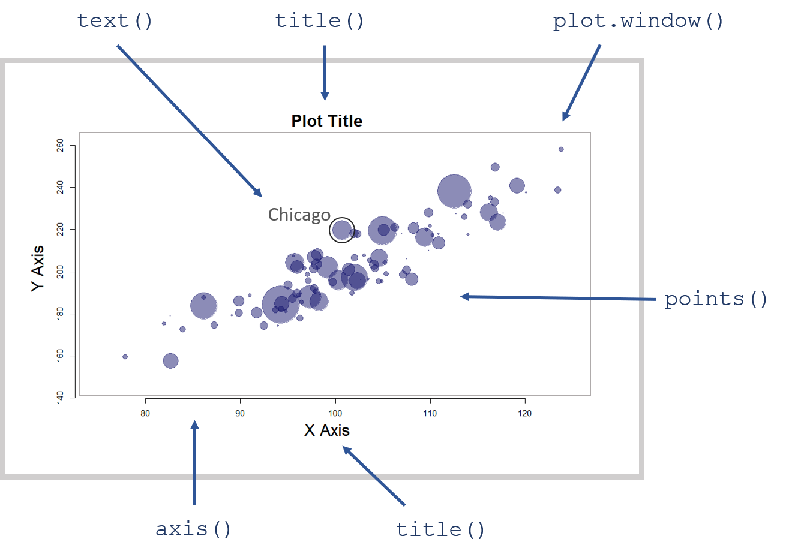

--- 
title: "Intro to Data Science for the Social Sector"
date: "Updated `r format(Sys.time(), '%B %d, %Y')`"
site: bookdown::bookdown_site
output: bookdown::gitbook
documentclass: book
bibliography: [book.bib, packages.bib]
biblio-style: apalike
link-citations: yes
description: "This is an introductory text to data science designed for social science graduate students in public affairs, nonprofit management, and international development."
---

# Welcome {-}

Placeholder


<!--chapter:end:index.Rmd-->


# (PART) PART I: FOUNDATIONS {-}

Placeholder

# Introduction to R

Placeholder


## Navigation
### Setting Your Working Directory
## Commenting Code
##  Here is some documentation for this script
## Help
## Install Programs (packages)
## Accessing Built-In Datasets in R
### Basic Data Operations
### Using the Lahman Data
### Example Analysis

<!--chapter:end:CH-01-introduction-to-r.Rmd-->


# Functions

Placeholder


## Key Concepts
## Computer Programs as Recipes
## Example Function
## Default Argument Values
## Assignment

<!--chapter:end:CH-02-functions.Rmd-->


# VECTORS {-}

Placeholder


## Key Concepts
## Vectors
## Common Vectors Functions
## The Combine Function
## Casting
## Numeric Vectors
### Integers Are Simple Numeric Vectors
## Character Vectors
### Quotes in Arguments
## Factors
## Logical Vectors
## Generating Vectors
## Variable Transformations
## Missing Values: NA's
## Datasets
### Data Frames
### Matrices
### Lists

<!--chapter:end:CH-03-data-structures.Rmd-->


# Logical Statements

Placeholder


## Key Concepts
## Operators 
## Selector Vectors
## Usefulness of Selector Vectors
## Compound Logical Statements
## NAs in Logical Statements
## Subsets

<!--chapter:end:CH-04-business-logic.Rmd-->


# DATA VERBS {-}

Placeholder


## Packages Used in This Chapter
## Key Concepts
## The **dplyr** Package
## Use **filter()** to Subset Rows
## **select()** Columns
## **arrange()** Sorts Data
## Variable Transforms with **mutate()**
## **rename()** Variables
## **summarize()** Variables

<!--chapter:end:CH-05-data_verbs.Rmd-->


# Descriptive Statistics

Placeholder


## Useful Packages

<!--chapter:end:CH-06-summary-stats.Rmd-->


# Data Recipes

Placeholder


## Packages Used in This Chapter
## Key Concepts
## The Pipe Operator **%>%**
## Building Data Recipes
## Conclusion

<!--chapter:end:CH-07-data_recipes.Rmd-->


# Analysis with Groups

Placeholder


## Packages Used in this Chapter
## Hypothetical Experimental Data
## Group Structure
### What Are Groups?
### Main Take-Away
### Example
## Analysis by Group
### Highest Ave Player Salary
### Most Players Paid Over $5 Million
### Fielding Positions
### Country of Birth
### Pay Raises

<!--chapter:end:CH-08-group-structure.Rmd-->

```{r include=FALSE, cache=FALSE}
knitr::opts_chunk$set(
  warning = FALSE,
  message = FALSE,
  comment = "###",
  collapse = TRUE,
  cache = TRUE,
  out.width = "70%",
  fig.align = 'center',
  fig.width = 6,
  fig.asp = 0.618,  # 1 / phi
  fig.show = "hold"
)

library( dplyr )
library( pander )

options( dplyr.print_min = 6, dplyr.print_max = 6 )
```
# DATA VIZ {-}

```{r, echo=F }

knitr::opts_chunk$set( echo = TRUE, message=F, warning=F, fig.width=8)

```

Visualization can be a powerful way to generate insights from data. Creating impactful graphics is not a trivial undertaking, however. There is a science to how the brain consumes visual information. And there is an art to combining elements of graphics in ways that make the data both aesthetically pleasing and informative. It takes practice to develop these skills. 

This section of the textbook is not about the design of a specific visualization or graphic, but rather the implementation. Once you have an idea for your graphic in your mind, you need a few basic R functions to create the visualization. We will cover these nuts and bolts of building custom graphics, some popular R packages for visualization, and some tricks to take your data viz game to the next level using dynamic graphics and animations.

```{r, fig.cap="The core graphics package allows you to control every element of a visualization.", echo=F, out.width='50%' }

```

If you would like to start building your data viz muscles, we recommend the following resources as good jumping-off points. 

Popular blogs that demonstrate the step-by-step process of making a mediocre graphic into a compelling graphic:

* [Makeover Mondays](http://www.makeovermonday.co.uk/gallery/)
* [Flowing Data](http://flowingdata.com/)
* [Junk Charts](http://junkcharts.typepad.com/junk_charts/)
* [NYT Graphics Blog](http://kpq.github.io/chartsnthings/)
* [Help Me Viz](https://twitter.com/HelpMeViz)


Useful introductory textbooks on data visualization:

* [Schwabish, J. A. (2014). An economist's guide to visualizing data. Journal of Economic Perspectives, 28(1), 209-34.](../READINGS/Schwabish (14) Visualizing Data for Economists.pdf)
* [T. Chiasson, D. Gregory, & Contributors (2013). Data + Design: A simple introduction to preparing and visualizing information.](https://static1.squarespace.com/static/55d9f3fbe4b001723c108c17/t/56214bdae4b0b08cace11af0/1445022682859/Ebook+On+Data+Visualization.pdf)
* [Tableau: Which Chart Goes with What Data](https://www.tableau.com/sites/default/files/media/which_chart_v6_final_0.pdf) 


Inspiration and help with R graphics:

* [R Graph Gallery](https://www.r-graph-gallery.com/)
* [R Graph Catalog](http://shiny.stat.ubc.ca/r-graph-catalog/)
* [R Graph Compendium](http://shinyapps.org/apps/RGraphCompendium/index.php)
* [ggplot2 Geoms Gallery](https://ggplot2.tidyverse.org/reference/)


# The plot() Function

```{r, fig.cap="The core graphics package allows you to control every element of a visualization.", echo=F, out.width='80%' }
knitr::include_graphics( "figures/anatomy_of_a_graph1.png" )
```

## Key Concepts


Mastering a few arguments in the **plot()** function allows for a lot of customization.

```{r, eval=F}
plot(
  
  x=fertilizer,          # data, if x is omitted then uses 1:length(y)
  y=corn.height,                   
  xlim=c(0,100),         # min and max value of axes
  ylim=c(200,350),   
  frame.plot=FALSE,      # draw a box around the data?
  col="steel blue",      # color of the points
  type="b",              # points="p", lines="l", both="b", or none="n"
  pch=19,                # shape of points to plot
  cex=2,                 # size of points
  main="Plot Title",     # title of your plot
  xlab="Label for X",    # axes labels
  ylab="Label for Y",  
  cex.lab=1.5            # aspect ratio for axes labels
  
  )
```


## plot() Arguments

This lecture is a brief introduction to the plot() function in R, the work horse of the graphics package. We will introduce the flexibility of the fully-customizable graphics engine in R through the demonstration of  some useful arguments.

To demonstrate these arguments we will use a simple dataset from a hypothetical farming experiment that examines the relationship between levels of new fertilizer under development and the height of the corn. To identify the optimal dosage of fertilizer to use, the experiment applies different levels to separate fields of corn, then measures the average final corn height at each dosage. The fields are scattered across three farms, and "moisture" represents the average Volumetric Water Content of the soil in each field.


```{r, echo=F}
fertilizer <- 1:100
corn.height <- 250 + 2*fertilizer + 20*rnorm(100) - 0.02*fertilizer^2
moisture <- abs( rnorm(100,50,25) / 100 )
farm <- factor( sample( c("A","B","C"), 100, replace=T ) )
dat <- data.frame( fertilizer, 
                   corn.height=round(corn.height,0), 
                   moisture=round(moisture,2),
                   farm )
head( dat ) %>% pander()
```


The default **plot()** function requires an x-variable and y-variable and will create a scatterplot, adding axes and a title:


```{r}
plot( x=fertilizer, y=corn.height )
```

Ok, so let's improve upon this a bit. You can use the following arguments to customize the plot:

## Titles


We can add better labels and a title with **xlab=**, **ylab=**, and **main=**.

```{r}
plot( 
      x=fertilizer, y=corn.height,
      xlab="Fertilizer (mg)",
      ylab="Corn Height (cm)",
      main="Relationship Between Fertilizer Intensity and Corn Growth"    
    )
```

We can also change their size with **cex.lab=** to control the size of the axes labels, and **cex.main=** to control the size of the title. 

Note that all of the **cex** arguments are aspect ratios, meaning that the default value of 1 represents 100% and all other argument values are in relation to this default. A value of 2 means to increase the title to 200% of the size, an argument of 0.5 shrinks the title to half the original size. 


```{r, eval=F}
plot( 
      x=fertilizer, y=corn.height,
      xlab="Fertilizer (mg)",
      ylab="Corn Height (cm)",
      main="cex.lab=2", 
      cex.lab=2,               # double the size of the axis labels
      col.lab="steelblue"      # change color of axis labels
    )

```

```{r, fig.width=5, echo=F}

# par( mar=c(5,5,5,2), mfrow=c(3,1) )  # layout

par( mar=c(5,5,5,2), bty="n" )
     
plot( 
      x=fertilizer, y=corn.height,
      xlab="Fertilizer (mg)",
      ylab="Corn Height (cm)",
      main="default cex.lab",
      col.lab="steelblue",
      cex.main=1.5
    )

plot( 
      x=fertilizer, y=corn.height,
      xlab="Fertilizer (mg)",
      ylab="Corn Height (cm)",
      main="cex.lab=0.5", cex.main=1.5,
      col.lab="steelblue",
      cex.lab=0.5
    )

plot( 
      x=fertilizer, y=corn.height,
      xlab="Fertilizer (mg)",
      ylab="Corn Height (cm)",
      main="cex.lab=2", cex.main=1.5,
      col.lab="steelblue",
      cex.lab=2
    )
```


## Type of Plot

We can plot points, lines, or some combination of lines and points using the **type=** argument:

* "l" for lines
* "p" for points
* "b" for both points and lines
* "o" plots lines over points
* "n" for no lines or points

```{r, eval=F}
plot( 
      x=fertilizer, y=corn.height,
      type="p",
      main='type="p"',
      cex.main=2,
      xlab="",
      ylab="",
      col.axis="gray60",
      frame.plot=F
    )
```


```{r, echo=F, fig.width=10}

par( mfrow=c(2,2), mar=c(2,2,5,2) )

plot( 
      x=fertilizer, y=corn.height,
      xlab="",
      ylab="",
      main='type="p"', 
      type="p", bty="n", col.axis="gray60",
      cex.main=2
    )


plot( 
      x=fertilizer, y=corn.height,
      xlab="",
      ylab="",
      main='type="l"',
      type="l", bty="n", col.axis="gray60",
      cex.main=2
    )

plot( 
      x=fertilizer, y=corn.height,
      xlab="",
      ylab="",
      main='type="b"',
      type="b", bty="n", col.axis="gray60",
      cex.main=2
    )

plot( 
      x=fertilizer, y=corn.height,
      xlab="",
      ylab="",
      main='type="o"',
      type="o", bty="n", col.axis="gray60",
      cex.main=2
    )


```


## Shape of Points


The argument **pch** determines the shape of the plot points. The numeric values 0 to 25 represent different default shapes. We can also use any number, letter, or symbol as a plotting shape.

```{r, echo=F}
pchShow <-
  function(extras = c("*",".", "o","O","0","+","-","|","%","#"),
           cex = 3, ## good for both .Device=="postscript" and "x11"
           col = "darkgray", bg = "gold", coltext = "black", cextext = 1.2,
           main = paste("plot symbols :  points (...  pch = *, cex =",
                        cex,")"))
  {
    nex <- length(extras)
    np  <- 26 + nex
    ipch <- 0:(np-1)
    k <- floor(sqrt(np))
    dd <- c(-1,1)/2
    rx <- dd + range(ix <- ipch %/% k)
    ry <- dd + range(iy <- 3 + (k-1)- ipch %% k)
    pch <- as.list(ipch) # list with integers & strings
    if(nex > 0) pch[26+ 1:nex] <- as.list(extras)
    plot(rx, ry, type = "n", axes  =  FALSE, xlab = "", ylab = "", main = main)
    abline(v = ix, h = iy, col = "lightgray", lty = "dotted")
    for(i in 1:np) {
      pc <- pch[[i]]
      ## 'col' symbols with a 'bg'-colored interior (where available) :
      points(ix[i], iy[i], pch = pc, col = col, bg = bg, cex = cex)
      if(cextext > 0)
          text(ix[i] - 0.3, iy[i], pc, col = coltext, cex = cextext)
    }
  }

pchShow()

```

Note that shapes 0 to 14 are hollow, 15 to 20 are solid, and 21 to 25 can also plot a background color specified by the **bg=** argument. 


```{r}
plot( 
      x=fertilizer, y=corn.height,
      frame.plot=FALSE,
      xlab="Fertilizer (mg)",
      ylab="Corn Height (cm)",
      main="pch=23", cex.main=1.5,
      pch=23, col="red", bg="green"
    )
```


## Size of Points

We change the size of points using the **cex=** argument (pronounced "chex"). Similar to the title cex, it is an aspect ratio so cex=2 increases the size of the plotting points to 200% of the original, and cex=0.5 scales the size down to half of the original size. 


```{r, eval=F}
plot( 
      x=fertilizer, y=corn.height,
      col="darkgoldenrod2", 
      pch=19, 
      cex=2,                        # scale points to 200% normal size
      xlab="", ylab="", las=1, 
      main="cex=2", cex.main=2,
      frame.plot=FALSE
    )
```


```{r, fig.width=5, echo=F }

# par( mar=c(4,2,5,2), mfrow=c(3,1) )  # layout

par( mar=c(4,3,5,2) )  # margins

plot( 
      x=fertilizer, y=corn.height,
      col="darkgoldenrod2", pch=19, frame=FALSE,
      xlab="", ylab="", main="cex=1 (default)",
      cex.main=2, las=1
    )

plot( 
      x=fertilizer, y=corn.height,
      col="darkgoldenrod2", pch=19, frame=FALSE,
      xlab="", ylab="",main="cex=0.5", cex.main=2,
      cex=0.5, las=1
    )

plot( 
      x=fertilizer, y=corn.height,
      col="darkgoldenrod2", pch=19, frame=FALSE,
      xlab="", ylab="", main="cex=2", cex.main=2,
      cex=2, las=1
    )
```


The **cex=** argument is also useful for incorporating a third numeric variable into the analysis. For example, perhaps we want to include the average moisture levels of the soil for each field. When we use a numeric vector like this with the **cex=** argument, instead of a single constant, the plot will adjust the size of observation based upon its measured moisture level. Since moisture values are between 0 and 1, I have scaled them by 3 to ensure the points are large enough to see. 


```{r}
plot( 
      x=fertilizer, y=corn.height,
      col="darkgoldenrod2", 
      cex=3*moisture,
      pch=19, frame.plot=F,
      xlab="Fertilizer (mg)",
      ylab="Corn Height (cm)",
      main="Relationship Between Fertilizer Intensity and Corn Growth"
    )
```


## Colors

The argument **col=** determines the color of plot points. To see a list of preset options check out:

[List of default named colors in R](http://www.stat.columbia.edu/~tzheng/files/Rcolor.pdf)

```{r}
plot( 
      x=fertilizer, y=corn.height,
      col="darkgoldenrod2", pch=19, cex=2,
      xlab="Fertilizer (mg)",
      ylab="Corn Height (cm)",
      main="Relationship Between Fertilizer Intensity and Corn Growth",
      frame.plot=FALSE
    )
```


In the example above we specified a single color for all of our corn heights. If we want to incorporate a third categorical variable in our analysis, we can use a factor in our dataset as the value we pass to the **col=** argument. For example, perhaps we want to indicate which farm each field belongs to in the graph. 


```{r}
plot( 
      x=fertilizer, y=corn.height,
      pch=19, cex=2,
      col=farm, 
      xlab="Fertilizer (mg)",
      ylab="Corn Height (cm)",
      main="Relationship Between Fertilizer Intensity and Corn Growth",
      frame.plot=FALSE
    )
```

Note that "farms" has to be a factor in order to use it in the **col=** argument. In this example, the farms have labels of "A" to "C".

```{r}
levels( farm )
```

You might be curious how R selected the colors for the three farms. The **palette()** function will print the default values that R uses for categorical variables:

```{r}
palette()
```

You can see that the first three are the colors used in the graph above. Since there are only 8 default values, if your categorical variable has more than 8 levels it will start to recycle colors.

Perhaps you don't like the default values. You can select your own by passing color names to the **palette()** function as follows:


```{r}
palette( c("forestgreen","darkorange1","darkorchid") )

plot( 
      x=fertilizer, y=corn.height,
      pch=18, cex=3,
      col=farm, 
      xlab="Fertilizer (mg)",
      ylab="Corn Height (cm)",
      main="Relationship Between Fertilizer Intensity and Corn Growth",
      frame.plot=FALSE
    )
```


## Looking Ahead


```{r}


abline( lm( corn.height ~ fertilizer + fertilizer^2  ), col="red" )
```

```{r}
plot( 
      x=fertilizer, y=corn.height,
      xlab="Fertilizer (mg)",
      ylab="Corn Height (cm)",
      ylim=c(200,400),
      main="Relationship Between Fertilizer Intensity and Corn Growth",
      pch=19, 
      col="gray",
      cex=2,
      bty="n"
    )

lines( lowess( fertilizer, corn.height ), col="darkgoldenrod2", lwd=4 )

tallest.x <- fertilizer[ which.max( corn.height ) ]
tallest.y <- corn.height[ which.max( corn.height ) ]
points( x=tallest.x, y=tallest.y, cex=3, lwd=1.5, col="firebrick4" )
text( x=tallest.x, y=tallest.y, labels="Tallest Stalk", pos=3, offset=1, col="firebrick4" )
```


# Customizing Plots


## Key Concepts

We can create almost any customized visualization using a small number of functions from the Core R graphics engine:

* plot.new(); plot.window()
* points()
* lines()
* text()
* segments()
* axis()
* title()


```{r, eval=F}
points(
  x=x, y=y,				       # plots points at the x,y positions 
  pch=19, 				       # the type of point to plot
  cex=2,					       # aspect ratio of point size
  col="red",				     # color of points
  bg="green"				     # fill color for open symbols
 )


text(
  x=x, y=y,				       # draws a line by connecting points 
  labels=some.text,			 # vector of labels to plot on the graph
  pos=3, 					       # position: 1=below, 2=left, 3=above, 4=right
  cex=2,					       # aspect ratio of text size
  col="red"				       # color of text
 )


lines(
  x=x, y=y,				       # draws a line by connecting points 
  lty="l",					     # type of lines, same as above
  lwd=0.5, 				       # line thickness
)


segments(
  x0=x0, y0=y0,		         # starting points of the segments (usually a vector)
  x1=x1, y1=y1,		         # end points of the segments (usually a vector)
  ...			                 # other arguments from lines()
 )


title(
  main="Plot Title",       # text for the plot title
  xlab="x variable",       # text for the x-axis label
  ylab="y variable",       # text for the y-axis label
  line= -1                 # move the title closer / further
)
 

axis(
  side=1                   # 1=below, 2=left, 3=above, 4=right
  at=c(10,20,30),          # position of tick marks
  labels=c("S","M","L")    # labels for tick marks 
)
```


## Packages Used in This Chapter

We will use some data from the **Lahman** baseball data package for examples in this chapter.

The **Master** data frame contains information about professional baseball players. We will focus on the relationship between height and weight of the players. 

```{r}
library( Lahman )
data( Master )
```

```{r, echo=F}
head( Master[, c(16:20,2,7) ] ) %>% pander()
```


```{r, echo=F}
Master <- filter( Master, birthYear > 1849 & birthYear < 1996 )

t1 <- tapply( Master$weight, Master$birthYear, mean, na.rm=T )
t2 <- as.numeric( names( t1 ) )
plot( t2, t1, pch=19, type="b",
      frame.plot=F,
      xlab="Year of Birth",
      ylab="Average Weight (lbs)",
      main="Weight of MLB Players Over Time" )


t1 <- tapply( Master$height, Master$birthYear, mean, na.rm=T )
t2 <- as.numeric( names( t1 ) )
plot( t2, t1, pch=19, type="b",
      frame.plot=F,
      xlab="Year of Birth",
      ylab="Average Height (inches)",
      main="Height of MLB Players Over Time" )


bmi <- (Master$weight * 0.45359237) / (Master$height / 39.370)^2 
t1 <- tapply( bmi, Master$birthYear, mean, na.rm=T )
t2 <- as.numeric( names( t1 ) )
plot( t2, t1, pch=19, type="b",
      frame.plot=F,
      xlab="Year of Birth",
      ylab="Average BMI",
      main="Body Mass Index of MLB Players Over Time" )
```


## Layering Approach


## Examples

Height and Weight of Players

Let's make this a little more realistic by using data from the Lahman package. Let's examine the relationship between the height and weight of players in MLB.

```{r, eval=F}

plot( Master$height, Master$weight, 
      pch=19, col=gray(0.5,0.5), cex=0.8,
      frame.plot=F, 
      main="Height and Weight of MLB Players",
      xlab="Height (inches)",
      ylab="Weight (lbs)"
 )


plot( Master$height, Master$weight, pch=19, col="gray", cex=1.5 )

t1 <- tapply( Master$weight, Master$height, mean, na.rm=T )

points( names(t1), t1, pch=19, col="red", cex=1.5 )


```

axis

label a point


```{r, eval=F}

data( Teams )

plot( Teams$H, Teams$W, pch=19, col="gray" )

lines( lowess( Teams$H, Teams$W ), col="red", lwd=4 )


# identify( Teams$H, Teams$W, Teams$name )

plot( Teams$ERA, Teams$W, pch=19, col="gray" )

lines( lowess( Teams$ERA, Teams$W ), col="red", lwd=4 )


era.20.bins <- cut( rank( Teams$ERA), breaks=20 )

t2 <- tapply( Teams$W, era.20.bins, mean, na.rm=T )
t3 <- tapply( Teams$ERA, era.20.bins, mean, na.rm=T )

points( t3, t2, pch=19, col="red", cex=2 )

names( Teams )

```


Graphics in R are create by layering elements: 

```{r, echo=F, fig.width=5}

plot.new()
plot.window( xlim=c(0,6), ylim=c(ymin,ymax) )

  
# par( mfcol=c(3,1), mar=c(2,2,5,1) )

par( mar=c(5,5,5,0) )

plot( 
      x=fertilizer, y=corn.height,
      xlab="",
      ylab="",
      main="", 
      type="n", 
      bty="n",
      ylim=c(220,400), las=1
    )


plot( 
      x=fertilizer, y=corn.height,
      xlab="",
      ylab="",
      main="", 
      type="p",
      pch=19,
      col="gray30",
      bty="n", 
      ylim=c(220,400), las=1
    )

text( mean(fertilizer), 380, 
      "Add Data", col="steelblue", cex=2 )

plot( 
      x=fertilizer, y=corn.height,
      xlab="Fertilizer (mg)",
      ylab="Corn Height (cm)",
      cex.lab=1,
      main="", 
      type="p",
      pch=19,
      col="gray30",
      bty="n",
      ylim=c(220,400), las=1
    )
title( main="Relationship Between Fertilizer Intensity and Corn Growth", cex.main=0.8 )

text( mean(fertilizer), 380, 
      "Add Titles", col="steelblue", cex=2 )

```


```{r, eval=F}


plot( 
      x=fertilizer, y=corn.height,
      xlab="Fertilizer (mg)",
      ylab="Corn Height (cm)",
      main="Relationship Between Fertilizer Intensity and Corn Growth",
      pch=19, 
      col="darkgoldenrod2",
      cex=2      
    )
```

If we want to open up some white space, we can also drop the plot box, or just some sides.

```{r, eval=F}

plot( 
      x=fertilizer, y=corn.height,
      xlab="Fertilizer (mg)",
      ylab="Corn Height (cm)",
      main="Relationship Between Fertilizer Intensity and Corn Growth",
      pch=19, 
      col="darkgoldenrod2",
      cex=2,
      bty="n"
    )


plot( 
      x=fertilizer, y=corn.height,
      xlab="Fertilizer (mg)",
      ylab="Corn Height (cm)",
      main="Relationship Between Fertilizer Intensity and Corn Growth",
      pch=19, 
      col="darkgoldenrod2",
      cex=2,
      bty="L"
    )
```


We can add lines to highlight trends (a regression is just the average of Y for each X).

```{r}

plot( 
      x=fertilizer, y=corn.height,
      xlab="Fertilizer (mg)",
      ylab="Corn Height (cm)",
      main="Relationship Between Fertilizer Intensity and Corn Growth",
      pch=19, 
      col="gray",
      cex=2,
      bty="n"
    )

lines( lowess( fertilizer, corn.height ), col="darkgoldenrod2", lwd=4 )


```


In order to add narrative to your graphs, you can add points and text.

The **points()** function operates with basically the same parameters as the **plot()** function. The **text()** function uses the same X and Y coordinates, but you also have to add an argument for the text that you want added to the plot. 

Let's highlight the tallest corn stalk as an example.


```{r, eval=F}

this.one <- which.max( corn.height )

tallest.x <- fertilizer[ this.one ]

tallest.y <- corn.height[ this.one ]

plot( 
      x=fertilizer, y=corn.height,
      xlab="Fertilizer (mg)",
      ylab="Corn Height (cm)",
      main="Relationship Between Fertilizer Intensity and Corn Growth",
      pch=19, 
      col="gray",
      cex=2,
      bty="n"
    )

lines( lowess( fertilizer, corn.height ), col="darkgoldenrod2", lwd=4 )

points( x=tallest.x, y=tallest.y, cex=2.5, col="darkgoldenrod2" )

text( x=tallest.x, y=tallest.y, labels="Tallest Stalk", pos=4, col="darkgoldenrod2" )

```


# Custom Plot Example

```{r, echo=F }
knitr::opts_chunk$set( echo = TRUE, message=F, warning=F, fig.width=10)
```

This example demonstrates the creation of custom visualizations in R. For reference, it took approximately two hours to develop the custom graphic.

This example was inspired by a blog about the popularity of computer languages on Stack Overflow. Joshua Kunst commented on the deficiencies of rank plots, and demonstrated a [superior plot](http://jkunst.com/r/what-do-we-ask-in-stackoverflow/) for representing changes in rank over time that looks like a NYC subway map.


To demonstrate how a similar graphic can be made in R, this chapter uses some hypothetical school data representing five years of rankings for ten schools within a specific district. The rankings represent some performance metric like graduation rates or average test scores. 

```{r, echo=F, warning=F, message=F }

library( pander )
library( dplyr )

# load fake data
df <-
structure(list(id = structure(1:10, .Label = c("A", "B", "C", 
"D", "E", "F", "G", "H", "I", "J"), class = "factor"), r1 = c(10, 
6, 9, 7, 4, 2, 8, 1, 5, 3), r2 = c(10, 6, 8, 4, 2, 1, 9, 3, 7, 
5), r3 = c(10, 5, 7, 4, 2, 3, 9, 1, 8, 6), r4 = c(10, 4, 8, 3, 
2, 5, 9, 1, 7, 6), r5 = c(9, 3, 10, 4, 2, 5, 8, 1, 7, 6)), .Names = c("id", 
"r1", "r2", "r3", "r4", "r5"), row.names = c(NA, -10L), class = "data.frame")

df2 <- df
df2[,2:6] <- 11 - df2[,2:6]
names( df2 ) <- c("SCHOOL","RANK.2011","RANK.2012","RANK.2013","RANK.2014","RANK.2015")

df2 %>% pander
```


## Basic Rank Plot

The original design for the graphic was very simple. It showed the starting rank and end rank of the school over the five-year period to give a sense of how much each school had changed. It is a little boring and also loses a lot of information regarding how consistent performance has been over time.


```{r, echo=F}
id <- df[,1]
y11 <- df[,2]
y15 <- df[,6]

plot( 1, 1, xlim=c(1,4), ylim=c(1,10), bty="n",
type="n", xaxt="n", yaxt="n", xlab="", ylab="" )

segments( x0=1, x1=3, y0=y11, y1=y15 )

text( 3.5, 1:10, id[order(df[,6])] )

axis( side=1, at=c(1,3), labels=c("2011","2015"), tick=F )

title( ylab="School Rank", line=0 )
title( main="School Rank 2011-2015" )

```


## Creating a Submay Map Rank Plot

Let's see how we put together a similar graphic using our school ranking data. Let's start by looking at the variable names and the type of data we are working with:

```{r}
head( df, 3 ) %>% pander
```

Note that the first row of data belongs to School A, so we can reference it as `df[ 1 , ]`. The second row of data belongs to School B, which we can reference as `df[ 2 , ]`. Etc.

We will open a blank plotting window, then we can add the path of each school's rankings from 2011 to 2015 using the `points()` function. We can play with the plot type to get the aesthetics correct.

Values for `type=` argument.

Argument | Result
---------|-------
"p" | points
"l" | lines
"b" | both
"c" | only connecting lines
"n" | nothing


## Lines

Let's try one with basic lines.

```{r}


id <- df$id          # save ID as separate variable
df <- df[ , -1 ]     # drop ID from the dataset so it's all numeric

# save some useful dimension information

ymin <- min(df)      # what is the largest value in the data frame?
ymax <- max(df)      # what is the smallest value in the data frame?
num.x <- 5           # we have five years of data


# create an empty plot with the correct dimensions for our plot
plot.new()
plot.window( xlim=c(0,6), ylim=c(ymin,ymax) )


points( 1:5, df[1,], type="l" ) # school A
points( 1:5, df[2,], type="l" ) # school B
points( 1:5, df[3,], type="l" )
points( 1:5, df[4,], type="l" )
points( 1:5, df[5,], type="l" )
points( 1:5, df[6,], type="l" )
points( 1:5, df[7,], type="l" )
points( 1:5, df[8,], type="l" )
points( 1:5, df[9,], type="l" )
points( 1:5, df[10,], type="l" )


text( x=0.5, y=10, labels="A" ) # rank in 2011
text( x=5.5, y=9, labels="A" )  # rank in 2015


```


## Connected Points

Not bad but I think that we can improve upon the aestetics. Let's change the lines to points plus connecting lines.


```{r}

plot.new()
plot.window( xlim=c(0,6), ylim=c(ymin,ymax) )

points( 1:5, df[1,], type="b" ) # school A
points( 1:5, df[2,], type="b" ) # school B
points( 1:5, df[3,], type="b" ) # etc...
points( 1:5, df[4,], type="b" )
points( 1:5, df[5,], type="b" )
points( 1:5, df[6,], type="b" )
points( 1:5, df[7,], type="b" )
points( 1:5, df[8,], type="b" )
points( 1:5, df[9,], type="b" )
points( 1:5, df[10,], type="b" )


text( x=0.5, y=10, labels="A" ) # rank in 2011
text( x=5.5, y=9, labels="A" )  # rank in 2015

```


That looks better, but if we want to match the subway map aestetic we need thicker lines. Let's try the line width parameter, lwd.


```{r}

plot.new()
plot.window( xlim=c(0,6), ylim=c(ymin,ymax) )

points( 1:5, df[1,], type="b", lwd=5, cex=2 )
points( 1:5, df[2,], type="b", lwd=5, cex=2 )
points( 1:5, df[3,], type="b", lwd=5, cex=2 )
points( 1:5, df[4,], type="b", lwd=5, cex=2 )
points( 1:5, df[5,], type="b", lwd=5, cex=2 )
points( 1:5, df[6,], type="b", lwd=5, cex=2 )
points( 1:5, df[7,], type="b", lwd=5, cex=2 )
points( 1:5, df[8,], type="b", lwd=5, cex=2 )
points( 1:5, df[9,], type="b", lwd=5, cex=2 )
points( 1:5, df[10,], type="b", lwd=5, cex=2 )


text( x=0.5, y=10, labels="A" ) # rank in 2011
text( x=5.5, y=9, labels="A" )  # rank in 2015

```


## Separate Points and Connecting Lines

It's not quite working because when we increase the line width, it makes our points that serve as the elbows thicker as well. Let's try to separate these components:


```{r}
plot.new()
plot.window( xlim=c(0,6), ylim=c(ymin,ymax) )

points( 1:5, df[1,], type="p", cex=2 )
points( 1:5, df[2,], type="p", cex=2 )
points( 1:5, df[3,], type="p", cex=2 )
points( 1:5, df[4,], type="p", cex=2 )
points( 1:5, df[5,], type="p", cex=2 )
points( 1:5, df[6,], type="p", cex=2 )
points( 1:5, df[7,], type="p", cex=2 )
points( 1:5, df[8,], type="p", cex=2 )
points( 1:5, df[9,], type="p", cex=2 )
points( 1:5, df[10,], type="p", cex=2 )

points( 1:5, df[1,], type="c", lwd=5 )
points( 1:5, df[2,], type="c", lwd=5 )
points( 1:5, df[3,], type="c", lwd=5 )
points( 1:5, df[4,], type="c", lwd=5 )
points( 1:5, df[5,], type="c", lwd=5 )
points( 1:5, df[6,], type="c", lwd=5 )
points( 1:5, df[7,], type="c", lwd=5 )
points( 1:5, df[8,], type="c", lwd=5 )
points( 1:5, df[9,], type="c", lwd=5 )
points( 1:5, df[10,], type="c", lwd=5 )

text( x=0.5, y=10, labels="A" ) # rank in 2011
text( x=5.5, y=9, labels="A" )  # rank in 2015
```


That's starting to look like what we want!


## Add Labels

How about we add some more labels.


```{r}
plot.new()
plot.window( xlim=c(0,6), ylim=c(ymin,ymax) )

points( 1:5, df[1,], type="p", cex=2 )
points( 1:5, df[2,], type="p", cex=2 )
points( 1:5, df[3,], type="p", cex=2 )
points( 1:5, df[4,], type="p", cex=2 )
points( 1:5, df[5,], type="p", cex=2 )
points( 1:5, df[6,], type="p", cex=2 )
points( 1:5, df[7,], type="p", cex=2 )
points( 1:5, df[8,], type="p", cex=2 )
points( 1:5, df[9,], type="p", cex=2 )
points( 1:5, df[10,], type="p", cex=2 )

points( 1:5, df[1,], type="c", lwd=5 )
points( 1:5, df[2,], type="c", lwd=5 )
points( 1:5, df[3,], type="c", lwd=5 )
points( 1:5, df[4,], type="c", lwd=5 )
points( 1:5, df[5,], type="c", lwd=5 )
points( 1:5, df[6,], type="c", lwd=5 )
points( 1:5, df[7,], type="c", lwd=5 )
points( 1:5, df[8,], type="c", lwd=5 )
points( 1:5, df[9,], type="c", lwd=5 )
points( 1:5, df[10,], type="c", lwd=5 )

text( 0.7, 1:10, id[order(df[,1])] )
text( 5.3, 1:10, id[order(df[,5])] )

text( 0, 1:10, paste(10:1,"---") )
text( 6, 1:10, paste("---",10:1) )
```


## Add Axes and Title


```{r}
plot.new()
plot.window( xlim=c(0,6), ylim=c(ymin,ymax) )

points( 1:5, df[1,], type="p", cex=2 )
points( 1:5, df[2,], type="p", cex=2 )
points( 1:5, df[3,], type="p", cex=2 )
points( 1:5, df[4,], type="p", cex=2 )
points( 1:5, df[5,], type="p", cex=2 )
points( 1:5, df[6,], type="p", cex=2 )
points( 1:5, df[7,], type="p", cex=2 )
points( 1:5, df[8,], type="p", cex=2 )
points( 1:5, df[9,], type="p", cex=2 )
points( 1:5, df[10,], type="p", cex=2 )

points( 1:5, df[1,], type="c", lwd=5 )
points( 1:5, df[2,], type="c", lwd=5 )
points( 1:5, df[3,], type="c", lwd=5 )
points( 1:5, df[4,], type="c", lwd=5 )
points( 1:5, df[5,], type="c", lwd=5 )
points( 1:5, df[6,], type="c", lwd=5 )
points( 1:5, df[7,], type="c", lwd=5 )
points( 1:5, df[8,], type="c", lwd=5 )
points( 1:5, df[9,], type="c", lwd=5 )
points( 1:5, df[10,], type="c", lwd=5 )

text( 0.7, 1:10, id[order(df[,1])] )
text( 5.3, 1:10, id[order(df[,5])] )

text( 0, 1:10, paste(10:1,"---") )
text( 6, 1:10, paste("---",10:1) )

title( ylab="Rank", line=1 )
axis( side=1, tick=F, at=1:5, labels=2011:2015 )
title( main="School Rank 2011-2015"  )
```


## Generalizing Code


```{r, echo=F}
head(df2,5) %>% pander
```


Because we are plotting data row by row (each row of data represents rankings for one school over time), we can simplify our code using a for loop (loops are covered in subsequent chapters):

```{r}
plot.new()
plot.window( xlim=c(0,6), ylim=c(ymin,ymax) )

for( i in 1:nrow(df) )
{
   points( 1:num.x, df[i,], type="p", 
           cex=1.5, col=gray(0.5,0.5), 
           pch=21, bg="white" ) 
  
   points( 1:num.x, df[i,], type="c", lwd=6, col=gray(0.5,0.5) )
}
```


## Improved Aesthetics

Finally, let's play with the colors and sizes of elements so that we can highlight specific schools for our report.


```{r}
plot.new()
plot.window( xlim=c(0,6), ylim=c(ymin,ymax) )

# add each row to a loop instead of repeating lines of code

for( i in 1:nrow(df) )
{
   points( 1:num.x, df[i,], type="p", cex=1.5, col=gray(0.5,0.5), 
           pch=21, bg="white" ) 
   points( 1:num.x, df[i,], type="c", lwd=6, col=gray(0.5,0.5) )
}


text( 0.7, 1:10, id[order(df[,1])], col=gray(0.5,0.5) )
text( 5.3, 1:10, id[order(df[,5])], col=gray(0.5,0.5) )

text( 0, 1:10, paste(10:1,"---"), col="gray60", cex=0.7 )
text( 6, 1:10, paste("---",10:1), col="gray60", cex=0.7 )

title( ylab="Rank", col.lab="gray80", cex.lab=1.5, line=1 )

axis( side=1, tick=F, at=1:5, labels=2011:2015, col.axis="gray", cex.axis=1 )
 
title( main="School Rank 2011-2015", col.main="gray50" )


# highlight a school

points( 1:5, df[2,], type="c", lwd=6, col="firebrick4" )
text( 0.7, df[2,1], "B", col="firebrick4" )
text( 5.3, df[2,5], "B", col="firebrick4" )

points( 1:5, df[6,], type="c", lwd=6, col="steelblue" )
text( 0.7, df[6,1], "F", col="steelblue" )
text( 5.3, df[6,5], "F", col="steelblue" )

points( 1:5, df[3,], type="c", lwd=6, col="goldenrod" )
text( 0.7, df[3,1], id[3], col="goldenrod" )
text( 5.3, df[3,5], id[3], col="goldenrod" )
```


<!--chapter:end:CH-09-plot-basics.Rmd-->


# DATA WRANGLING {-}

Placeholder


## Packages Used in This Chapter
## Relational Databases
## Set Theory
### Set Theory Functions
### Set Theory Using Logical Operators
## Merging Data
## use character columns of names to get sensible sort order
### The by.x and by.y Arguments
## Non-Unique Observations in ID Variables
### Example of Incorrect Merge
## The %in% function
## The Match Function

<!--chapter:end:CH-99-merging-data.Rmd-->

